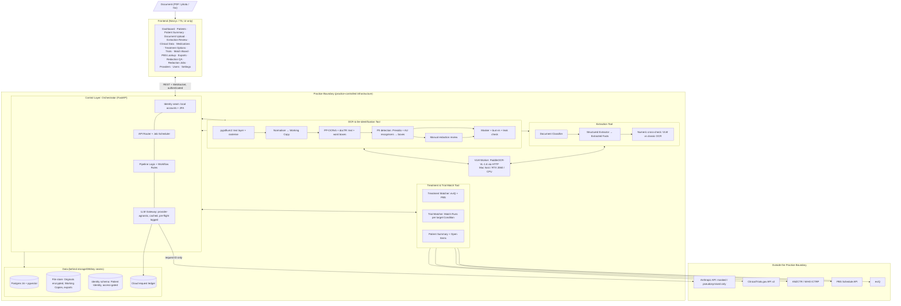
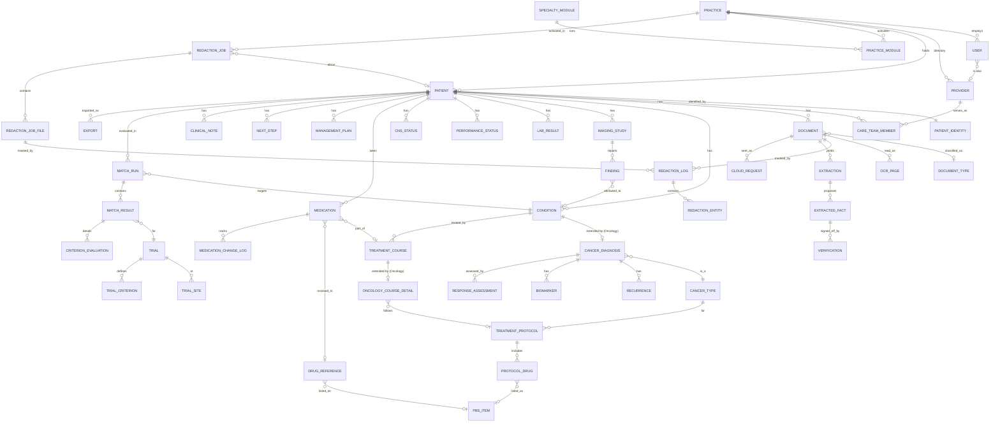
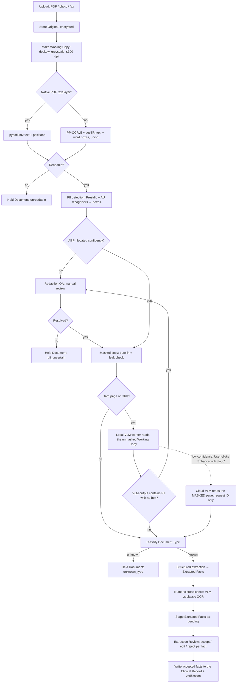
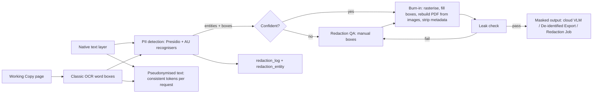
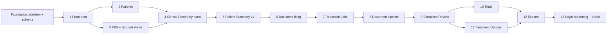

# Vigil — Clinical Decision Support Platform
### Technical Design Document v1.3

> **Working name:** *Vigil*. A clinical decision support tool for oncologists. It ingests patient documents, turns them into a structured clinical record, matches patients against standard-of-care treatments and clinical trials, and surfaces PBS drug information. Identifiable patient data never leaves the practice.
>
> **Audience:** This doc feeds two downstream steps: (1) **Claude Design** for UI mockups (see §5 Screen Inventory), and (2) **Claude Code** for implementation (see §3 Stack, §6 Data Model, §12 API Surface, §14 Repo Structure, §15 Build Order).
>
> **Regulatory posture:** Clinical Decision Support Software (CDSS) operating under the TGA CDSS exemption. The tool informs and supports; the clinician decides. It does not autonomously recommend, prescribe, or replace clinical judgment. All outputs are independently verifiable by the treating clinician. The exemption is assessed for single-practice use. **Before a second Practice is onboarded, the exemption must be re-evaluated and a TGA notification of supply may be required** (see [revisit-later.md](revisit-later.md) #13).

---

## What changed in v1.3

**v1.3 (2026-09-25): general Core + Specialty Modules** ([ADR 0004](adr/0004-general-core-with-specialty-modules.md)). Vigil is structured as a specialty-agnostic **Core** with pluggable **Specialty Modules**; **Oncology** is the first and only module in the MVP (§4.1). The general **Condition** replaces the cancer-only Diagnosis in the Core; Oncology extends it into a **Cancer Diagnosis**. **Comorbidity** is now a view, not a table. Match Runs target a Condition. Oncology-only concepts (Stage, Disease Extent, Recurrence, Biomarker, Line of Therapy, Response Assessment, ECOG, CNS status, eviQ Treatment Options) move into the Oncology module. Previous version: [archive/Vigil_Design_Document_v1.2.md](archive/Vigil_Design_Document_v1.2.md).

**v1.3 build stages (2026-09-25):** §15 is rewritten from 12 back-end-first phases into **13 stakeholder-demoable stages**; Patients' Documents come straight after the Patient Summary. The Clinical Record is entered by hand first, screens appear stage by stage and section by section, and login hardening comes last (required before prod).

**v1.3 schema decisions (2026-09-25, for the baseline migration, ticket #2):**
- Practice scoping extends to child rows, kept consistent by composite foreign keys.
- Database roles restrict Patient Identity and forbid hard deletes.
- Audit and immutable tables reject updates.
- Every written-down value set is a CHECK.
- Job Kinds and fact kinds are registries that modules add to.
- The data model is browsable as a generated, clickable diagram ([data-model/](data-model/index.html)).

All of these are in §6.2–§6.3.

### v1.2

v1.2 incorporates the outcomes of the design-grilling sessions of 2026-09-24. The companion files are part of this spec:

| File | Role |
|------|------|
| [CONTEXT.md](../CONTEXT.md) | **The glossary. All domain terms in this doc follow it.** Where this doc and CONTEXT.md disagree, CONTEXT.md wins. |
| [adr/](adr/) | Architecture decisions: 0001 de-identify before anything leaves the Practice Boundary; 0002 no AGPL PDF libraries; 0003 local MVP with cloud seams; 0004 general Core with Specialty Modules. |
| [quality-gates.md](quality-gates.md) | Reference Set, deployment gates, masking leak tests, go-live checklist. |
| [hardware-options.md](hardware-options.md) | Where the OCR and VLM models can run. |
| [revisit-later.md](revisit-later.md) | Provisional decisions and deferred scope. |
| [frontend-design.md](frontend-design.md) | Frontend brief for Claude Design. |
| [archive/](archive/) | Previous versions (v1.1, v1.2). |

Headline changes from v1.1:
- **Privacy pipeline reversed.** Local OCR first, then PII masking. Only masked or pseudonymised content ever leaves the **Practice Boundary**. v1.1 sent raw images to Claude vision first ([ADR 0001](adr/0001-deidentify-before-leaving-practice.md)).
- **Review is per Extracted Fact**, and **Verification is human-only**, with rights set by Job Title.
- **Clinical model rebuilt:**
  - Diagnosis now owns Recurrences, Biomarkers (full history), Stage and Disease Extent *(v1.3: now the Oncology module's Cancer Diagnosis)*.
  - Treatment Course replaces therapy lines.
  - Finding and Response Assessment replace Lesion tracking.
- **Match states renamed** to Potentially Eligible / Needs Information / Excluded. Each Match Run now targets one Diagnosis *(v1.3: one Condition)*.
- **User is separate from Provider.** Logins are individual, with 2FA. Every record belongs to a Practice.
- **Scope:**
  - Schema induction, letter drafting, Access Grants and multi-practice are out of the MVP.
  - The MVP processes **synthetic data only**, with every guardrail active.
  - The MVP is built to move to Azure later ([ADR 0003](adr/0003-local-mvp-with-cloud-seams.md)).

---

## ⚠️ CLAUDE CODE: ENVIRONMENT SETUP REQUIREMENTS

**CRITICAL: Do not install dependencies directly onto the host machine.**

All dependency installation must happen inside isolated environments:

- **Python dependencies:** Always create and use a virtual environment (`python -m venv .venv` or `conda create`) before installing any packages via `pip`. Never run `pip install` outside a venv.
- **Node.js dependencies:** Use `npm install` within the project directory (local `node_modules/`). Never use `npm install -g` for project dependencies.
- **System-level services (PostgreSQL):** Run exclusively via Docker containers defined in `docker-compose.yml`. Do not install Postgres or any other service directly on the host OS.
- **OCR/document processing tools** (PaddleOCR, docTR, pypdfium2, LibreOffice): install them inside the Docker backend container via the Dockerfile, not on the host.
- **Exception: the local VLM worker.** On a Mac, the VLM may run on the host (llama.cpp with Metal) as a separate HTTP service, because Docker on macOS cannot use the GPU. It is installed in its own isolated directory with its own venv or binary, never globally. See [hardware-options.md](hardware-options.md) option 1c.

The application stack runs via `docker compose up`. Host prerequisites: Docker, Docker Compose, Node.js (for frontend dev), Python 3.12+ (for backend dev outside Docker if preferred), and optionally the VLM worker.

### Environments

| Environment | Purpose | Data | Login |
|-------------|---------|------|-------|
| **dev** | Development | Synthetic only | **Dev login** available (bypasses password/2FA). |
| **test** | Unit tests + end-to-end tests against the Reference Set only | Synthetic only (the Reference Set) | Real login flow, exercised by the E2E tests |
| **prod** | Real use by the Practice. **Not part of the MVP.** | Real patients | Real login |

> **Claude Code note: the dev login must be impossible in test or prod.** Enable it only when `VIGIL_ENV=dev`. At startup, the app must **refuse to start** if the dev login is enabled in any other environment. Add a test that asserts this. Every guardrail (masking, Verification, per-fact review, Job Title permissions, leak tests, quality gates, database roles) is fully active in dev and test even though the data is synthetic. **Exception:** login hardening (2FA, inactivity lock, re-authentication) is built in the last stage (Stage 13) and is required before prod (§15).

---

## 1. Goals & Design Principles

| # | Goal | Implication |
|---|------|-------------|
| G1 | **Clinical decision support, not clinical decision making.** The tool surfaces information; the clinician decides. | All outputs are framed as information for review. No autonomous recommendations. No language suggesting the tool has made a clinical determination: hence "Potentially Eligible", "Treatment Option", never "Eligible" or "Recommended". Maintains the TGA CDSS exemption. |
| G2 | **Identifiable data never leaves the Practice Boundary.** The boundary is infrastructure the practice controls: its own machines today, its own Azure tenant (Australian region) later. | Local OCR and local VLMs may read unmasked pages. Anything sent to a third party (Claude or any cloud model) is masked or pseudonymised first, tagged with a one-off request ID. Public data (PBS, eviQ, trials) flows in freely. See [ADR 0001](adr/0001-deidentify-before-leaving-practice.md). |
| G3 | **General Core, specialty modules.** The Core is specialty-agnostic; each specialty is a Specialty Module activated per Practice (§4.1, ADR 0004). **Oncology is the first module** and supports all malignancies, common and rare. Launches with breast, lung, colorectal and melanoma; expands to all cancer types including rare tumours (e.g. Merkel cell, sarcomas), where the tool adds the most value because information and trials are hardest to find. | Clinical logic is registry/config-driven, not hardcoded to any specialty or diagnosis. New specialties are added one at a time, after research and requirements gathering with a clinician from that specialty ([revisit-later.md](revisit-later.md) #17). Adding a Cancer Type requires only data (eviQ protocols + PBS cross-references), not code. |
| G4 | **Structured source of truth.** Free-text clinical documents become typed, queryable, longitudinal data: the Clinical Record. | Postgres relational core. Only accepted, human-verified Extracted Facts enter the Clinical Record. |
| G5 | **Traceable.** Every extracted value and every match decision cites its source. | Source location (page + box) on every Extracted Fact; evidence refs on every Criterion Result; every Verification records User, Job Title and time. |
| G6 | **Paper-ready.** Handles the worst-case input: phone photos of printouts, faxes, scanned PDFs, and native digital PDFs. | Local OCR (PP-OCRv5 + docTR) for text and word positions; local VLM (PaddleOCR-VL-1.6) for hard pages and tables; cloud VLM only as a last resort, on masked pages. |
| G7 | **Offline-capable (MVP only).** | Comes free because the MVP runs locally. **Not designed for**: no service worker or offline sync. Revisit at the Azure move ([revisit-later.md](revisit-later.md) #14). |
| G8 | **Repeatable and measured.** Re-running a Document or Patient through the pipeline reproduces the same result, and any change to a model, prompt or engine is measured before deployment. | Versioned prompts, pinned model IDs, deterministic report templates, content-addressed LLM cache, and the Reference Set gates in [quality-gates.md](quality-gates.md). |
| G9 | **Cloud-ready.** The MVP runs locally but will move to Azure. | Storage, database, VLM worker, job queue, keys and login each sit behind a swappable interface ([ADR 0003](adr/0003-local-mvp-with-cloud-seams.md)). |

### Non-goals (MVP)
- Not a regulated medical device. Operates under the TGA CDSS exemption for single-practice use.
- No real patient data. The MVP runs dev and test environments only.
- No EMR/EHR integration (MOSAIQ, Genie, CHARM, EPIC). Standalone document upload only.
- No multi-practice / multi-tenant operation, and no Access Grants between Practices. The data model still records a Practice on every Patient, User and Document ([revisit-later.md](revisit-later.md) #13).
- No patient-facing features. Staff-only tool.
- No treatment ordering or prescribing. Information display only.
- No letter drafting ([revisit-later.md](revisit-later.md) #8).
- No schema induction for unknown Document Types ([revisit-later.md](revisit-later.md) #11).

---

## 2. Tiered Product Architecture

### Tier 1: Document Ingestion & Clinical Record
The foundation. Handles Document upload in any format (scanned PDF, digital PDF, phone photos, faxes):
- Keeps the **Original** and makes a normalised **Working Copy**.
- Runs local OCR, locates and masks PII, and classifies the Document Type.
- Extracts candidate **Extracted Facts**. Each is accepted, edited or rejected on its own, and accepted facts form the **Clinical Record**.
- **Holds** Documents the pipeline can't read reliably or can't classify.

### Tier 2: Treatment & Clinical Trial Matching
Built on the Clinical Record. Three sub-components:
- **Standard-of-care Treatment Options.** Treatment Protocols from eviQ (Cancer Institute NSW), matched to a Cancer Diagnosis on Cancer Type, Disease Extent and intent, next Line of Therapy, and Biomarkers. Deterministic.
- **PBS drug information.** From the PBS Schedule API, refreshed monthly. Shows PBS Listing per drug for the indication, PBS Coverage per Treatment Option, and patient co-payments.
- **Clinical trial matching.** From ClinicalTrials.gov API v2 and ANZCTR. A **Match Run** evaluates a Patient against trials for a chosen target Condition. Each criterion gets a **Criterion Result** (Met / Not Met / Unknown) and each trial a **Match State** (Potentially Eligible / Needs Information / Excluded), with per-criterion evidence.

### Tier 3: Patient Summary ("At a Glance")
The clinical payoff screen: a single view with the most current picture of a Patient before a consultation, built from the Clinical Record. It contains:
- Patient Identity.
- Each Condition in focus; for oncology, each Cancer Diagnosis with its Stage, Disease Extent, Biomarkers (with discordance flags) and Recurrences.
- Latest scans with their Response Assessment, and most recent bloods with anything flagged.
- Current Treatment Course and Line of Therapy, with best response.
- ECOG.
- Comorbidities (the other Conditions) and Medications.
- The Management Plan (verbatim) with Next Steps.
- **Open Items.**

This is the screen Dr De Souza opens before walking into a consultation room. The tier relies on Tier 1 data but not on Tier 2.

### Cross-cutting: De-identification, Redaction & Privacy
Not a tier but a foundational module with its own UI:
- Local OCR with word positions, PII detection, and masking (burned in, never overlay-only).
- A **manual redaction UI** (draw, remove and label boxes) that is also used for Extraction Review.
- **Redaction Jobs**: standalone de-identification of files for trial portals and referrals, keeping the Originals, the outputs and the audit trail.
- A pre-flight view of exactly what would leave the Practice Boundary on any cloud request.
- Masking leak tests and the PII gates ([quality-gates.md](quality-gates.md)).

---

## 3. Technology Stack

| Layer | Choice | Notes |
|-------|--------|-------|
| Frontend | **Next.js 14 (App Router) + TypeScript** | Local web app at `localhost:3000`. No service worker (G7 is not designed for). |
| UI | **Tailwind CSS + shadcn/ui**, TanStack Query, TanStack Table | Clinical-professional aesthetic. Dense tables. Green/amber/red state colours. Types generated from backend OpenAPI. |
| Page/box viewer | **react-pdf** (`pdfjs-dist`) + **react-konva** | One component that draws boxes over a page, shared by Redaction QA and Extraction Review. Boxes are stored in PDF points. No commercial SDKs (Adobe, Nutrient, Apryse). |
| Backend | **Python 3.12 + FastAPI**, Pydantic v2 | Async REST + WebSocket for pipeline progress. |
| ORM / migrations | **SQLAlchemy 2.0 + Alembic** | Schema-versioned; no runtime DDL. |
| DB | **PostgreSQL 16** | JSONB for flexible payloads; **pgvector** for semantic search over criteria and clinical notes. Behind the database seam (Azure Database for PostgreSQL later). |
| Jobs | **Durable job model** (`job`/`job_step` tables; Job Kinds from the `job_kind` registry) + async worker, behind a queue interface | Resumable ingestion. Managed queue later (ADR 0003). |
| File storage | **Local disk** behind a storage interface | Originals encrypted at rest. Blob Storage later (ADR 0003). |
| PDF handling | **pypdfium2** (text layer + rasterise) + **pikepdf** (metadata strip) + **img2pdf**/Pillow (rebuild) | **No PyMuPDF** (AGPL; [ADR 0002](adr/0002-no-agpl-pdf-libraries.md)). |
| OCR: PII localisation | **PP-OCRv5** (PaddleOCR 3.x) + **docTR**, union of word/line boxes | Runs on every page, CPU-capable, inside Docker. Provisional ([revisit-later.md](revisit-later.md) #1, #1a). |
| OCR: reading | **PaddleOCR-VL-1.6** (0.9B, Apache-2.0) via an HTTP **VLM worker** (llama.cpp GGUF) | Worker runs on the Mac host (Metal), on the RTX 2060 box (CUDA), or on CPU. Alternative: GLM-OCR. See [hardware-options.md](hardware-options.md). |
| OCR: last resort | **Claude vision**, masked pages only | **On-click per Document in the initial build** ([revisit-later.md](revisit-later.md) #2). |
| LLM | **Anthropic API** (Claude) via a provider-agnostic gateway; **instructor** + Pydantic for structured output | Receives de-identified text or masked images only. Model IDs pinned per pipeline version. Temperature 0. Content-addressed caching. |
| PII detection | **Presidio** (text) + custom AU recognisers (Medicare with check digit, IHI, DVA, MRN formats, AU phone/address, DOB, provider names) | Hits are mapped back to OCR boxes for masking. Presidio's image redactor is **not** used (beta; [revisit-later.md](revisit-later.md) #4). |
| Login | **Local accounts + TOTP 2FA**, behind an identity interface | Entra ID later (ADR 0003). Dev login in dev only. |
| Keys | Local keystore / `.env`, behind a key interface | Key Vault later (ADR 0003). |
| PBS data | **PBS Schedule API** (public, free) | Monthly refresh on the 1st. |
| Treatment protocols | **eviQ adapter** | Weekly check. **Confirm eviQ terms of use before building** ([revisit-later.md](revisit-later.md) #9). |
| Trial data | **ClinicalTrials.gov API v2** + **ANZCTR** (WHO ICTRP feed / scraping) | Incremental refresh. Snapshotted for reproducibility. |
| Report export | **python-docx** + **LibreOffice headless** → PDF | Deterministic templates bound to structured data. |
| Redaction QA check | **x-ray** (Free Law Project) + re-OCR + text-layer extraction | Automated leak tests ([quality-gates.md](quality-gates.md)). |
| Eval | **pytest** + Reference Set harness | Gates in [quality-gates.md](quality-gates.md), run in the test environment. |
| Packaging | **Docker Compose** (postgres, backend, frontend) + optional VLM worker | `docker compose up`. |

> **Claude Code note:** The backend Dockerfile installs PaddleOCR, docTR, pypdfium2, pikepdf, LibreOffice headless and poppler-utils inside the container, in a virtualenv. Use **ARM64 builds** on Apple Silicon (Paddle's official images are x86 and would run emulated). The VLM worker is reached over HTTP at `VLM_WORKER_URL`; when that is unset, the pipeline skips the local VLM step and relies on classic OCR.

---

## 4. System Architecture

The frontend is UI-only. All logic flows through a central Control Layer that delegates to independent, swappable tool modules and infrastructure seams.



**Key architectural invariants:**

1. **The frontend is UI-only.** No business logic and no direct tool calls. Everything goes through the Control Layer, and every request is authenticated as a User.
2. **The Control Layer is the single brain.** It sequences the pipeline, manages job state, and enforces the privacy invariant.
3. **Tools are independent modules.** They can be tested, versioned and replaced independently. The VLM worker is an external HTTP service, so it can move between machines, or to Azure, without code changes.
4. **Identifiable data never leaves the Practice Boundary.** Only the LLM Gateway may call a third-party model, and it accepts only (a) masked page images that passed the leak check, or (b) text that passed PII detection and pseudonymisation. Every call is written first to the **cloud request ledger** (one-off request ID → Document → Patient), and only the request ID is sent. The gateway refuses any payload that hasn't passed through the OCR & De-identification Tool.
5. **Patient Identity is access-gated.** It lives in a separate `identity` schema, is shown freely in the local UI, and is never included in any payload to a third party.
6. **Nothing enters the Clinical Record without human Verification.** Extracted Facts are candidates until a User with the right Job Title accepts them.
7. **Infrastructure sits behind seams.** Storage, database, VLM worker, job queue, keys and login are accessed only through their interfaces (ADR 0003).

### 4.1 Core and Specialty Modules

Vigil is a **Core** that applies to any specialty, plus **Specialty Modules** that plug in at fixed points ([ADR 0004](adr/0004-general-core-with-specialty-modules.md)). The pattern is a **plugin architecture**:

1. **Specialty Module contract.** Every module implements one interface declaring its contributions at each extension point:

| Extension point | What a module contributes | Oncology example |
|---|---|---|
| Clinical Record | Extension tables (via ordinary migrations; **no runtime DDL**) and fact kinds with Pydantic schemas | `cancer_diagnosis`, `biomarker`, `recurrence` |
| Condition extension | Which Conditions it extends, and how | A Condition that is a cancer → Cancer Diagnosis |
| Document Types | Document Types, classification hints, extraction prompts | `pathology_molecular` |
| Verification rights | Rows added to §6.4 for its fact kinds | Stage: clinician only |
| Patient Summary & Clinical Data | UI sections and tabs | Diagnosis block, Biomarkers tab |
| Trial matching | Its criteria attribute vocabulary and evaluators | `required_biomarker`, `prior_systemic_lines` |
| Treatment Options (optional) | A Treatment Option source | eviQ + PBS |
| Open Items | Extra Open Item types | Biomarker discordance |

2. **Module registry.** The Core discovers modules only through the registry and **never imports a module**. Modules may import the Core's public service interfaces, never another module.
3. **Strategy per extension point.** For example, the Treatment Options screen asks the registry "which source applies to this Condition?", and the owning module answers.
4. **Per-Practice activation.** A Practice may have several modules active. Only a **developer admin** switches modules on or off, in Settings, and each change is recorded as a Verification. Deactivating a module hides its sections and stops its extraction, but its **data is kept and never deleted**. A Document whose Document Type belongs to an inactive module becomes a **Held Document**. Users aren't restricted by module in the MVP. A **Builder** assembles each Practice's active configuration (extension points, sections, vocabularies) from its enabled modules at startup.
5. **Portability rule.** Each concept (e.g. Line of Therapy, Response Assessment) is implemented as **one self-contained unit** (its tables, schemas, extraction prompt, rules, evaluators and UI section), reached only through its own interface. That way, moving a concept from Oncology to the Core, or to another module, is a mechanical move, not a rewrite. Tests target the unit's interface so they move with it.

**Where today's concepts live:**

| Core | Oncology module |
|---|---|
| Patient, Practice, User, Provider, Care Team, Verification | Cancer Diagnosis (Cancer Type, histology, Stage, Disease Extent) |
| Document, Extraction, Extracted Fact, Held Document, Redaction Job | Recurrence, Biomarker |
| **Condition** (and the Comorbidity view) | Line of Therapy (oncology extension of Treatment Course) |
| Treatment Course, Regimen, Medication | Response Assessment |
| Imaging Study, Finding, Lab Result, Clinical Note | Performance status (ECOG), CNS status |
| Management Plan, Next Step, Open Item | Treatment Protocol, Treatment Option (eviQ), PBS Coverage per option |
| Trial matching engine, Match Run, Match State, Criterion Result | Oncology trial-criteria vocabulary |
| PBS lookup and PBS Listing, exports, Patient Summary shell | Oncology Patient Summary sections |

---

## 5. Screen Inventory (for Claude Design)

> The full frontend brief (tokens, app shell, navigation by Job Title, component inventory, per-screen specs, scaffold requirements, synthetic sample data) is in **[frontend-design.md](frontend-design.md)**. This table is the summary.

| # | Screen | Purpose | Key elements |
|---|--------|---------|--------------|
| 1 | **Login** | Individual sign-in | Username + password, TOTP 2FA prompt, 2FA enrolment (QR code) on first login. In dev only, a clearly badged **"Dev login"** button. Inactivity lock after 10 minutes returns here with the session preserved. |
| 2 | **Dashboard** | Practice overview | Practice-wide **Open Items** queue, filterable by type (Held Documents, Extracted Facts awaiting review, Needs Information criteria, Next Steps due, Stale Match Runs, Biomarker discordance) and by who can act (e.g. clinician-only Verifications). Recent activity, next refresh dates (PBS/eviQ/trials), VLM worker status, environment badge (DEV/TEST). |
| 3 | **Patient List** | Browse/search/create Patients | Table: name, Cancer Type(s), Disease Extent, #Documents, #Open Items, last updated. "New patient" button. Search/filter by Cancer Type. |
| 4 | **Patient Overview** | Clinical profile for one Patient | Conditions list; sections from active Specialty Modules. Oncology: header per Cancer Diagnosis (Cancer Type, Stage, Disease Extent, Biomarker chips), Treatment Course timeline with Line of Therapy markers, ECOG badge, CNS status panel (if applicable), key lab trends, Open Items. Tabs: Clinical Data / Documents / Treatment Options / Trials / Exports. |
| 5 | **Document Upload** | Ingest Documents | Drag-drop zone + camera/scanner input. Per-Document status stepper: uploaded → OCR → PII masked → classified → extracted → in review, or **Held** (with reason). Document Type badge. Batch upload. "Hold this document" action (User chooses to file it as a scan only). "Enhance with cloud" button on low-confidence pages, which opens the pre-flight view first. |
| 6 | **Extraction Review** | Review Extracted Facts one by one | Split view: the page (left) with the **shared box viewer** highlighting each fact's source location ↔ list of Extracted Facts (right) with confidence band. Accept / edit / reject **per fact**. Facts whose VLM and classic-OCR numbers disagree are flagged "numbers disagree" and forced to low confidence. Facts the current User's Job Title can't verify are shown read-only, with "needs clinician". |
| 7 | **Redaction QA** | Review and correct PII masking | Shared box viewer over the page: proposed boxes coloured by entity type (Name, DOB, Medicare, MRN, Address, Phone, Provider), each marked auto or manual. Draw rectangle, remove false positive, restore, relabel; select OCR words to box them. "Burn in" produces the masked output and runs the leak check (pass/fail shown). **Pre-flight tab:** exactly what would leave the Practice Boundary for a cloud request (masked image and/or pseudonymised text, and the request ID). |
| 8 | **Redaction Jobs** | Standalone de-identification for trial portals and referrals | New job: upload one or many files, optionally link a Patient. Each file goes through the same masking and review as screen 7. Download redacted PDFs. Job list with an **"Unlinked" filter** for jobs awaiting filing to a Patient. Originals and outputs are kept. |
| 9 | **Clinical Data Viewer** | Longitudinal Clinical Record | Core tabs: Conditions / Labs / Imaging & Findings / Treatment Courses. Oncology module tabs: Response Assessments / Biomarkers / Performance Status / CNS. Time-series tables, lab trend charts with reference ranges. Biomarkers show full history by specimen and date, with discordance flags. Each row links to its source Document and Verification (who, Job Title, when). |
| 10 | **Medication Manager** | Medication list with reconciliation | As v1.1, plus: a cancer drug's Medication links to its Treatment Course; the verified badge shows who verified and their Job Title; the reconciliation queue covers Medications (brand/generic) and **Conditions** ("Is 'T2DM' the same as 'type 2 diabetes'?"). Change log. Print view. |
| 11 | **Treatment Options** | Standard-of-care options for one Condition (Oncology module: eviQ) | Condition selector (Cancer Diagnoses in the MVP). Treatment Options matched on Cancer Type + Disease Extent/intent + next Line of Therapy + Biomarkers. Each shows: protocol name, intent, line, drugs, **PBS Listing per drug** (Unrestricted / Restricted / Authority Required / Not Listed for this indication), **PBS Coverage** badge (Fully / Partially / Not Covered, naming the gap), co-payment, eviQ link and "as of <eviQ version date>". Stale-data warning if the eviQ refresh failed. |
| 12 | **Trial Browser** | Explore the local trial database | Filter by phase/status/site/condition/drug. Trial detail: parsed criteria (each marked "about the target cancer" or "whole person"), sites with distance from the practice, registry link, last refreshed. |
| 13 | **Match Board** | Patient vs trials | **Target Condition selector** (preselected when the Patient has one active Condition in the relevant module). "Run match". Three columns: **Potentially Eligible / Needs Information / Excluded**. Each trial card expands to per-criterion evidence (**Met / Not Met / Unknown**, with rationale and source data). **Stale banner** (Clinical Record changed, trial data refreshed, or run over a month old) with a Re-run button; stale runs remain viewable. Diff vs the previous run. |
| 14 | **PBS Drug Lookup** | Quick drug reference | Search by drug name or active ingredient. PBS item code, PBS Listing per indication, co-payment (general + concessional), prescribing conditions, Safety Net info, schedule date. |
| 15 | **Patient Summary** | "At a Glance" consultation page (Tier 3) | **Registration:** name, DOB, age, Medicare number, address, contact details, mobile. **Diagnosis** (Oncology section; one block per Cancer Diagnosis): Cancer Type, histology, Stage (at diagnosis), Disease Extent (now), Biomarker chips (latest, with discordance flag), Recurrences (site, date, confirmed/suspected). **Most Recent Results:** latest bloods (flagged values, sparklines), latest scans with Response Assessment (responding/stable/progressing) and key Findings. **Recent Treatment:** Treatment Courses in the last 6 months, current Regimen, Line of Therapy, best response. **Clinical Notes:** most recent note, most recent letter to referrer. **Management:** Management Plan quoted verbatim with source link, plus **Next Steps**. **Medical History:** Comorbidities (active/resolved), current Medications. **Open Items.** Each section shows "last updated" linking to its source. Print-friendly layout. |
| 16 | **Exports** | Generate and sign off reports | Template picker (treatment summary, trial matching report, Patient Summary snapshot, combined). **Kind selector, no default: Identified Export or De-identified Export** (the latter labelled with the Pseudonym and masked). Live preview. **Sign-off step:** the User confirms and signs off (recorded with name, Job Title, time, recipient). Export to PDF/DOCX. Vigil never sends the file; the User sends or prints it. Export history. |
| 17 | **Provider Management** | Manage the Practice's provider directory | Internal and external Providers: title, name, provider number, specialty, contact details. Link to Patients with **Care Team** roles (treating oncologist, referring GP, referring specialist, surgeon, radiation oncologist, trial-site contact). |
| 18 | **User Management** | Manage who can log in (clinicians, secretaries and developer admins only) | Users with Job Title (clinician / trial coordinator / secretary / developer admin), optional link to their own Provider record, 2FA status, active/inactive, last login. Reset password / reset 2FA. |
| 19 | **Settings** | System configuration | Practice details (name, address, location for trial distances), VLM worker URL + health, cloud escalation mode (**on-click only** in the initial build; the automatic mode is designed but disabled), LLM provider/model/API key, confidence thresholds, refresh schedules (PBS monthly, eviQ weekly, trials weekly/on demand), trial geographic scope (AU only / AU+US+UK+EU / custom), backup status and last successful restore test. |

**Design language:** Clinical-professional. Dense but legible tables. Colour-coded states throughout: green (Potentially Eligible / Met / Fully Covered / Unrestricted), amber (Needs Information / Unknown / Partially Covered / Restricted or Authority Required), red (Excluded / Not Met / Not Covered / Not Listed), grey (context / not assessed). An environment badge is always visible in dev and test. shadcn/ui + Tailwind so it maps cleanly to Claude Code output. No pixel art, no playfulness: this is a clinical tool. Think paycalculator.com.au density with better typography.

---

## 6. Data Model

> **Terms follow [CONTEXT.md](../CONTEXT.md).** Table names are the snake_case form of glossary terms. **Every table belongs to either the Core or one Specialty Module** (§4.1). Module tables are marked *(Oncology)* below. A module table may reference Core tables; a Core table must never reference a module table. Where v1.1 used a different word (e.g. `therapy_line`, `molecular_result`, `lesion`, `observation`), that word is retired. Don't reintroduce it.

### 6.1 Entity Relationships

> **Clickable diagram:** [docs/data-model/index.html](data-model/index.html) is generated from the database models by `make erd`, and `make ci` fails if it is out of date. It shows every table, grouped into Core and Oncology, with its columns, allowed values, keys and relations. The Mermaid diagram below is only the overview.



### 6.2 Database Robustness: Constraints, Indexes & Conventions

> **Claude Code note: this section is mandatory.** Every table must implement these conventions. Don't skip constraints for speed; a corrupt clinical database is worse than a slow migration.

**Base model (all tables inherit):**
- `id`: UUID primary key, server-generated (`gen_random_uuid()`).
- `created_at`: `TIMESTAMPTZ NOT NULL DEFAULT now()`.
- `updated_at`: `TIMESTAMPTZ NOT NULL DEFAULT now()`, auto-updated via trigger.
- `deleted_at`, `deleted_by_user_id`, `deleted_reason`: soft delete. All queries filter `WHERE deleted_at IS NULL` by default via SQLAlchemy query hooks. **Users never hard-delete anything.** A soft delete requires a reason and also writes a `verification` row with `action = 'delete'`. A CHECK makes the three columns all set or all null, and requires a non-empty reason.
- **Models:** every table has a SQLAlchemy model from the baseline onward, in the package of the module that owns it (Oncology's models live in the Oncology module). The Alembic baseline is generated from the models and then edited by hand for triggers, grants and seed rows. A **drift test** fails if the models and the migrated database disagree. The Core and each Specialty Module have their own migrations (baseline: `0001_core`, then `0002_oncology`).

**Practice scoping.** There's only one Practice in the MVP, but every query is scoped by `practice_id` from day one. Every table falls into exactly one of three groups:

| Group | `practice_id` | Tables |
|---|---|---|
| **Practice data** | `NOT NULL` FK → `practice`, on child rows too | `user`, `provider`, `practice_module`, `patient`, `identity.patient_identity`, `care_team_member`, `document`, `ocr_page`, `extraction`, `extracted_fact`, `verification`, every Clinical Record table (Core and Oncology), `medication_change_log`, `next_step`, `match_run`, `match_result`, `criterion_evaluation`, `redaction_job`, `redaction_job_file`, `redaction_log`, `redaction_entity`, `report`, `export` |
| **Support data** | Nullable (null = system-wide, e.g. a Refresh) | `job`, `pipeline_run`, `llm_call_log`, `cloud_request` (null only for public text, e.g. parsing a trial's criteria). `job_step` has none; it's reached through its `job`. |
| **Shared reference data** | None | `practice` itself, `specialty_module`, `job_kind`, `fact_kind`, `document_type`, `cancer_type`, `treatment_protocol`, `protocol_drug`, `drug_reference`, `pbs_item`, `pbs_refresh_log`, `eviq_refresh_log`, `trial`, `trial_site`, `trial_snapshot`, `trial_criterion`, `llm_cache` |

- **Composite FKs and a nullable `practice_id`.** A composite FK isn't checked when `practice_id` is null. So `cloud_request` also has plain FKs to `document` and `user`, plus a CHECK: a Patient payload (masked image or pseudonymised text) needs both `practice_id` and `document_id`, and a public-text payload has no `document_id`.
- **A child row can't point at another Practice's parent.** Every Practice-data table has `UNIQUE (id, practice_id)`. Every FK from one Practice-data table to another is **composite**, `(parent_id, practice_id) → parent(id, practice_id)`, so the database rejects a mismatch. Examples: a Condition belongs to the same Practice as its Patient, and a Verification to the same Practice as its User.

**Provenance convention for Clinical Record tables** (condition, cancer_diagnosis, recurrence, biomarker, treatment_course, oncology_course_detail, imaging_study, finding, response_assessment, lab_result, performance_status, cns_status, medication, management_plan, clinical_note):
- `source_fact_id`: FK → `extracted_fact`, nullable. Null means the value was entered directly by a User.
- `source_document_id`: FK → `document`, nullable.
- `entered_by_user_id`: FK → `user`, nullable. Set when entered directly.
- A CHECK requires `source_fact_id` or `entered_by_user_id`: every Clinical Record row says where it came from.
- A row exists in a Clinical Record table **only after** a Verification by a User whose Job Title permits it (§6.4). Unverified candidates live only in `extracted_fact`.

**Foreign key constraints:**
- Every FK column has an explicit `REFERENCES` with `ON DELETE` behaviour. Because deletes are soft, `ON DELETE` rules mostly guard against developer error:
  - Patient-scoped data: `ON DELETE RESTRICT`. A Patient with data can't be hard-deleted at the DB level.
  - User references (`reviewed_by_user_id`, `entered_by_user_id`, etc.): `ON DELETE RESTRICT`. Users are deactivated, never deleted, so the audit trail stays intact.
  - Optional Provider references: `ON DELETE SET NULL`, which nulls only the Provider column, never `practice_id` (Postgres 15+ column list). A required one (`care_team_member.provider_id`) is `RESTRICT`.
  - Extraction → Document, MatchResult → MatchRun, CriterionEvaluation → MatchResult: `ON DELETE CASCADE`.
- Every FK has a corresponding index on the referencing column (Postgres doesn't create these automatically).

**Check constraints** (enum-like columns are enforced in the DB, not only in the application):
- `user.job_title IN ('clinician', 'trial_coordinator', 'secretary', 'developer_admin')`
- `provider.specialty IN ('medical_oncology', 'radiation_oncology', 'surgery', 'general_practice', 'haematology', 'pathology', 'radiology', 'other')`
- `care_team_member.role IN ('treating_oncologist', 'referring_gp', 'referring_specialist', 'surgeon', 'radiation_oncologist', 'trial_site_contact')`
- `document.status IN ('uploaded', 'ocr', 'masking', 'redaction_review', 'classifying', 'extracting', 'in_review', 'complete', 'held', 'failed')`
- `extracted_fact.review_status IN ('pending', 'accepted', 'edited', 'rejected', 'withdrawn')`
- `condition.status IN ('active', 'resolved')`
- `cancer_diagnosis.disease_extent IN ('localised', 'locally_advanced', 'metastatic', 'unknown')`
- `cancer_diagnosis.cancer_status IN ('active', 'no_evidence_of_disease', 'unknown')`
- `recurrence.status IN ('suspected', 'confirmed', 'reclassified_as_new_primary')`
- `recurrence.extent IN ('local', 'regional', 'distant')`
- `treatment_course.modality IN ('systemic', 'surgery', 'radiation')`
- `treatment_course.intent IN ('curative', 'neoadjuvant', 'adjuvant', 'palliative')`
- **Line of Therapy rule (Oncology):** `oncology_course_detail.line_of_therapy` may be set only when its Treatment Course is systemic with palliative intent. It spans two tables, so it's enforced by a constraint trigger, not a CHECK. Only advanced/metastatic systemic courses get a line number.
- `response_assessment.direction IN ('responding', 'stable', 'progressing')`
- `response_assessment.source IN ('radiology_report', 'clinician')`
- `match_result.match_state IN ('POTENTIALLY_ELIGIBLE', 'NEEDS_INFORMATION', 'EXCLUDED')`
- `criterion_evaluation.result IN ('MET', 'NOT_MET', 'UNKNOWN')`
- `trial_criterion.scope IN ('target_condition', 'whole_person')`
- `export.kind IN ('identified', 'deidentified')`
- `verification.action IN ('accept', 'edit', 'reject', 'override', 'attribute', 'sign_off_export', 'delete', 'move', 'hold', 'activate_module', 'deactivate_module')`
- Documents & OCR: `document.input_method IN ('native_pdf', 'scan', 'photo', 'fax')`; `document.hold_reason IN ('unreadable', 'unknown_type', 'pii_uncertain', 'user_held')`, which must be set when `status = 'held'` and null otherwise; `ocr_page.engine IN ('ppocr_v5', 'doctr')`; `extraction.reader IN ('text_layer', 'classic_ocr', 'local_vlm', 'cloud_vlm')`.
- Extracted Facts:
  - `extracted_fact.confidence_band IN ('high', 'medium', 'low')`.
  - `extracted_fact.numeric_crosscheck IN ('agree', 'disagree', 'not_applicable')`.
  - `extracted_fact.required_job_title IN ('clinician', 'trial_coordinator', 'secretary')`. It can never be `developer_admin`, who can't verify anything.
  - `confidence BETWEEN 0 AND 1`.
- Oncology:
  - `biomarker.method IN ('NGS', 'FISH', 'IHC', 'PCR', 'ctDNA')` and `biomarker.specimen_kind IN ('primary', 'metastasis', 'liquid_biopsy')`.
  - `oncology_course_detail.best_response IN ('CR', 'PR', 'SD', 'PD', 'NE')`.
  - `performance_status.scale IN ('ECOG', 'KPS')`, with ECOG 0–5 and KPS 0–100 in multiples of 10.
- Medications:
  - `medication.status IN ('active', 'discontinued', 'on_hold', 'completed', 'unknown')`.
  - `frequency IN ('daily', 'twice_daily', 'three_times_daily', 'weekly', 'fortnightly', 'monthly', 'prn', 'stat', 'other')`.
  - `route IN ('oral', 'iv', 'subcut', 'im', 'topical', 'inhaled', 'pr', 'other')`.
  - `category IN ('cancer_treatment', 'supportive_care', 'comorbidity_management', 'supplement', 'other')`.
  - `source IN ('patient_reported', 'document_extracted', 'doctor_entered', 'pharmacy_list')`.
  - `confidence IN ('high', 'medium', 'low')`.
  - `medication_change_log.change_type IN ('added', 'dose_changed', 'discontinued', 'restarted', 'status_changed', 'verified', 'corrected')`.
- Plan, notes and labs: `next_step.kind IN ('rescan', 'mdt', 'trial_window', 'review', 'other')`; `clinical_note.note_type IN ('clinical_note', 'letter_to_referrer', 'discharge_summary')`; `lab_result.flag IN ('low', 'normal', 'high', 'critical')`.
- Protocols & PBS: `treatment_protocol.intent` uses the Treatment Course intents; `protocol_drug.role IN ('backbone', 'combination', 'maintenance')`; `pbs_item.restriction_level IN ('unrestricted', 'restricted', 'authority_required', 'authority_required_streamlined')`.
- Trials: `trial.registry IN ('CTGOV', 'ANZCTR')`; `trial_criterion.kind IN ('inclusion', 'exclusion')`.
- Redaction:
  - `redaction_job.purpose IN ('trial_portal', 'referral', 'other')`.
  - `redaction_job.status IN ('draft', 'processing', 'in_review', 'complete', 'failed')`.
  - `redaction_entity.entity_type IN ('NAME', 'DOB', 'MEDICARE', 'IHI', 'DVA', 'MRN', 'ADDRESS', 'PHONE', 'EMAIL', 'PROVIDER_NAME', 'REFERRING_DOCTOR')`.
  - `redaction_entity.origin IN ('auto', 'manual')`.
  - `redaction_entity.status IN ('active', 'removed_false_positive')`.
- Cloud requests: `cloud_request.purpose IN ('vlm_read', 'classify', 'extract', 'adjudicate', 'parse_criteria')`; `payload_kind IN ('masked_image', 'pseudonymised_text', 'public_text')`; `status IN ('pending', 'sent', 'received', 'failed')`. The ledger row is written as `pending` before anything is sent.
- Reports & audit:
  - `report.report_type IN ('treatment_summary', 'trial_match', 'patient_summary_snapshot', 'combined')`.
  - `pipeline_run.kind IN ('ingest', 'extract', 'match', 'report', 'pbs_refresh', 'trial_refresh', 'eviq_refresh', 'ocr', 'mask', 'redaction_job', 'reference_set_eval')`.
  - `pipeline_run.status` and `job.status IN ('queued', 'running', 'succeeded', 'failed', 'cancelled')`.
  - `job_step.status IN ('pending', 'running', 'succeeded', 'failed', 'skipped')`.
  - `pbs_refresh_log.status` and `eviq_refresh_log.status IN ('succeeded', 'partial', 'failed')`.
  - `llm_call_log.endpoint IN ('local_vlm', 'cloud')`.
- **Domain rules as CHECKs:**
  - `treatment_course`: `regimen_name`/`regimen_planned` only when systemic.
  - `recurrence`: `attributed_by_user_id` and `attributed_at` are set together, and required unless `suspected`; `new_cancer_diagnosis_id` is set exactly when `reclassified_as_new_primary`.
  - `response_assessment`: an override (`overrides_id`) is always `source = 'clinician'`.
  - `next_step`: `done_at` and `done_by_user_id` are set together.
  - `export`: needs a Patient or a Redaction Job (`patient_id` is null only for an unlinked Redaction Job's export); `job_title_at_time` is never `developer_admin`.
  - `lab_result`: a numeric `value` or a `value_text` (for results like "<5").
  - Start/end dates in order on Treatment Courses and Medications; counts, page numbers, doses, SUVmax and steroid doses never negative; confidences between 0 and 1.
  - `verification.job_title_at_time` is one of the four Job Titles.
- **One of two parents:** `ocr_page` and `redaction_log` belong to exactly one of `document_id` or `redaction_job_file_id` (a CHECK allows one, not both and not neither).
- **Module-contributed values are registries, not CHECKs**, because the Core can't name a module's values:
  - `job.kind` must exist in `job_kind`.
  - `extracted_fact.fact_kind` must exist in `fact_kind`.
  - `practice_module.module_key` must exist in `specialty_module`.

  Each is an FK, so the database rejects an unknown value. Modules add their rows in their own migrations.
- **Deliberately free text** (the value set is open-ended or not yet decided; [revisit-later.md](revisit-later.md) #19):
  - Oncology: `biomarker.result`, `cancer_diagnosis.stage_system`, `cancer_diagnosis.laterality`.
  - Imaging and labs: `imaging_study.modality`, `lab_result.panel`, `medication.dose_unit`.
  - People: `patient.sex`, `provider.title`.
  - Coding: `condition.code_system` (TBD, [revisit-later.md](revisit-later.md) #6).
  - Trials: `trial.phase`, `trial.overall_status`, `trial_site.site_status`, `trial_criterion.attribute` (validated by the owning module's vocabulary).
- Numeric bounds: `performance_status.value >= 0`, `finding.size_mm > 0`, `oncology_course_detail.line_of_therapy >= 1`.

**Unique constraints:**
- `patient_identity.patient_id`: one identity row per Patient.
- `patient.pseudonym`: unique (e.g. `VG-0042`).
- `user(practice_id, username)`.
- `document(patient_id, original_sha256)`: no duplicate uploads of the same file for the same Patient.
- `provider(practice_id, provider_number)` (partial, where not null).
- `pbs_item(item_code, schedule_date)`.
- `trial(registry, external_id)`.
- `cloud_request.request_id`.
- `drug_reference.generic_name` (one canonical entry per drug).
- `match_result(match_run_id, trial_id)`: one result per trial per Match Run.
- `practice_module(practice_id, module_key)`; `specialty_module.key`, `fact_kind.key`, `job_kind.key`, `document_type.key`, `cancer_type.key`.

**Indexes (beyond PK and FK indexes):**
- `patient`: partial index on `deleted_at IS NULL`.
- `lab_result`: `(patient_id, analyte, collected_at DESC)`.
- `imaging_study`: `(patient_id, modality, study_date DESC)`.
- `biomarker`: `(cancer_diagnosis_id, name, collected_on DESC)`, for the latest result and discordance checks.
- `treatment_course`: `(condition_id, start_date)`.
- `condition`: `(patient_id, status)`.
- `document`: `(patient_id, doc_date DESC)`; partial index on `status = 'held'`.
- `extracted_fact`: `(review_status, required_job_title)`, for the review queue.
- `trial`: GIN index on `conditions` (JSONB).
- `trial_site`: `(country, city)`.
- `match_run`: `(patient_id, target_condition_id, created_at DESC)`.
- `practice_module`: unique `(practice_id, module_key)`.
- `job`: `(status, run_after, priority)`, so a worker can claim the next Job (`SELECT … FOR UPDATE SKIP LOCKED`).
- `job_step`: unique `(job_id, sequence)`.
- `llm_cache`: `cache_key`.

**JSONB validation:** JSONB columns with a defined shape (`extracted_fact.payload`, `ocr_page.words`, `treatment_course.details`, etc.) are validated by Pydantic before write. `document_type.json_schema` holds the JSON Schema for each Document Type's extraction.

**Encryption:**
- **Originals** are encrypted at rest in the file store (AES-256-GCM, key via the key seam).
- `patient_identity` columns ending `_encrypted` use application-level AES-256-GCM and are `BYTEA`. The key is held via the key seam (`.env` / local keystore in the MVP; Key Vault later), never in the database.
- `patient_identity` lives in a separate Postgres schema (`identity`) with restricted grants.
- TOTP secrets (`user.totp_secret_encrypted`) are encrypted the same way.

**Database roles and grants.** Restrictions are enforced by Postgres itself, not only by the app:

| Role | Login | What it can do |
|---|---|---|
| `vigil_owner` | Yes (migrations only) | Owns every schema and table; runs Alembic. The running app never uses it. |
| `vigil_app` | Yes (the backend) | `SELECT`, `INSERT`, `UPDATE` on the main schema. **No `DELETE` on any table** except `llm_cache`, `job` and `job_step`, so Patient data can only be soft-deleted. Reaches the `identity` schema only through `identity_access`. |
| `identity_access` | No | `USAGE` on the `identity` schema; `SELECT`, `INSERT`, `UPDATE` (never `DELETE`) on its tables. Granted only to `vigil_app`. |
| `vigil_support` | Yes (support tooling) | Read-only on Support-data and registry tables (`job`, `job_step`, `job_kind`, `pipeline_run`, `llm_call_log`, `cloud_request`, the refresh logs, `specialty_module`, `practice_module`). **Never** the `identity` schema or any Patient data table. It's the database-level mirror of the developer admin's rule (§6.4). |

Roles are created by `python -m app.db.provision` (`make migrate`; the `migrate` service in Docker Compose), which needs the cluster admin and then runs the migrations as `vigil_owner`. New tables get the `vigil_app` grants automatically through default privileges.

`PUBLIC` has no privileges on the `identity` schema. Tests prove that a role without `identity_access` is refused, and that `vigil_app` can't `DELETE` Patient data.

**Tables that never change once written.** A trigger rejects every `UPDATE`, `DELETE` and `TRUNCATE` on `verification`, `medication_change_log`, `llm_call_log`, `match_run`, `match_result`, `criterion_evaluation` and `trial_snapshot`, with a test per table. They keep the standard columns for uniformity, but can't be soft-deleted. **`cloud_request`** is the one partial exception: it may be updated only to record sending and the reply (`status`, `sent_at`, `response_received_at`); every other column is locked, and it can't be deleted.

### 6.3 Table Catalogue

**Practice, People & Identity**

| Table | Purpose | Key columns |
|-------|---------|-------------|
| `practice` | A Practice using Vigil. One row in the MVP. | `name`, `address`, `phone`, `fax`, `email`, `abn` (nullable), `lat`, `lng` (for trial site distances) |
| `user` | A person who logs into Vigil | `practice_id`, `username`, `display_name`, `password_hash` (argon2id), `totp_secret_encrypted`, `totp_enrolled_at`, `job_title` (clinician/trial_coordinator/secretary/developer_admin), `provider_id` (FK, nullable: the User's own Provider record), `is_active`, `last_login_at` |
| `provider` | A clinician in the Practice's directory, internal or external | `practice_id` (whose directory), `title`, `first_name`, `last_name`, `provider_number` (nullable), `specialty`, `is_internal`, `organisation` (for external), `phone`, `email`, `fax`, `notes` |
| `patient` | A Patient of the Practice | `practice_id`, `pseudonym` (stable reference used **only** on De-identified Exports, e.g. `VG-0042`), `sex`, `created_at`. No real identity here. |
| `patient_identity` | **Access-gated** Patient Identity (`identity` schema) | `patient_id`, `given_name`, `family_name`, `dob`, `medicare_number_encrypted`, `medicare_irn`, `ihi_encrypted` (nullable), `mrn`, `address_encrypted`, `phone_encrypted`, `mobile_encrypted`, `email_encrypted`, `next_of_kin_name`, `next_of_kin_phone_encrypted` |
| `care_team_member` | A Provider's role in one Patient's care | `patient_id`, `provider_id`, `role`, `is_primary`, `start_date`, `end_date` (null = current), `notes` |
| `specialty_module` | Registry of installed Specialty Modules. "Installed" means the module's code ships with this build; its row and tables are created by migrations (the baseline registers `oncology`). | `key` (unique, e.g. `oncology`), `display_name`, `version` |
| `practice_module` | Which modules are active for a Practice | `practice_id`, `module_key` (FK → `specialty_module.key`), `is_active`, `changed_by_user_id` (developer admin; each change also writes a Verification with action `activate_module`/`deactivate_module`). The bootstrap command (§15 Stage 13) activates Oncology; until then `make demo-data` activates it in dev for the new Practice, attributed to the first developer admin it creates ([revisit-later.md](revisit-later.md) #18). |

**Documents, OCR & Extraction**

| Table | Purpose | Key columns |
|-------|---------|-------------|
| `document` | One uploaded file belonging to a Patient | `practice_id`, `patient_id`, `document_type_id` (nullable until classified), `original_uri` (encrypted), `original_sha256`, `working_copy_uri`, `page_count`, `doc_date`, `uploaded_by_user_id`, `input_method` (native_pdf/scan/photo/fax), `status`, `hold_reason` (nullable: `unreadable`/`unknown_type`/`pii_uncertain`/`user_held`), `held_by_user_id` (nullable) |
| `document_type` | Registry of known Document Types | `key` (e.g. `radiology_ct`), `display_name`, `module_key` (FK → `specialty_module.key`, null = Core; a Document of an inactive module's type is Held), `json_schema` (JSONB), `extraction_prompt_ref`, `version`, `is_active`. Developer-maintained only; no proposed types in the MVP. |
| `ocr_page` | Classic-OCR output for one page of the Working Copy | `document_id` (or `redaction_job_file_id`), `page_number`, `engine` (ppocr_v5/doctr), `engine_version`, `words` (JSONB: `[{text, bbox_pt, confidence}]`), `mean_confidence`, `rotation_deg` |
| `extraction` | One run of the extractor over a Document | `document_id`, `document_type_id`, `pipeline_run_id`, `reader` (text_layer/classic_ocr/local_vlm/cloud_vlm), `model_id`, `prompt_version`, `created_at` |
| `extracted_fact` | One candidate clinical statement: **the unit of review** | `extraction_id`, `patient_id`, `fact_kind` (FK → `fact_kind.key`: condition/cancer_diagnosis/recurrence/biomarker/lab_result/imaging_study/finding/response_assessment/treatment_course/medication/performance_status/cns_status/management_plan/clinical_note), `module_key` (null = Core), `payload` (JSONB, validated against the fact kind's Pydantic model, which the owning module registers), `source_locations` (JSONB: `[{page, bbox_pt, text}]`), `confidence` (0–1), `confidence_band` (high/medium/low), `numeric_crosscheck` (agree/disagree/not_applicable), `required_job_title` (the minimum Job Title that may verify it, from §6.4), `review_status`, `accepted_record_table`, `accepted_record_id` (set on accept) |
| `verification` | A User's sign-off on anything: **the audit spine** | `subject_table`, `subject_id`, `user_id`, `job_title_at_time`, `action`, `reason` (nullable), `before` (JSONB, nullable), `after` (JSONB, nullable), `reauthenticated` (bool: true for clinician-only actions), `created_at` |

**Registries & Jobs** (Core; modules add rows through their own migrations)

| Table | Purpose | Key columns |
|-------|---------|-------------|
| `fact_kind` | Every kind of Extracted Fact, and who contributed it | `key` (unique, e.g. `lab_result`, `biomarker`), `module_key` (FK → `specialty_module.key`, null = Core), `record_table` (the Clinical Record table an accepted fact lands in) |
| `job_kind` | Every Job Kind. A Job of an unknown kind is rejected by the database. | `key` (unique, e.g. `ingest_document`, `refresh_pbs`), `module_key` (FK, null = Core), `description` |
| `job` | One Job on the durable queue (§3). **Payload holds IDs only.** | `kind` (FK → `job_kind.key`), `status`, `practice_id` (nullable: null = system-wide, e.g. a Refresh), `payload` (JSONB, IDs only), `priority`, `attempts`, `max_attempts`, `run_after`, `locked_at`, `locked_by` (worker ID), `last_error` (IDs only), `pipeline_run_id` (nullable), `finished_at`. The queue refuses to enqueue or run a Job whose Job Kind's module isn't active for its Practice. |
| `job_step` | One resumable step of a Job | `job_id` (`ON DELETE CASCADE`), `sequence`, `name`, `status`, `started_at`, `finished_at`, `output` (JSONB, IDs only), `error_detail` (IDs only) |

**Clinical Record: Conditions (Core) and Cancer (Oncology)**

| Table | Purpose | Key columns |
|-------|---------|-------------|
| `cancer_type` *(Oncology)* | Registry of Cancer Types (site + histology only, **no subtypes**) | `key` (e.g. `breast`, `nsclc`, `colorectal`, `melanoma`), `display_name`, `icd10_codes` (JSONB), `staging_systems` (JSONB), `is_active` |
| `condition` | Any diagnosed condition of a Patient (**Core**). Comorbidities are a view over this table: the Conditions other than the one in focus. | `patient_id`, `name`, `code_system` (nullable; SNOMED CT-AU or ICD-10-AM, TBD per [revisit-later.md](revisit-later.md) #6), `code` (nullable), `status` (active/resolved), `onset_date` (nullable), `extended_by_module` (nullable module key, e.g. `oncology`), `notes`, + provenance |
| `cancer_diagnosis` *(Oncology)* | Oncology's extension of a Condition that is a primary cancer: one per primary | `condition_id` (unique FK), `cancer_type_id`, `histology`, `primary_site`, `laterality`, `dx_date`, `stage_system` (TNM/FIGO/Ann Arbor/…), `stage` (**at diagnosis, never updated**), `disease_extent`, `disease_extent_as_of`, `cancer_status`, + provenance |
| `recurrence` *(Oncology)* | A return of a Cancer Diagnosis's cancer | `cancer_diagnosis_id`, `status`, `detected_on`, `extent` (local/regional/distant), `sites` (JSONB), `evidence_document_id` (biopsy/pathology report), `attributed_by_user_id` (clinician), `attributed_at`, `new_cancer_diagnosis_id` (set when reclassified as a new primary), + provenance |
| `biomarker` *(Oncology)* | One molecular/genomic/IHC result, **never overwritten** | `cancer_diagnosis_id`, `name` (e.g. EGFR, HER2, ER, PD-L1), `variant` (nullable, e.g. exon 19 del, T790M), `result` (positive/negative/equivocal/low/…), `value_num` (nullable, e.g. TPS 60), `value_unit`, `method` (NGS/FISH/IHC/PCR/ctDNA), `specimen_site`, `specimen_kind` (primary/metastasis/liquid_biopsy), `collected_on`, `reported_on`, + provenance. "Current" = latest `collected_on` per `name`. A disagreement with an earlier result raises an Open Item. |

**Clinical Record: Treatment**

| Table | Purpose | Key columns |
|-------|---------|-------------|
| `treatment_course` | Any course of treatment for a Condition (**Core**): systemic, procedure/surgery, radiation or other | `condition_id`, `modality` (systemic/surgery/radiation; modules may add values), `intent`, `regimen_name` (systemic only), `regimen_planned` (JSONB: planned drugs and doses), `start_date`, `end_date` (null = ongoing; set only when a User records that the course ended), `reason_stopped`, `details` (JSONB: surgery = procedure, margins; radiation = site, dose, fractions), + provenance |
| `oncology_course_detail` *(Oncology)* | Oncology's extension of a Treatment Course | `treatment_course_id` (unique FK; the row has its own UUID `id` like every table), `line_of_therapy` (nullable; see the Line of Therapy rule), `treatment_protocol_id` (nullable), `best_response` (CR/PR/SD/PD/NE, nullable) |
| `drug_reference` | Canonical drug lookup | As v1.1: `generic_name`, `brand_names`, `drug_class`, `atc_code`, `is_cancer_drug`, `pbs_item_id`, `common_doses`, `common_routes` |
| `medication` | One drug a Patient takes or has taken | As v1.1, with these changes: `treatment_course_id` (replaces `therapy_line_id`; set when the drug belongs to a Treatment Course); `verified_by`/`verified_at` removed (Verification lives in `verification`); `prescribed_by_provider_id`. Stopping one drug of a Regimen changes this row's status; the Treatment Course continues. |
| `medication_change_log` | Audit trail of Medication changes. Never changes once written. | As v1.1 (`medication_id`, `change_type`, `previous_value`, `new_value`, `changed_at`, `reason`), with `changed_by_user_id` (replaces `changed_by` → provider) |

**Clinical Record: Imaging, Labs, Status**

| Table | Purpose | Key columns |
|-------|---------|-------------|
| `imaging_study` | One imaging examination | `patient_id`, `modality` (CT/MRI/PET/PET-CT/bone/ultrasound/X-ray), `body_region`, `study_date`, `impression` (verbatim), `comparison_date`, + provenance |
| `finding` | One observation in a single study (**not linked across studies**) | `imaging_study_id`, `patient_id`, `condition_id` (nullable: attributed only when the report says so), `site`, `laterality`, `description`, `size_mm` (nullable), `suv_max` (nullable), `is_new` (nullable), `is_measurable` (nullable: ≥10 mm on CT, for trial criteria), + provenance |
| `response_assessment` *(Oncology)* | Stated direction of a Cancer Diagnosis at a point in time | `patient_id`, `cancer_diagnosis_id` (nullable = unattributed; unattributed rows show as Needs Information), `assessed_on`, `direction`, `source`, `imaging_study_id` (nullable), `overrides_id` (nullable: a clinician override of an earlier row), + provenance |
| `lab_result` | One lab value | As v1.1 (`analyte`, `value`, `unit`, `ref_low`, `ref_high`, `flag`, `collected_at`, `panel`) + `value_text` for non-numeric results + provenance |
| `performance_status` *(Oncology)* | ECOG or KPS at a point in time | As v1.1 + provenance |
| `cns_status` *(Oncology)* | CNS disease status (first-class because it gates most trials) | As v1.1 + provenance |

**Clinical Record: Plan & Notes**

| Table | Purpose | Key columns |
|-------|---------|-------------|
| `management_plan` | The treating clinician's plan, **quoted verbatim** | `patient_id`, `plan_text`, `plan_date`, `authored_by_provider_id`, + provenance. Vigil never rewrites it. |
| `next_step` | A dated item a User adds alongside the plan | `patient_id`, `kind` (rescan/mdt/trial_window/review/other), `description`, `due_date`, `created_by_user_id`, `done_at` (nullable), `done_by_user_id` |
| `clinical_note` | Free-text notes and letters | As v1.1 (`author_provider_id`, `recipient_provider_id`) + provenance |

**Treatment Protocols & PBS**

| Table | Purpose | Key columns |
|-------|---------|-------------|
| `treatment_protocol` *(Oncology)* | An eviQ standard-of-care protocol | `cancer_type_id`, `protocol_name`, `intent`, `line_of_therapy` (nullable), `disease_extent_required` (JSONB), `biomarker_requirements` (JSONB, e.g. `{"HER2": "positive"}`), `eviq_id`, `eviq_url`, `eviq_version`, `eviq_updated_on`, `last_checked_at`, `evidence_level`, `raw_data` (JSONB) |
| `protocol_drug` *(Oncology)* | One drug in a protocol | As v1.1 |
| `pbs_item` | PBS Schedule entry | As v1.1. `indications` (JSONB) holds per-indication restriction levels, from which PBS Listing is derived per Condition (by the owning module). |
| `pbs_refresh_log`, `eviq_refresh_log` | Refresh history | `refreshed_at`, `item_count`, `status`, `error_detail`; `pbs_refresh_log` also keeps `schedule_date` (as v1.1). A failed eviQ refresh shows a stale-data warning; the old protocols stay visible. |

**Trials & Matching**

| Table | Purpose | Key columns |
|-------|---------|-------------|
| `trial`, `trial_site`, `trial_snapshot` | Registry records, sites, immutable snapshots | As v1.1 |
| `trial_criterion` | One parsed eligibility criterion | As v1.1 + `scope` (target_condition/whole_person), `attribute` from the owning module's vocabulary |
| `match_run` | One evaluation of a Patient against trials for a **target Condition**. Never changes once made. | `patient_id`, `target_condition_id`, `snapshot_id`, `clinical_record_as_of` (timestamp of the latest Clinical Record change used), `ruleset_version`, `model_version`, `run_by_user_id`, `created_at`. **Stale** is computed, not stored: a newer Clinical Record change, a newer trial snapshot, or `created_at` older than 30 days. |
| `match_result` | One Patient × one trial | `match_run_id`, `trial_id`, `match_state`, `score` |
| `criterion_evaluation` | One Criterion Result | `match_result_id`, `trial_criterion_id`, `result`, `rationale`, `evidence_ref` (JSONB: Clinical Record row + criterion text) |

**De-identification, Redaction & Cloud Requests**

| Table | Purpose | Key columns |
|-------|---------|-------------|
| `redaction_job` | A standalone de-identification of one or more files | `practice_id`, `patient_id` (nullable: unlinked jobs appear in the "Unlinked" filter), `created_by_user_id`, `purpose` (trial_portal/referral/other), `status` |
| `redaction_job_file` | One file in a Redaction Job | `redaction_job_id`, `original_uri` (encrypted), `original_sha256`, `redacted_uri`, `redacted_sha256`, `leak_check_passed` (bool), `leak_check_report` (JSONB) |
| `redaction_log` | PII detection and masking for one Document or Redaction Job file | `document_id` or `redaction_job_file_id`, `pipeline_run_id`, `entity_count`, `min_confidence`, `required_manual_review` (bool), `reviewed_by_user_id`, `leak_check_passed` |
| `redaction_entity` | One PII item | `redaction_log_id`, `entity_type` (NAME/DOB/MEDICARE/IHI/DVA/MRN/ADDRESS/PHONE/EMAIL/PROVIDER_NAME/REFERRING_DOCTOR), `page_number`, `bbox_pt`, `text_hash` (never plaintext), `replacement_token`, `confidence`, `origin` (auto/manual), `status` (active/removed_false_positive) |
| `cloud_request` | **The ledger:** every payload sent outside the Practice Boundary. Support data. | `practice_id` (null only for public text), `request_id` (random UUID, the only identifier sent), `document_id`, `page_numbers`, `purpose` (vlm_read/classify/extract/adjudicate/parse_criteria), `payload_kind` (masked_image/pseudonymised_text/public_text), `payload_sha256`, `initiated_by_user_id` (required in on-click mode), `model_id`, `sent_at`, `response_received_at`, `status` |

**Exports, Reports & Audit**

| Table | Purpose | Key columns |
|-------|---------|-------------|
| `report` | A generated report (not yet exported) | `patient_id`, `match_run_id` (nullable), `report_type` (treatment_summary/trial_match/patient_summary_snapshot/combined), `template_version`, `manifest` (JSONB), `file_uri` |
| `export` | A signed-off Identified or De-identified Export | `patient_id` (null only for an unlinked Redaction Job), `report_id` (nullable), `redaction_job_id` (nullable), `kind`, `recipient_description`, `recipient_provider_id` (nullable), `file_uri`, `file_sha256`, `signed_off_by_user_id`, `job_title_at_time`, `signed_off_at`. De-identified Exports carry the Pseudonym and must pass the leak check. |
| `pipeline_run` | Audit record of any pipeline execution | As v1.1; `kind` adds `ocr`, `mask`, `redaction_job`, `reference_set_eval` |
| `llm_call_log` | Every model call, local or cloud | As v1.1 + `endpoint` (local_vlm/cloud), `cloud_request_id` (nullable) |
| `llm_cache` | Content-addressed response cache | As v1.1 |

> **Retired from v1.1:** `therapy_line` (→ `treatment_course`), `molecular_result` (→ `biomarker`), `lesion` / `lesion_measurement` (→ `finding` + `response_assessment`), `diagnosis` (→ Core `condition` + Oncology `cancer_diagnosis`, v1.3), `comorbidity` (→ a view over `condition`, v1.3), `observation` (PET/bone → `finding`; surgery/radiation → `treatment_course.details`; anything else → the Document is Held), `patient.display_name` (→ real name from `patient_identity`; `pseudonym` only for exports), `patient.is_synthetic` (synthetic data lives only in dev/test), `patient_provider` (→ `care_team_member`), and the `document_type.status = proposed` flow.

**Open Items are derived, not stored.** A `summary/open_items` query builds them from: Held Documents, `extracted_fact` rows with `review_status = 'pending'`, Criterion Results of `UNKNOWN` in non-Stale Match Runs, `next_step` rows that are due, Stale Match Runs, Biomarker discordance, unattributed Response Assessments and Findings, suspected Recurrences, and unlinked Redaction Jobs.

### 6.4 Verification Rights

Specialty Modules add rows for their own fact kinds; rows marked *(Oncology)* come from the Oncology module.

Who may verify each kind of value. `extracted_fact.required_job_title` is set from this table when the fact is created.

| Value | Clinician | Trial coordinator | Secretary | Developer admin |
|---|---|---|---|---|
| Patient Identity, Care Team, Document Type, redaction review, holding a Document | ✅ | ✅ | ✅ | ❌ |
| Lab results, Medications, Conditions (non-cancer), Imaging studies, Findings, *(Oncology)* Performance status, CNS status, Clinical notes, Management Plan | ✅ | ✅ | ❌ | ❌ |
| Treatment Courses, *(Oncology)* Biomarkers | ✅ | ✅ | ❌ | ❌ |
| *(Oncology)* Cancer Diagnosis, Stage, Disease Extent, Recurrence attribution, Response Assessment overrides | ✅ (re-authentication required) | ❌ | ❌ | ❌ |
| Sign-off on an Identified Export | ✅ | ✅ | ✅ | ❌ |
| Sign-off on a De-identified Export | ✅ | ✅ | ✅ | ❌ |
| **Manage Users** (create, deactivate, reset password/2FA, change Job Title) | ✅ | ❌ | ✅ | ✅ |
| **Activate / deactivate Specialty Modules** for the Practice | ❌ | ❌ | ❌ | ✅ |
| Change Settings | ✅ | ❌ | ❌ | ✅ |
| **View Patient data** (Patients, Patient Identity, Clinical Record, Documents, Extracted Facts, Match Runs, Redaction Jobs, exports, Open Items) | ✅ | ✅ | ✅ | ❌ **never** |
| **Support views** (health, pipeline-run status and errors, the cloud request ledger's metadata, job queue, refresh logs, VLM worker status, audit counts) | ✅ | ✅ | ✅ | ✅ |
| **Start a Refresh** (trial registries, PBS, eviQ) from the Support Views | ❌ | ❌ | ❌ | ✅ |

**Developer admins** configure and support Vigil, and **can never access Patient data, in any environment**. Every Patient-data endpoint returns 403 for them, and the frontend hides those screens. Their Dashboard shows system status instead of Open Items. Troubleshooting that would need Patient data is done by a clinician, secretary or trial coordinator. Granting or removing the developer admin Job Title is recorded as a Verification.

> **Claude Code note: support data must contain no Patient data.** Logs, `pipeline_run.inputs` and `error_detail`, job payloads, health output and ledger metadata use **IDs only** (UUIDs, request IDs, Document Type keys, counts, timings). They never contain names, identifiers, document text, extracted values or file contents. This is what makes the developer admin's support views safe. Add a test that seeds a synthetic Patient with a distinctive name and asserts the name never appears in any support endpoint's output or in the application logs.

> **Claude Code note:** Enforce this in the service layer (a single `can_verify(user, fact_kind)` function), not in the UI alone. The UI shows facts a User can't verify as read-only with a "needs clinician" badge. Clinician-only actions require re-entering the password or TOTP code within the last 5 minutes, recorded as `verification.reauthenticated = true`.

---

## 7. Document Ingestion Pipeline



**Key design decisions:**

- **Local first.** Every page is read inside the Practice Boundary. The local VLM may read the *unmasked* Working Copy because it runs on a practice-controlled machine. Traffic to the VLM worker is encrypted (TLS), and the worker does not persist inputs.
- **Masking happens before anything leaves the Practice Boundary**, never after. A cloud VLM only ever sees the **masked** page, sent with a one-off `request_id` from the `cloud_request` ledger. It never receives the Pseudonym or any Patient identifier.
- **Cloud escalation is on-click in the initial build.** A User clicks "Enhance with cloud" on a Document; the pre-flight view shows exactly what will be sent; the call is recorded with `initiated_by_user_id`. The automatic mode (low local confidence + passed redaction QA → send) is designed but disabled ([revisit-later.md](revisit-later.md) #2).
- **Double-check the VLM for PII.** The VLM can read a name the classic OCR missed. Its output is re-scanned for PII, and any hit without a matching mask box sends the page back to Redaction QA (fail closed).
- **Classic OCR stays the reference for numbers.** Every numeric Extracted Fact read by a VLM is compared with the classic OCR text in the same region. If they disagree, `numeric_crosscheck = 'disagree'` and the fact is forced to low confidence ([§7.4](#74-numeric-cross-check)).
- **Nothing enters the Clinical Record without human Verification** by a User whose Job Title permits it (§6.4). Unverified values exist only as Extracted Facts.
- **Fail closed, never guess.** An unreadable page, an unknown Document Type, or PII that can't be located confidently makes the Document **Held**. It is never partially processed.

> **Decided (2026-09-24):** every cloud call carrying patient-derived content, including classification and extraction on **pseudonymised text**, must trace to a User action ("Process", "Enhance with cloud", "Run match") and is logged in `cloud_request`. Automatic mode and a local LLM for classification/extraction are deferred ([revisit-later.md](revisit-later.md) #2).

### 7.1 Supported Document Types (launch set)

General Document Types (labs, letters, medication lists, radiology, surgical reports) are **Core**. Each Core type's extraction prompt pulls Core facts plus the facts of every **active** Specialty Module that extends it (e.g. the Oncology module adds Biomarkers and Recurrences to `clinical_letter`). `pathology_molecular` belongs to the **Oncology** module.

| Type key | Source documents | Proposes Extracted Facts of kind |
|----------|-----------------|----------------------------------|
| `radiology_ct` | CT (chest/abdo/pelvis/brain) | `imaging_study`, `finding`, `response_assessment` |
| `radiology_mri` | MRI (brain, liver, spine) | `imaging_study`, `finding`, `response_assessment`, `cns_status` |
| `radiology_pet_ct` | PET/CT | `imaging_study`, `finding` (incl. SUVmax, avid sites), `response_assessment` |
| `radiology_bone_scan` | Bone scan | `imaging_study`, `finding`, `response_assessment` |
| `pathology_histology` | Histopathology reports | `condition` + `cancer_diagnosis`, `biomarker` (IHC: ER/PR/HER2/Ki67; TTF1/p40), `recurrence` (when a biopsy confirms a recurrence) |
| `pathology_molecular` | NGS / molecular addendum | `biomarker` (EGFR, ALK, ROS1, BRAF, KRAS, PD-L1 TPS, HER2, PIK3CA, BRCA1/2, MSI, …) with specimen and date |
| `labs_haematology` | FBC | `lab_result` |
| `labs_chemistry` | U&E/LFT/renal/bone profile | `lab_result` |
| `labs_tumour_markers` | CEA, CA15-3, CA125, PSA, AFP, etc. | `lab_result` (panel = tumour_markers) |
| `clinical_letter` | Oncologist letters, discharge summaries, GP referrals | `condition` (+ `cancer_diagnosis` for cancers), `recurrence`, `treatment_course`, `performance_status`, `medication`, `management_plan` (verbatim), `clinical_note`, `response_assessment` |
| `medication_list` | Printed lists, pharmacy printouts, patient lists, pill-bottle photos | `medication` (one per drug; source `patient_reported` or `pharmacy_list`) |
| `surgical_report` | Operative notes | `treatment_course` (modality surgery; details: procedure, margins), `finding` |
| `radiation_report` | Radiation oncology summaries | `treatment_course` (modality radiation; details: site, dose, fractions) |

> **Claude Code notes on Document Types:**
> - Each fact kind has a Pydantic model in `backend/app/modules/extraction/schemas/`. It constrains the model's structured output **and** validates the result. Extraction prompts live in `prompts/extraction/` as versioned templates.
> - **Medication and Condition extraction from clinical letters is important.** GP referral letters almost always contain both lists. Extract each drug or condition as a separate fact (the name is mandatory; everything else is best effort), then reconcile ([§7.2](#72-reconciliation-medications-and-comorbidities)).
> - **Management Plans are extracted verbatim.** The prompt must copy the plan text exactly, never summarise it.
> - **Line of Therapy** is proposed only for palliative-intent systemic courses (the DB CHECK enforces this).

### 7.2 Reconciliation (Medications and Conditions)

Medication and Condition facts from a new Document go through reconciliation before they're accepted:

```
Extracted Medication fact (e.g. "Norvasc 5mg daily")
        │
        ▼
Resolve against drug_reference
        │  ├── Exact match → generic_name = "amlodipine", drug_reference_id set
        │  ├── Fuzzy match → flag for review ("Did you mean amlodipine?")
        │  └── No match → keep drug_name_raw, drug_reference_id = null, flag for review
        ▼
Check against the Patient's existing Medications
        │  ├── Same drug + same dose → propose "already recorded" (reject as duplicate)
        │  ├── Same drug + different dose → propose "dose change"
        │  ├── Same class / similar name → flag possible duplicate
        │  └── No match → propose "new medication"
        ▼
Pending Extracted Fact, shown in the Medication Manager reconciliation queue
        │
        ▼
User (clinician or trial coordinator) confirms new / marks duplicate / updates existing / rejects
        │
        ▼
Write to medication (source = 'document_extracted') + verification row
```

**Conditions** follow the same shape, with string/synonym matching ("T2DM" ↔ "type 2 diabetes") in place of `drug_reference`. Whether to match against a standard terminology (SNOMED CT-AU / ICD-10-AM) is open ([revisit-later.md](revisit-later.md) #6).

### 7.3 Drug Reference Table Seeding

Unchanged from v1.1. `drug_reference` is pre-seeded from PBS data (oncology-listed drugs), eviQ protocol drugs, and a curated list of ~500 common non-cancer medications (`data/seed/common_medications.json`, shipped with the repo). Seed script: `backend/scripts/seed_drug_reference.py`.

### 7.4 Numeric Cross-check

For every numeric Extracted Fact whose value came from the VLM (local or cloud):
1. Map the fact's `source_locations` onto the classic OCR words (`ocr_page.words`) in the same region.
2. Normalise both values (decimal separators, units, thousands separators).
3. If they match, `numeric_crosscheck = 'agree'`.
4. If they differ or classic OCR has nothing there, `numeric_crosscheck = 'disagree'` and the confidence band is forced to `low`. The Extraction Review screen flags it "numbers disagree".

A fact with `numeric_crosscheck = 'disagree'` can never be bulk-accepted.

### 7.5 Held Documents and Misfiled Documents

- **Held Documents** keep their Original and Working Copy, have no Extracted Facts, and appear as Open Items. A User can resolve one by entering data by hand (direct entry, `source_fact_id = null`, `source_document_id` set) or by re-running the pipeline after a fix (e.g. a new Document Type). A User may also hold a Document on purpose ("file as scan only").
- **A misfiled Document** (uploaded to the wrong Patient) is **moved**, not deleted:
  1. Set the correct `patient_id` on the Document.
  2. Withdraw its Extracted Facts from the wrong Patient (`review_status = 'withdrawn'`) and soft-delete any Clinical Record rows derived from them.
  3. Re-stage the facts as pending on the correct Patient.
  4. Record both moves as `verification` rows (`action = 'move'`), with a reason.
- **Retention periods** and patient deletion requests are undecided ([revisit-later.md](revisit-later.md) #15). The MVP never hard-deletes.

---

## 8. Unknown Document Types

**Schema induction (v1.1 §8) is out of the MVP.** A Document the classifier can't place in a known Document Type becomes **Held** (`hold_reason = 'unknown_type'`). The developer reviews the hold queue and adds new Document Types (Pydantic model + prompt + migration if needed). No runtime DDL, and no LLM-generated schemas. Schema induction is deferred to [revisit-later.md](revisit-later.md) #11.

---

## 9. De-identification Engine (Cross-cutting)

### 9.1 Architecture



**Two outputs, one detector:**
- **Masked image/PDF.** Used for cloud VLM reads, De-identified Exports and Redaction Jobs.
- **Pseudonymised text.** Used for LLM classification, extraction and criterion adjudication. The text keeps consistent tokens *within a request* (`[PATIENT]`, `[PROVIDER_1]`, `[DOB_REDACTED]`), so the model can still reason about "this patient" and "their referring doctor".

### 9.2 PII Entity Types (Australian-specific)

| Entity type | Detection method | Examples |
|-------------|-----------------|----------|
| `NAME` | Presidio NER + pattern matching | "Kelly Nguyen" |
| `DOB` | Regex (DD/MM/YYYY, D-Mon-YYYY, …) + context ("DOB:", "born") | "15/03/1965" |
| `MEDICARE` | Regex: 10 digits with check digit + optional IRN | "2123 45670 1/1" |
| `IHI` | Regex: 16 digits starting `800360` + Luhn | "8003 6012 3456 7890" |
| `DVA` | Regex: DVA file number formats | "NX123456" |
| `MRN` | Regex, configurable per institution | "MRN: 1234567", "UR: A987654" |
| `ADDRESS` | Presidio + AU address patterns | "42 Smith St, Hurstville NSW 2220" |
| `PHONE` | Regex: AU mobile, landline, international | "0412 345 678" |
| `EMAIL` | Regex | "k.nguyen@example.com" |
| `PROVIDER_NAME` | NER + title patterns ("Dr.", "Prof."), hospital/clinic names | "St George Private Hospital" |
| `REFERRING_DOCTOR` | Context: "Referred by", "Referring:", letter signatures | "Referred by Dr. Jane Smith" |

Also masked in every masked output: barcodes and QR codes (detected and blacked out), EXIF metadata, the original filename (replaced with the request ID or the Pseudonym), and the PDF text layer (removed by rebuilding the PDF from images).

### 9.3 Identity and Pseudonyms

- **Patient Identity** is shown freely in the local UI and never appears in any payload that leaves the Practice Boundary.
- **Cloud requests** carry a one-off `request_id` only. The `cloud_request` ledger maps it back to the Document and Patient, and is never sent. A different ID is used for every request, so the provider can't link requests to the same Patient.
- **The Pseudonym** (`patient.pseudonym`, e.g. `VG-0042`) is the stable reference printed on **De-identified Exports**, so a receiving centre can quote it back. It isn't used anywhere else.

### 9.4 Redaction Jobs (standalone de-identification)

Trial reports (bloods, scans, etc.) must be de-identified before upload to trial portals. A **Redaction Job**:
- Takes one or many files. It's not a Document and doesn't enter the extraction pipeline.
- Runs each file through the same OCR → PII → review → burn-in → leak-check steps as §9.1.
- **Keeps the Originals (encrypted), the redacted outputs and the full audit trail.**
- May be linked to a Patient. Unlinked jobs appear under the "Unlinked" filter and as an Open Item to be filed.
- Its downloads are De-identified Exports, signed off by the User (`export` row).

### 9.5 Burn-in Procedure (no AGPL; [ADR 0002](adr/0002-no-agpl-pdf-libraries.md))

1. Rasterise every page with **pypdfium2** at 300 dpi (or use the Working Copy image).
2. Fill every active `redaction_entity` box, plus a few pixels of padding, with solid black using Pillow. Boxes are stored in PDF points, and rotation, CropBox and MediaBox offsets are applied before filling.
3. Rebuild the PDF **from the images only** (img2pdf / Pillow). No original content streams, fonts, annotations, attachments or text layer survive.
4. Strip metadata and XMP with **pikepdf**; replace the title and filename.
5. Optionally re-OCR with OCRmyPDF to make the output searchable again. This is safe because the PII pixels are already gone.
6. Run the **leak check** (re-OCR, text-layer extraction, metadata/EXIF read, barcode decode, x-ray). Any recovered PII fails the output.

### 9.6 Synthetic Data and the Reference Set

The MVP processes **synthetic data only** (dev and test environments). Dr De Souza provides synthetic patient documents (fake names, fake identifiers, realistic clinical content). They form the **Reference Set**, which [quality-gates.md](quality-gates.md) describes in full:
- **Readable documents** with known correct Extracted Facts and known PII positions, annotated independently by Dr De Souza and an in-house User, with disagreements resolved before the set is locked.
- **Deliberately unreadable documents**, which must route to manual review and produce no Extracted Facts.
- **Leak-test variants**: rotated, downscaled, and with hidden text layers.

The synthetic import accepts a directory of files plus a JSON manifest with the expected PII entities (page + box) and the expected Extracted Facts.

---

## 10. Treatment Options: Standard of Care (Oncology module: eviQ + PBS)

Treatment Options are an **optional Specialty Module extension point** (§4.1). The Oncology module supplies them from eviQ. Other specialties may have no free guideline source (most rely on licensed Therapeutic Guidelines), so their modules may omit this.

### 10.1 eviQ Adapter

eviQ (eviq.org.au) is a free, open-access resource of evidence-based cancer treatment protocols maintained by Cancer Institute NSW, structured by cancer type, treatment intent, line of therapy and specific protocol.

> **Blocking prerequisite:** confirm eviQ's terms of use permit automated access **before** building the scraper ([revisit-later.md](revisit-later.md) #9).

The adapter:
1. Indexes eviQ protocol pages for the four launch Cancer Types.
2. Extracts structured protocol data: protocol name, drugs, dosing, intent, line, **Disease Extent requirements**, **Biomarker requirements**.
3. Stores it in `treatment_protocol` + `protocol_drug`, with `eviq_version` and `eviq_updated_on`.
4. Cross-references each drug against `pbs_item`.
5. Checks weekly and logs changes in `eviq_refresh_log`. If the structure changes or the refresh fails, the adapter fails gracefully: existing protocols stay visible with a **stale-data warning**, and the failure is flagged for manual review. It never silently produces incorrect data.

> **Claude Code note:** Build a respectful scraper: at least 2 seconds between requests, a proper User-Agent, caching, and raw HTML stored in the file store for audit and re-parsing.

### 10.2 PBS Schedule Adapter

Unchanged from v1.1. The adapter pulls the oncology-relevant PBS Schedule monthly (1st of the month, or on demand), normalises it into `pbs_item`, and cross-links with `protocol_drug`.

PBS is presented at two levels:
- **PBS Listing** (per drug, **for this indication**): Unrestricted / Restricted / Authority Required / Not Listed. Derived from `pbs_item.indications` against the Cancer Diagnosis's Cancer Type, Disease Extent and Biomarkers. "PBS-listed" is never shown without an indication.
- **PBS Coverage** (per Treatment Option): Fully Covered / Partially Covered (naming the drugs that aren't) / Not Covered.

Other fields surfaced: prescribing conditions, general and concessional co-payments, Safety Net thresholds, schedule date.

### 10.3 Treatment Matching Logic

**Deterministic, not LLM-driven.** Runs per **Cancer Diagnosis**.

```
For a given Cancer Diagnosis D:
1. Cancer Type = D.cancer_type
2. Setting from D.disease_extent:
     localised / locally_advanced → intents {curative, neoadjuvant, adjuvant}
     metastatic                  → intent  {palliative}
3. For metastatic: next Line of Therapy =
     (max line_of_therapy of D's systemic palliative Treatment Courses) + 1, or 1 if none
4. Query treatment_protocol WHERE cancer_type = D.cancer_type
     AND intent IN setting intents
     AND (line_of_therapy IS NULL OR line_of_therapy = next line)
5. Filter by biomarker_requirements against D's CURRENT Biomarkers (latest per name).
     Requirement unmet → drop. Biomarker missing → keep, marked "Biomarker needed" (becomes an Open Item).
     Biomarker discordant → keep, marked "Biomarker discordance: check".
6. For each remaining protocol → Treatment Option with PBS Listing per drug and PBS Coverage.
7. Order: current standard of care first, then alternatives. Show "as of <eviq_updated_on>".
```

Example: stage II breast cancer, post-surgery, no systemic therapy yet → Disease Extent localised → adjuvant protocols, filtered by current ER/PR/HER2.

The LLM is used only to (a) help parse protocol requirements that can't be structured deterministically during the eviQ import, and (b) generate an explanation when the clinician asks "why is this option showing?". **Both are on public or pseudonymised data only.**

This logic is provisional until Dr De Souza walks through real cases ([revisit-later.md](revisit-later.md) #10).

---

## 11. Clinical Trial Matching: Three-State Engine

For each trial, evaluate every gating criterion to a **Criterion Result** (**Met / Not Met / Unknown**), then combine them into a **Match State**.

**Met always means "this criterion does not stand in the way of eligibility."** For an inclusion criterion, Met means the Patient satisfies it. For an exclusion criterion, Met means the exclusion does **not** apply. So "No other malignancy within 5 years" is **Not Met** for a Patient with melanoma treated 3 years ago.

### 11.1 Trial Data Sources & Geographic Scope

Unchanged from v1.1:
- **ClinicalTrials.gov API v2** is the primary source (field-scoped queries, pagination, incremental refresh on `lastUpdatePostDate`).
- **ANZCTR** comes via the WHO ICTRP feed, with scraping as a fallback; it's flagged as a lower-confidence source.
- **Geographic scope:** Australia only (default), Australia + US/UK/EU, or custom.

### 11.2 Criterion Parsing

Eligibility free text becomes an array of structured criteria, using the controlled **attribute vocabulary**:

`age`, `ecog`, `prior_systemic_lines`, `required_biomarker` (EGFR, ALK, ROS1, BRAF, KRAS, HER2, BRCA, …), `pd_l1_tps`, `brain_mets_status`, `leptomeningeal_disease`, `measurable_disease`, `organ_function` (creatinine clearance, liver function, ANC, platelets), `prior_immunotherapy`, `prior_targeted_therapy`, `hormone_receptor_status`, `her2_status`, `disease_extent_required`, `stage_at_diagnosis`, `histology_required`, `other_malignancy_within_years`, `condition_exclusion`

Attributes come from the owning Specialty Module's vocabulary. The list above is the **Oncology** vocabulary; the Core supplies the whole-person basics (`age`, `organ_function`, `condition_exclusion`, `other_malignancy_within_years`).

Each criterion also gets a **scope**:
- `target_condition`: about the Condition under study (for oncology, "the cancer") (Biomarkers, Line of Therapy, histology, Disease Extent, Stage).
- `whole_person`: about the Patient as a whole (age, ECOG, organ function, other Conditions, **other malignancies**, CNS status).

Criteria parsing runs on **public trial text only**, so it may call the cloud LLM without on-click.

### 11.3 Evaluation

A **Match Run** evaluates a Patient against the trial snapshot for one **target Condition** (a Cancer Diagnosis in the MVP):
- `target_condition` criteria are checked against the target Condition and its module extension (for oncology): its current Biomarkers, its Treatment Courses (for lines), its Disease Extent and Stage.
- `whole_person` criteria are checked against the whole Clinical Record. **Other Cancer Diagnoses count as "other malignancies".** Example: a Patient with active NSCLC and melanoma treated 3 years ago, matched with the NSCLC as target, is **Excluded** from a trial with a 5-year other-malignancy exclusion, and the melanoma Diagnosis is cited as evidence.
- `measurable_disease` is evaluated from Findings (`is_measurable`, `size_mm`).

How each criterion is evaluated:
- **Deterministic pre-filters** on structured fields (age, ECOG, required Biomarkers, line count, Disease Extent, receptor status, organ function thresholds, CNS flags, other malignancies).
- **LLM criterion adjudication** for free-text criteria that can't be resolved deterministically. Input: the criterion text plus the relevant Clinical Record values, pseudonymised (age in years, never DOB; no identity fields). Output: `{result, rationale, evidence_ref}`. Clicking **"Run match"** is the User action that authorises these cloud calls, each logged in `cloud_request`.

Missing data → **Unknown**, never assumed.

### 11.4 Aggregation

| Condition | Match State |
|-----------|-------------|
| Any gating criterion Not Met | **Excluded** |
| Nothing Not Met, but ≥1 gating criterion Unknown | **Needs Information** (lists exactly what's unknown; each Unknown becomes an Open Item) |
| All gating criteria Met | **Potentially Eligible** |

### 11.5 Staleness

Match Runs never change once made. A run is **Stale** (computed, never stored) when any of these is true:
- The target Patient's Clinical Record has changed since `clinical_record_as_of`.
- A newer trial snapshot exists.
- The run is **more than 30 days old**, because trial statuses change even when nothing else does.

Stale runs stay viewable, with a banner and a Re-run button. They are never re-run automatically. Unknown criteria from Stale runs don't generate Open Items; the Stale run itself does.

---

## 12. API Surface (FastAPI)

All endpoints except `/auth/*` and `/health` require an authenticated User session. Every query is scoped to the User's Practice. Mutations that sign something off write a `verification` row.

```
# Auth & Users
POST   /auth/login                          Username + password → pending 2FA
POST   /auth/2fa                            TOTP code → session
POST   /auth/2fa/enrol                      Start TOTP enrolment (QR)
POST   /auth/reauth                         Re-authenticate before clinician-only actions
POST   /auth/logout
GET    /auth/me                             The signed-in User (name, Job Title, Practice)
GET    /auth/dev-login/users                DEV ONLY: active Users you can sign in as
POST   /auth/dev-login                      DEV ONLY: sign in as a chosen User (routes not registered elsewhere; startup fails if enabled)
GET    /users                               List Users (Job Title, 2FA status, active)
POST   /users                               Create User
PATCH  /users/{id}                          Update Job Title / deactivate / link Provider
POST   /users/{id}/reset-2fa

# Practice, Providers & Care Team
GET    /practice                            Practice details
PATCH  /practice
POST   /providers                           Create Provider (internal or external)
GET    /providers
GET    /providers/{id}
PATCH  /providers/{id}
POST   /patients/{id}/care-team             Add Care Team member with role
GET    /patients/{id}/care-team

# Patients
POST   /patients                            Create Patient (+ Patient Identity)
GET    /patients                            List (filter by Cancer Type, Disease Extent)
GET    /patients/{id}                       Patient + identity + Conditions overview
PATCH  /patients/{id}
PATCH  /patients/{id}/identity              Update Patient Identity (verification row)

# Documents
POST   /patients/{id}/documents             Upload → stores Original, starts OCR + masking
GET    /patients/{id}/documents
GET    /documents/{id}                      Detail + status + hold reason
POST   /documents/{id}/process              User authorises classification + extraction (cloud calls on pseudonymised text; see §7)
POST   /documents/{id}/hold                 Hold on purpose ("file as scan only")
POST   /documents/{id}/move                 Move a misfiled Document to another Patient (with reason)
POST   /documents/{id}/cloud-read           "Enhance with cloud" (on-click); returns pre-flight first
GET    /documents/{id}/pages/{n}            Working Copy page image + OCR words + boxes

# Extracted Facts & Review
GET    /documents/{id}/facts                Extracted Facts for a Document
GET    /review-queue                        Pending facts (filter: patient, fact kind, required Job Title)
POST   /facts/{id}/accept                   Accept (Job Title checked; clinician-only needs recent reauth)
POST   /facts/{id}/edit                     Edit + accept
POST   /facts/{id}/reject
POST   /facts/bulk-accept                   Only facts with high confidence and numeric_crosscheck != disagree

# Redaction QA
GET    /documents/{id}/redaction            Redaction log + entities (boxes)
POST   /documents/{id}/redaction/entities   Add manual box
PATCH  /redaction-entities/{id}             Relabel / mark false positive / restore
POST   /documents/{id}/redaction/burn-in    Produce masked output + run leak check
GET    /cloud-requests/{id}/preflight       Exactly what would leave the Practice Boundary

# Redaction Jobs
POST   /redaction-jobs                      Create job (optional patient_id), upload files
GET    /redaction-jobs                      List (filter: unlinked)
GET    /redaction-jobs/{id}
PATCH  /redaction-jobs/{id}                 Link to a Patient
POST   /redaction-jobs/{id}/files/{fid}/burn-in
GET    /redaction-jobs/{id}/files/{fid}/download   Signed-off De-identified Export

# Clinical Record
GET    /patients/{id}/conditions            Conditions (Core); ?view=comorbidities&focus={condition_id}
POST   /patients/{id}/conditions            Direct entry
GET    /conditions/{id}/cancer-diagnosis    (Oncology) Stage, Disease Extent, Biomarkers, Recurrences
PUT    /conditions/{id}/cancer-diagnosis    (Oncology) Create/update: clinician, reauth
POST   /recurrences/{id}/attribute          Confirm / reclassify as new primary (clinician, reauth)
GET    /cancer-diagnoses/{id}/biomarkers    (Oncology) Full history + discordance flags
GET    /patients/{id}/treatment-courses
GET    /patients/{id}/imaging               Imaging studies + Findings
GET    /patients/{id}/response-assessments
POST   /response-assessments                Clinician override
GET    /patients/{id}/labs
GET    /patients/{id}/performance-status
GET    /patients/{id}/cns-status
GET    /patients/{id}/conditions/reconcile
POST   /patients/{id}/conditions/reconcile
GET    /patients/{id}/management-plan
GET    /patients/{id}/next-steps
POST   /patients/{id}/next-steps
PATCH  /next-steps/{id}                     Mark done
GET    /patients/{id}/clinical-notes
GET    /patients/{id}/timeline
DELETE /{record-type}/{id}                  Soft delete with reason (verification row); never hard

# Medications (as v1.1, with User-based verification)
GET    /patients/{id}/medications
POST   /patients/{id}/medications
PATCH  /medications/{id}
POST   /medications/{id}/discontinue
GET    /medications/{id}/changelog
GET    /patients/{id}/medications/reconcile
POST   /patients/{id}/medications/reconcile
GET    /drug-reference
GET    /drug-reference/{id}

# Treatment Options (eviQ + PBS)
GET    /treatment-protocols                 Browse (filter by Cancer Type, intent, line)
GET    /treatment-protocols/{id}            Detail + PBS Listing per drug
POST   /treatment-protocols/refresh         eviQ refresh
GET    /conditions/{id}/treatment-options   Treatment Options from the owning module (Oncology: eviQ + PBS Coverage)

# PBS
GET    /pbs/drugs
GET    /pbs/drugs/{item_code}
POST   /pbs/refresh

# Trials
POST   /trials/refresh
GET    /trials
GET    /trials/{id}                         Detail + parsed criteria (with scope) + sites

# Matching
POST   /patients/{id}/match                 Body: {target_condition_id} → Match Run
GET    /patients/{id}/match-runs            Runs with computed Stale flag + reasons
GET    /match-runs/{id}                     Results + Criterion Results
GET    /match-runs/{id}/diff?vs={other_id}

# Patient Summary & Open Items
GET    /patients/{id}/summary               Full "At a Glance" payload
GET    /patients/{id}/open-items
GET    /open-items                          Practice-wide (filter by type, actionable-by Job Title)

# Reports & Exports
POST   /patients/{id}/reports               Generate report (type + template)
GET    /reports/{id}                        Preview
POST   /reports/{id}/export                 Body: {kind: identified|deidentified, recipient} → sign-off → file
GET    /exports                             Export history

# Specialty Modules
GET    /modules                             Installed modules + active flag for this Practice
PATCH  /modules/{key}                       Activate/deactivate (developer admin; Verification)

# System
GET    /pipeline-runs
GET    /pipeline-runs/{id}
GET    /document-types                      Registry (read-only in the MVP)
GET    /cloud-requests                      Ledger (what left the Practice Boundary, when, by whom)
GET    /health                              DB, VLM worker, LLM connectivity, last refresh dates, last backup + restore test
```

Every mutating pipeline endpoint returns a `pipeline_run_id`. The frontend polls `GET /pipeline-runs/{id}` or subscribes via `WS /pipeline-runs/{id}/stream`.

---

## 13. Model Orchestration & Privacy

| Concern | Design |
|---------|--------|
| Model endpoints | Two kinds behind the `LLMGateway`: **local** (the VLM worker over HTTP, inside the Practice Boundary) and **cloud** (Anthropic, outside it). Each pipeline step declares which endpoints it may use. |
| **Privacy invariant** | **The gateway refuses any cloud payload that isn't a leak-checked masked image, pseudonymised text, or public data** (trial text, eviQ). Every cloud call is written to `cloud_request` **before** sending; only the `request_id` is sent. **Hard, non-negotiable architectural constraint.** |
| Cloud authorisation | In the initial build, every cloud call carrying patient-derived content must trace to a User action (`initiated_by_user_id`): "Enhance with cloud", "Process", or "Run match". Public-data calls (criteria parsing) don't need one. |
| Pre-flight | For any patient-derived cloud payload, the exact content is viewable before sending (Redaction QA pre-flight tab) and after (the ledger). |
| Structured output | Tool/JSON-schema-constrained responses → Pydantic validation → retry on invalid. No free-form parsing. |
| Prompt registry | Prompts are versioned artifacts (`prompt_key@version`) in `prompts/`. The version is recorded on every `pipeline_run` and `extraction`. |
| Caching | `llm_cache` keyed on `hash(prompt_version, model_id, input_hash)`. A cache hit gives identical output, so runs are reproducible. |
| Task separation | `read_page`, `classify_document`, `extract_*`, `parse_criteria`, `adjudicate_criterion`, `explain_option`, `narrate_*` are distinct prompt families with distinct schemas. |
| Guardrails | Pydantic validation, confidence scoring, numeric cross-check, VLM PII re-scan, per-fact human review, Job Title-based Verification. |
| Model pinning & gates | Every step references a specific `model_id` (local or cloud). **Any change of model, prompt or OCR engine must pass the Reference Set gates** ([quality-gates.md](quality-gates.md)) in the test environment before deployment. |
| Cost/observability | Tokens, latency and cost per call in `llm_call_log`, with `endpoint` (local/cloud). |
| Zero data retention | Configure the Anthropic client for ZDR where available. Verify Anthropic's current data retention policy at build time. |

---

## 14. Repository Structure: Modular Monolith

Each backend domain module is **self-contained**: it owns its models, Pydantic schemas, service layer and API router. Modules communicate only through service interfaces. The orchestrator coordinates cross-module workflows. **Infrastructure is reached only through `core/seams/`** (ADR 0003).

> **Claude Code note: module boundary rule.** A module may import from `core/` (including `core/seams/`) and `llm/`. A module must NOT import another module's internals. **Specialty Modules** (under `specialties/`) may call Core module services but never each other, and the **Core never imports a Specialty Module**: it reaches them only through the module registry (§4.1). If module A needs data from module B, it calls B's service interface. Only the orchestrator imports multiple module services to compose workflows.

```
vigil/
├── docker-compose.yml               # Postgres + backend + frontend
├── .env.example                     # VIGIL_ENV, keys, VLM_WORKER_URL, paths
├── README.md
├── CONTEXT.md                       # Glossary: all names follow it
├── docs/                            # This doc, ADRs, quality gates, hardware, revisit list
│
├── frontend/                        # Next.js 14 + TypeScript
│   ├── app/
│   │   ├── login/
│   │   ├── dashboard/               # Practice-wide Open Items
│   │   ├── patients/
│   │   ├── patients/[id]/
│   │   │   ├── summary/             # Tier 3 "At a Glance"
│   │   │   ├── documents/
│   │   │   ├── clinical-data/
│   │   │   ├── medications/
│   │   │   ├── treatment-options/
│   │   │   ├── trials/              # Match Board for this Patient
│   │   │   └── exports/
│   │   ├── review/                  # Extraction Review
│   │   ├── redaction/               # Redaction QA + pre-flight
│   │   ├── redaction-jobs/
│   │   ├── trials/
│   │   ├── pbs/
│   │   ├── providers/
│   │   ├── users/
│   │   └── settings/
│   ├── components/
│   │   ├── ui/                      # shadcn base
│   │   ├── page-viewer/             # SHARED: react-pdf + react-konva box viewer
│   │   ├── patients/
│   │   ├── documents/
│   │   ├── clinical/
│   │   ├── matching/
│   │   └── layout/                  # Shell, nav, environment badge, inactivity lock
│   ├── lib/
│   ├── generated/                   # openapi-typescript
│   └── ...
│
├── backend/
│   ├── app/
│   │   ├── core/
│   │   │   ├── config.py            # Settings incl. VIGIL_ENV; refuses dev login outside dev
│   │   │   ├── database.py
│   │   │   ├── base_model.py        # Entity: UUID, timestamps, soft delete; PracticeEntity / SupportEntity / SharedEntity
│   │   │   ├── vocabulary.py        # Value sets shared by several modules (Job Titles, intents, statuses)
│   │   │   ├── permissions.py       # can_verify(user, fact_kind), Job Title rules (§6.4)
│   │   │   └── seams/               # ─── Swappable infrastructure (ADR 0003) ───
│   │   │       ├── storage.py       # LocalDiskStorage → BlobStorage later
│   │   │       ├── keys.py          # LocalKeystore → KeyVault later
│   │   │       ├── queue.py         # DbJobQueue → managed queue later
│   │   │       ├── identity.py      # LocalAccounts (+TOTP) / DevLogin → Entra ID later
│   │   │       └── vlm_worker.py    # HTTP client for the VLM worker
│   │   │
│   │   ├── llm/
│   │   │   ├── gateway.py           # Local + cloud endpoints; enforces the privacy invariant
│   │   │   ├── anthropic_impl.py
│   │   │   ├── ledger.py            # cloud_request writes + preflight
│   │   │   ├── cache.py
│   │   │   └── versioning.py
│   │   │
│   │   ├── orchestrator/
│   │   │   ├── pipelines.py         # Ingestion, redaction job, matching, reporting
│   │   │   ├── jobs.py
│   │   │   └── scheduler.py         # PBS / eviQ / trial refresh; backup
│   │   │
│   │   ├── modules/
│   │   │   ├── accounts/            # User, login, 2FA, reauth
│   │   │   ├── practice/            # Practice, Provider, Care Team
│   │   │   ├── patients/            # Patient, Patient Identity
│   │   │   ├── documents/           # Document, Original/Working Copy, hold, move
│   │   │   │   ├── normalise.py     # Deskew, greyscale, ≤300 dpi
│   │   │   │   └── text_layer.py    # pypdfium2
│   │   │   ├── ocr/                 # Classic OCR + VLM reading
│   │   │   │   ├── ppocr.py
│   │   │   │   ├── doctr_engine.py
│   │   │   │   ├── union.py         # Merge word boxes from both engines
│   │   │   │   └── vlm_read.py      # Via core/seams/vlm_worker.py
│   │   │   ├── deid/                # PII detection, masking, burn-in, leak check, Redaction Jobs
│   │   │   │   ├── detect.py        # Presidio + AU recognisers → boxes
│   │   │   │   ├── au_recognizers.py
│   │   │   │   ├── pseudonymise.py  # Per-request tokens for text
│   │   │   │   ├── burn_in.py       # pypdfium2 + Pillow + img2pdf + pikepdf
│   │   │   │   ├── leak_check.py    # re-OCR, text layer, metadata, EXIF, barcodes, x-ray
│   │   │   │   └── redaction_jobs.py
│   │   │   ├── extraction/          # Classification, Extracted Facts, cross-check, review
│   │   │   │   ├── schemas/         # One Pydantic model per fact kind
│   │   │   │   ├── classify.py
│   │   │   │   ├── extract.py
│   │   │   │   ├── crosscheck.py
│   │   │   │   └── review.py        # accept/edit/reject → Clinical Record + verification
│   │   │   ├── clinical/            # Core Clinical Record: Condition, Treatment Course, imaging, labs, notes, plans
│   │   │   ├── medications/         # + Condition reconciliation
│   │   │   ├── pbs/                 # PBS adapter + PBS Listing (Core)
│   │   │   ├── registry/            # Specialty Module contract, registry, per-Practice activation, config builder
│   │   │   ├── trials/
│   │   │   ├── matching/            # Match Runs, scope, aggregation, staleness
│   │   │   ├── summary/             # Patient Summary + Open Items (derived)
│   │   │   └── reports/             # Reports + Exports (sign-off)
│   │   │
│   │   ├── specialties/             # ─── Specialty Modules (import Core services only; never each other) ───
│   │   │   └── oncology/            # cancer_diagnosis, recurrence, biomarker, course detail, response, ECOG, CNS,
│   │   │                            # eviQ Treatment Options, oncology trial vocabulary, UI section manifests
│   │   │                            # (one self-contained unit per concept: portability rule, §4.1)
│   │   │
│   │   ├── audit/                   # pipeline_run, llm_call_log, llm_cache, verification
│   │   ├── db/                      # Tooling: all-models metadata, role provisioning + migrate, `make erd` generator
│   │   └── main.py
│   │
│   ├── alembic/
│   ├── scripts/
│   │   ├── seed_drug_reference.py
│   │   └── backup_restore.py        # Encrypted local backup + restore test
│   ├── tests/
│   │   ├── modules/
│   │   ├── integration/
│   │   ├── e2e/                     # Run in the test environment with real login
│   │   └── conftest.py
│   └── ...
│
├── vlm-worker/                      # Optional separate service (Mac host / RTX 2060 / CPU)
│   ├── README.md                    # llama.cpp + PaddleOCR-VL-1.6 GGUF setup per machine
│   └── serve.sh
│
├── prompts/                         # Versioned prompt templates
│   ├── reading/
│   ├── classification/
│   ├── extraction/
│   ├── criteria_parsing/
│   ├── adjudication/
│   └── narration/
│
├── eval/                            # Reference Set harness (runs in test)
│   ├── reference_set/               # Synthetic documents + manifests (expected PII + facts)
│   ├── unreadable/                  # Deliberately unreadable documents
│   ├── leak_tests/
│   ├── gates.py                     # Pass/fail per quality-gates.md
│   └── harness.py
│
└── data/                            # Gitignored except seed/
    ├── seed/common_medications.json
    ├── originals/                   # Encrypted
    ├── working/
    ├── masked/
    └── exports/
```

> **Claude Code notes:**
> - `data/` is gitignored; `prompts/` and `eval/reference_set/` are version-controlled (synthetic only; never commit real data).
> - `.env` is gitignored; `.env.example` is committed with placeholders.
> - All models inherit `core.base_model.Entity` (UUID `id`, `created_at`, `updated_at`, soft-delete columns) through exactly one of `PracticeEntity`, `SupportEntity` or `SharedEntity` (§6.2 Practice scoping). Each module's tables are in its own `models.py`.
> - Routers call only their own module's service layer. Services accept and return Pydantic schemas, never SQLAlchemy models.

---

## 15. Build Stages

> **Current status and ticket order:** [build-order.md](build-order.md).

> **Principle (2026-09-25):** every stage ends with something a stakeholder can see and use. Each stage finishes with a **stage demo**: a short written script run from a laptop in dev against the synthetic demo Practice (`make demo-data`), shown to Dr De Souza, practice staff or anyone else we're presenting to. Nothing is hosted until the Azure move ([ADR 0003](adr/0003-local-mvp-with-cloud-seams.md)).
>
> **Rules:**
> - **Order (revised 2026-09-25):** after the Patient Summary come Patients' Documents (filing, then the trust gate, pipeline and extraction), so the Practice can track Patients and their Documents before any matching. Trials, Treatment Options and Exports follow.
> - **Build the product's value first.** The Clinical Record is **entered by hand first** (every Clinical Record table allows a row "entered by a User"). The Patient Summary, PBS and trial matching run on that record. The document pipeline arrives later and fills the *same* record automatically.
> - **Tie each ticket to a visible feature where there is one.** A ticket that is genuinely back end only (logic, a job, an interface) is fine; don't force a screen onto it. Infrastructure seams ([ADR 0003](adr/0003-local-mvp-with-cloud-seams.md)) are built inside the first slice that needs them, not up front.
> - **The front end grows stage by stage.** A screen is hidden from the navigation until its stage ships (a stage flag per screen). Dev has a "Show upcoming screens" toggle that shows the placeholders. Screens grow **section by section**, each section appearing once its data exists (the section registry, §4.1).
> - **Tickets are small, logical vertical slices.** There's no fixed count per stage. Each stage is a GitHub milestone. Only the next few stages are broken into tickets; later stages stay as outlines until the demos have taught us something.
> - **Login hardening comes last** (Stage 13): real accounts with 2FA, the inactivity lock, re-authentication, rate limiting and the bootstrap command. It is **required before prod or any real Patient data**. Until then:
>   - Demos use the **dev login**, where you pick a seeded User (one per Job Title). Permissions by Job Title are real from Stage 1.
>   - Clinician-only Verifications check the Job Title and record `reauthenticated = false`.
>   - End-to-end tests run in dev through the dev login. The test environment runs the unit and database tests and the quality gates, and takes over the end-to-end tests once the real login exists. There is no test-only login shortcut.
>
>   Every other guardrail (masking, Verification, per-fact review, Job Title permissions, leak tests, quality gates, database roles and grants) is fully active in dev and test from the start ([revisit-later.md](revisit-later.md) #21).
> - **From Stage 7 onward**, a stage isn't done until its quality gates pass in the test environment.



| Stage | Shows stakeholders | Milestone |
|---|---|---|
| Foundation | Walking skeleton (#11, done); baseline schema + clickable data model (#2) | none |
| 1 | Front door: dev login as a seeded User, permissions by Job Title, User Management basics, Practice details, Specialty Modules in Settings, System status | Stage 1 · Front door |
| 2 | Patients: Patient List, Patient Identity (encrypted), Providers, Care Team | Stage 2 · Patients |
| 3 | PBS Drug Lookup on real PBS data; Support Views and the developer admin's Dashboard | Stage 3 · PBS & Support Views |
| 4 | The Clinical Record entered by hand, in three parts | Stage 4 · Clinical Record by hand |
| 5 | Patient Summary v1 and Open Items | Stage 5 · Patient Summary |
| 6 | Document filing: upload a Patient's Documents, view them, set Type and date by hand | Stage 6 · Document filing |
| 7 | Redaction Jobs: the de-identification trust gate | Stage 7 · Redaction Jobs |
| 8 | The document pipeline processes filed Documents | Stage 8 · Document pipeline |
| 9 | Extraction Review into the same Clinical Record | Stage 9 · Extraction Review |
| 10 | Trial Browser, then the Match Board | Stage 10 · Trials |
| 11 | Treatment Options (eviQ + PBS Coverage) | Stage 11 · Treatment Options |
| 12 | Reports and Exports | Stage 12 · Exports |
| 13 | Login hardening, backup, polish: MVP complete | Stage 13 · Login hardening & polish |
---

### Foundation (done or in review)

- **Walking skeleton** (#11): Docker Compose, environments and the dev-login guard, `/health`, the app shell, OpenAPI types, the `eval/` gates harness.
- **Baseline schema** (#2): every §6 table, constraint and index; the `identity` schema; database roles and grants; triggers; registries; the drift test; the clickable data model (`make erd`).

---

### Stage 1: Front door

**What:**
- **Dev login as a seeded User:** pick the synthetic clinician (Dr Alex Rivera), trial coordinator, secretary or developer admin; names from [frontend-design.md](frontend-design.md) §10, since no real people appear in demo data. This replaces the skeleton's "Preview as". It comes with the identity interface and its dev-login implementation.
- **Demo data v1** (`make demo-data`, dev only): the demo Practice and one User per Job Title.
- **Permissions and Verification:** one permission check implementing §6.4, and the Verification service.
- **User Management basics:** list, create, deactivate and change Job Title, each change recorded as a Verification. Password and 2FA resets come in Stage 13.
- **Practice details** in Settings.
- **Specialty Modules** in Settings: the module contract, registry and Builder (§4.1). A developer admin switches Oncology on or off, and its sections appear or disappear.
- **Stage flags:** only built screens appear in the navigation, plus a **System status** page (health).

**Stage demo:** log in as the clinician, then the secretary, then the developer admin, and watch the navigation change (the developer admin has no Patient screens and gets a 403). Add a User and change a Job Title, then show the Verification it recorded. Switch Oncology off and back on.

**Depends on:** Foundation.

---

### Stage 2: Patients

**What:**
- **Patients with Patient Identity:** create and edit. Sensitive fields are encrypted with the key interface. Pseudonym, Patient List with search, and a Patient Overview showing only built tabs.
- Developer admins get 403. A second Practice is proved unable to see these Patients.
- **Soft-deleting a Patient:** requires a reason and writes a Verification.
- **Provider directory:** list, search, filter, create, edit, soft-delete.
- **Care Team** on the Patient Overview, and each Provider's Patients.
- Demo data adds synthetic Patients, Providers and Care Teams.

**Stage demo:** find Jane Citizen (synthetic), edit her details and show the audit entry. Show that the identifying fields are ciphertext in the database. Add her treating oncologist and referring GP.

**Depends on:** Stage 1.

---

### Stage 3: PBS Drug Lookup & Support Views

**What:**
- **Job queue:** the queue interface, Job Kinds and the worker. A developer admin can start a Refresh (§6.4). This part is mostly back end.
- **PBS adapter:** a monthly Refresh from the PBS Schedule API into `pbs_item`. A bundled sample keeps demos working offline.
- **PBS Drug Lookup screen** (§5 screen 14).
- **Support Views:** Jobs, pipeline runs and Refresh history, and the developer admin's system-status Dashboard. A quality gate checks that **no Patient data appears in support data** (§6.4).

**Stage demo:** look up pembrolizumab and read its PBS Listing per indication and its co-payments. As the developer admin, start a PBS Refresh and watch it in the Support Views.

**Depends on:** Stage 1. Can run alongside Stage 2.

---

### Stage 4: Clinical Record entered by hand

Three parts, each with its own section of the Clinical Data Viewer (§5 screen 9):
- **4a Conditions and cancer:** Conditions (the Comorbidity view), and *(Oncology)* Cancer Diagnosis with Stage and Disease Extent, Biomarker history with discordance flags, and Recurrences with clinician attribution.
- **4b Treatment and Medications:** Treatment Courses and Regimens, *(Oncology)* Line of Therapy and best response, and the Medication Manager. This covers drug reference seeding, linking a cancer drug to its Treatment Course, the change log, and PBS links from Stage 3.
- **4c Results and plan:** labs with trends, Imaging Studies and Findings, *(Oncology)* Response Assessments, ECOG and CNS status, Clinical Notes, the Management Plan (verbatim) and Next Steps.

Every entry is recorded as "entered by a User" with a Verification, and clinician-only values check the Job Title (§6.4).

**Stage demo:** build Jane Citizen's record by hand: breast cancer with HER2 3+ and ER+ history, adjuvant then palliative first-line courses, current Medications, and the latest bloods. Show that a secretary can't record a Stage.

**Depends on:** Stage 2, and Stage 3 for the PBS links in 4b.

---

### Stage 5: Patient Summary v1 & Open Items

**What:**
- `summary/` builder and the **Patient Summary** (§5 screen 15), with sections for the data that exists: Registration, Diagnosis, Most Recent Results, Recent Treatment, Clinical Notes, Management, Medical History, each linked to its source.
- **Derived Open Items** per Patient, and on the Dashboard across the Practice. Types appear as their sources exist.
- Print-friendly layout.

**Stage demo:** open Jane Citizen's Summary as it would look in a consultation, then follow a value back to where it came from.

**Depends on:** Stage 4.

---

### Stage 6: Document filing

**What:**
- **Storage interface** (ADR 0003): Originals encrypted at rest.
- **Upload** (scan, PDF, photo; drag-drop and batch) to a Patient: the Original is stored, and a **Working Copy** is made (deskew, greyscale, ≤300 dpi; §7).
- The Patient's **Documents tab**: list by date, with Document Type, status and who uploaded it. Duplicate uploads are refused (same file, same Patient).
- The **shared page viewer** (react-pdf + react-konva) for reading any page; Redaction QA and Extraction Review reuse it later.
- A User sets the **Document Type and date by hand**. **Hold** a Document on purpose ("keep as a scan only"); **move** a misfiled Document to the right Patient; soft delete with a reason.
- Filed Documents stay `status = 'uploaded'`, shown as "Filed, not yet processed". The Stage 8 pipeline processes them.
- The Patient Summary shows "latest letter" and "latest scan" links.
- Nothing leaves the Practice Boundary in this stage; there's no OCR and no cloud.

**Stage demo:** drop Jane Citizen's latest CT report and a GP letter onto her record, read them in the viewer, file the CT as "CT report, 12 Aug 2026", then open her Summary and follow the latest-scan link.

**Depends on:** Stage 5 (Stage 2 for Patients).

---

### Stage 7: Redaction Jobs (the trust gate)

**What:**
- Reuses Stage 6's storage, Working Copy and page viewer; adds the text layer via pypdfium2.
- **Classic OCR:** PP-OCRv5 + docTR, with the union of word boxes.
- **PII detection:** Presidio + AU recognisers, then boxes.
- **Burn-in** (§9.5) and the **leak check**.
- **Redaction QA** on the shared page viewer.
- The **Redaction Jobs** screen, with the "Unlinked" filter.
- Import of the **Reference Set**.
- Gates: **PII detection** and **masking leak tests**, including rotated and downscaled variants.

**Stage demo:** upload a synthetic pathology report, review and correct the masking boxes, burn in, show the leak check pass, and download the clean PDF for a trial portal.

**Why here:** nothing patient-derived may leave the Practice Boundary until this passes. It's also useful on its own (Dr De Souza confirmed it).

**Depends on:** Stage 6.

---

### Stage 8: Document pipeline

**What:**
- The pipeline runs on **filed Documents** (everything still `uploaded` from Stage 6, and every new upload), with a status stepper on the Documents tab.
- The **VLM worker** (llama.cpp + PaddleOCR-VL-1.6; [hardware-options.md](hardware-options.md)) and the VLM PII re-scan.
- The **LLM gateway** with local and cloud endpoints, privacy-invariant enforcement, the **cloud request ledger**, pre-flight and the cache.
- **"Enhance with cloud"** (on-click; masked pages only).
- Classification (the User can still correct the Document Type), and **Held Documents** when the pipeline can't read one.
- VLM worker settings.
- Gate: **unreadable routing**.

**Stage demo:** process Jane Citizen's filed Documents, then drop in a synthetic fax and a phone photo and watch them move through the pipeline. Show an unreadable scan being Held. Then show exactly what an "Enhance with cloud" request would send.

**Depends on:** Stage 7.

---

### Stage 9: Extraction Review

**What:**
- Pydantic models and prompts per fact kind; **Extracted Facts**; the **numeric cross-check**.
- **Extraction Review:** per-fact review with Job Title enforcement. Accepted facts land in the *same* Clinical Record tables that Stages 4–5 display, from the Documents filed in Stage 6 onward.
- **Reconciliation** of Medications and Conditions (§7.2).
- Gate: **extraction accuracy**.

**Stage demo:** upload a synthetic clinic letter, then review its Extracted Facts. A secretary can't accept a Stage, and "numbers disagree" is flagged. The accepted facts appear on the Patient Summary.

**Depends on:** Stage 8. *Consider splitting: labs and imaging first, then pathology and letters.*

---

### Stage 10: Trials

- **10a Trial Browser:** ClinicalTrials.gov and ANZCTR Refreshes, snapshots, sites with distance from the Practice, geographic scope, and criteria parsing with scope (target_condition / whole_person). Parsing sends **public trial text only** through the LLM gateway, recorded in the ledger as `public_text`.
- **10b Match Board:** Match Runs per target Condition; deterministic pre-filters; adjudication on pseudonymised values (authorised by "Run match"); Potentially Eligible / Needs Information / Excluded; Stale runs; the diff. Unknown criteria become Open Items.

**Stage demo:** browse Australian breast cancer trials near the Practice, then run a match for Jane Citizen and walk through a Needs Information criterion.

**Depends on:** Stage 9, so matching also sees extracted data. **10a (the Trial Browser) loads public data only and can start any time after Stage 3** if we want something to show while the document stages are built.

---

### Stage 11: Treatment Options

**Blocked until eviQ's terms of use are confirmed** ([revisit-later.md](revisit-later.md) #9).

**What:** the eviQ indexer for the four launch Cancer Types, the §10.3 matching logic, PBS Coverage, and a stale-data warning. Frontend: Treatment Options (§5 screen 11) and its Patient Summary section.

**Stage demo:** Treatment Options for Jane Citizen's next line, each with its PBS Listing and Coverage. Dr De Souza's walkthrough cases ([revisit-later.md](revisit-later.md) #10) are encoded as tests.

**Depends on:** Stage 4 (data) and Stage 3 (PBS). It can move earlier as soon as eviQ is cleared.

---

### Stage 12: Reports & Exports

**What:** report templates, and **Identified vs De-identified Exports** with an explicit choice and **sign-off**. De-identified Exports carry the Pseudonym and must pass the leak check. Frontend: the Exports screen.

**Stage demo:** export Jane Citizen's Summary as an Identified Export for her GP, and a trial-matching report as a De-identified Export, then show both in the export history.

**Depends on:** Stages 5, 7 and 9 (and 10 for trial-matching reports).

---

### Stage 13: Login hardening & polish

**What:**
- **Accounts:** local accounts (argon2id), **TOTP 2FA** enrolment and login, rate limiting, the **10-minute inactivity lock**, **re-authentication** for clinician-only actions (`reauthenticated = true`), and password/2FA resets in User Management.
- The **bootstrap command:** it creates the Practice and the first developer admin, then activates Oncology ([revisit-later.md](revisit-later.md) #18).
- End-to-end tests move to the test environment through the real login.
- The **onboarding journey** ([revisit-later.md](revisit-later.md) #22).
- **Encrypted local backup and a tested restore**; hardware measurements; performance; UI polish, print stylesheet and an accessibility pass; the user guide.

**Exit criteria:**
- All gates pass.
- A backup restores cleanly onto a fresh instance.
- **MVP complete on synthetic data.** Going live with real Patients is a separate milestone, gated by the go-live checklist in [quality-gates.md](quality-gates.md).

**Depends on:** all previous stages.

---

## 16. Oncology Module: Launch Cancer Types & Expansion Strategy

The architecture is cancer-agnostic by design. **Dr De Souza's stated goal is coverage of all malignancies**, including haematological cancers and especially rare cancers (Merkel cell, sarcomas, etc.), where the tool adds the most value.

**Adding a Cancer Type requires data, not code:** register it in `cancer_type`, index its eviQ protocols, and cross-reference PBS drugs.

**Subtypes are not Cancer Types.** "HR+/HER2− breast" is the Cancer Type `breast` plus current Biomarkers ER+, PR+, HER2−. Protocol requirements and trial criteria are expressed against Biomarkers.

### Launch set

**Breast** (`breast`)
- Biomarkers: ER, PR, HER2 (IHC + FISH), Ki67, BRCA1/2, PIK3CA, PD-L1.
- Subtypes derived from Biomarkers: HR+/HER2−, HER2+, triple-negative.
- eviQ protocols: adjuvant/neoadjuvant chemotherapy, endocrine therapy, CDK4/6 inhibitors, anti-HER2 therapy, immunotherapy for TNBC.
- PBS-relevant drugs: trastuzumab, pertuzumab, palbociclib, ribociclib, abemaciclib, pembrolizumab (TNBC), olaparib (BRCA+), tamoxifen, letrozole, anastrozole.

**Non-Small Cell Lung Cancer** (`nsclc`)
- Biomarkers: EGFR (L858R, exon 19 del, T790M, exon 20 ins), ALK, ROS1, BRAF V600E, KRAS G12C, MET exon 14, RET, NTRK, PD-L1 TPS, HER2.
- eviQ protocols: first-line TKIs, immunotherapy ± chemotherapy, chemotherapy doublets, maintenance.
- PBS-relevant drugs: osimertinib, alectinib, lorlatinib, dabrafenib + trametinib, sotorasib, pembrolizumab, nivolumab + ipilimumab, atezolizumab.

**Colorectal** (`colorectal`)
- Biomarkers: KRAS, NRAS, BRAF V600E, MSI/dMMR, HER2.
- eviQ protocols: FOLFOX, FOLFIRI, CAPOX, anti-EGFR (RAS wild-type), anti-VEGF, immunotherapy (MSI-H).
- PBS-relevant drugs: cetuximab, panitumumab, bevacizumab, pembrolizumab (MSI-H), oxaliplatin, irinotecan, capecitabine, 5-FU.

**Melanoma** (`melanoma`)
- Biomarkers: BRAF V600E/V600K, NRAS, KIT, PD-L1.
- eviQ protocols: adjuvant immunotherapy, adjuvant BRAF+MEK, first-line immunotherapy (single/combination), BRAF+MEK targeted therapy.
- PBS-relevant drugs: pembrolizumab, nivolumab, ipilimumab, dabrafenib + trametinib, encorafenib + binimetinib.

### Expansion priority (post-launch)
- **Wave 2:** prostate, upper GI (gastric, oesophageal, pancreatic), renal cell carcinoma.
- **Wave 3:** head & neck, ovarian/gynaecological, bladder/urothelial.
- **Wave 4:** rare tumours (Merkel cell, sarcomas, neuroendocrine, cholangiocarcinoma): the highest value-add per Dr De Souza.
- **Wave 5:** haematological malignancies (lymphoma, myeloma, leukaemia). Different staging systems (Ann Arbor, R-ISS) and treatment paradigms, but the architecture supports them.

---

## 17. Offline Capability

The MVP runs locally, so everything except external calls works without internet: viewing, uploading, local OCR, local VLM reading, review, Treatment Options and trials from the last refresh, and deterministic matching. **Offline behaviour isn't designed for** (no service worker, no sync). When offline:
- **Cloud calls** (cloud reads, classification/extraction if cloud, LLM adjudication) show "waiting for connection" and stay queued.
- **Refreshes** (PBS, eviQ, trials) show the last-refreshed date.

Revisit at the Azure move ([revisit-later.md](revisit-later.md) #14).

---

## 18. Resolved Decisions

### From Dr De Souza (v1.1)

| # | Question | Answer | Impact |
|---|----------|--------|--------|
| 1 | Cancer type scope | All malignancies, including haem and rare cancers. Rare tumours are the highest value-add. | Cancer-agnostic architecture; expansion roadmap in §16. |
| 2 | Report template preference | No preferred template. Key: all important info visible on the landing page. | Patient Summary per spec (screen 15); flexible report templates. |
| 3 | Trial coordinator access | Same view as doctor. | Within a Practice, every User sees all its Patients. *Verification* rights still differ by Job Title (§6.4). |
| 4 | Trial geographic scope | Australia primary; international limited to US/UK/Europe. | Geographic presets; default Australia only. |
| 5 | Standalone de-identification | Yes: all trial reports need de-identifying. | **Redaction Jobs** (§9.4). |
| 6 | Synthetic patient data | Yes, will provide. | The MVP runs on synthetic data only; it forms the Reference Set. |
| 7 | Printable reports | Yes, for inter-centre referrals; not for patients. | **Identified Exports** with sign-off (screen 16). |

### From the design-grilling sessions (2026-09-24 and 2026-09-25)

| Topic | Decision | Where |
|-------|----------|-------|
| Privacy boundary | The Practice Boundary is practice-controlled infrastructure (today its machines; later its Azure tenant). Local OCR first; mask before anything leaves. | ADR 0001, §4, §7, §9 |
| OCR stack | PP-OCRv5 + docTR for word boxes; PaddleOCR-VL-1.6 local reader; Claude as the last resort. Provisional. | §3, revisit #1 |
| Cloud escalation | On-click per Document in the initial build; automatic mode designed but disabled. | §7, revisit #2 |
| Cloud calls for classification, extraction, adjudication | Pseudonymised text only, and every call traces to a User action ("Process", "Enhance with cloud", "Run match"). | §7, §13 |
| Implementation details | Clinician re-authentication within 5 minutes; Stale after 30 days; Line of Therapy CHECK = systemic + palliative intent; IHI/DVA/email PII types; VLM worker over TLS, keeps nothing. | §6, §7, §9, §11 |
| PDF library | No PyMuPDF (AGPL); pypdfium2 + pikepdf; burn-in by rasterising. | ADR 0002, §9.5 |
| Redaction UI | Built in-house (react-pdf + react-konva), shared with Extraction Review. | §3, §5 |
| Review unit | The Extracted Fact, not the whole extraction. | §6, §7 |
| Verification | Human only; rights by Job Title; clinician-only items need re-authentication. | §6.4 |
| Users vs Providers | Separate; the in-house coordinator/secretary is a User; `trial_site_contact` is an external Provider role. | §6 |
| Clinical model | Diagnosis (v1.3: Oncology Cancer Diagnosis on a Core Condition) per primary; Stage fixed; Disease Extent current; Recurrence attributed by a clinician via biopsy; Biomarker full history; Treatment Course + Line of Therapy rule; Finding + Response Assessment (no Lesion). | §6 |
| Match states | Potentially Eligible / Needs Information / Excluded; Met / Not Met / Unknown. | §11 |
| Match Runs | Per target Condition (v1.3); Stale after a Clinical Record change, a new snapshot, or 30 days. | §11 |
| Treatment Options | Cancer Type + Disease Extent/intent + next Line + Biomarkers. Provisional. | §10.3, revisit #10 |
| PBS | PBS Listing per drug per indication; PBS Coverage per option. | §10.2 |
| Originals | Kept encrypted; Working Copy ≤300 dpi for OCR and display. | §7 |
| Held Documents | Unreadable, unknown type, PII uncertain, or held by a User. | §7.5 |
| Exports | Identified vs De-identified, explicit choice, User sign-off; Vigil never sends. | §5, §6 |
| Pseudonym | Only on De-identified Exports; cloud requests use one-off request IDs. | §9.3 |
| Environments | dev / test / prod; the MVP is dev + test; synthetic only, full guardrails; dev login in dev only. | Env section |
| Cloud-readiness | Seams for storage, DB, VLM worker, queue, keys, login; no multi-tenancy yet. | ADR 0003, §14 |
| Practices | Every Patient/User/Document belongs to a Practice; Access Grants and Combined View deferred. | revisit #13 |
| Core + Specialty Modules (v1.3) | A specialty-agnostic Core with pluggable Specialty Modules (plugin architecture: contract, registry, Strategy per extension point, per-Practice activation by developer admins); Oncology first. Condition is Core, Cancer Diagnosis is Oncology, Comorbidity is a view. Each concept is a self-contained unit so it can move between modules and the Core. Next specialties: private outpatient specialists, then GP; hospitals are future work. | ADR 0004, §4.1, revisit #17 |
| Deletion | No hard deletes by Users; misfiled Documents are moved. Retention undecided. | §7.5, revisit #15 |
| v1.1 §19 open decisions | Comorbidities (v1.3: non-focus Conditions) from all letters (reconciled); Management Plan verbatim + Next Steps; no letter drafting in the MVP; eviQ checked weekly. | §7, §10 |

---

## 19. Remaining Open Decisions

None for the MVP design. Everything deferred or provisional is tracked in [revisit-later.md](revisit-later.md), with items needing Dr De Souza marked **Ask Dr De Souza**. Items that block specific phases or go-live:
- **Stage 11** is blocked on confirming eviQ's terms of use (#9).
- **Go-live with real patients** is gated by the checklist in [quality-gates.md](quality-gates.md) (incl. Presidio maturity #4 and retention #15).

---

## Appendix A: Data Source & Model Summary

| Source | Type | Access | Refresh | Cost |
|--------|------|--------|---------|------|
| PBS Schedule API | Drug listings + prescribing conditions | Free public API | Monthly (1st) | Free |
| eviQ (Cancer Institute NSW) | Standard-of-care protocols | Free web access, no API (scraper; **terms of use to confirm**) | Weekly check | Free |
| ClinicalTrials.gov API v2 | Trial registry | Free public API | On demand + scheduled | Free |
| ANZCTR | AU/NZ trial registry | WHO ICTRP feed / scraping | On demand | Free |
| PP-OCRv5 (PaddleOCR 3.x), docTR | Local OCR with word boxes | Apache-2.0 | Pinned version | Free |
| PaddleOCR-VL-1.6 | Local VLM reader (0.9B) | Apache-2.0, GGUF via llama.cpp | Pinned version | Free (local compute) |
| Anthropic API (Claude) | Cloud LLM/VLM: masked or pseudonymised input only | API key | Per call | Per usage |

## Appendix B: Key External References

- **TGA CDSS exemption guidance:** tga.gov.au, Understanding clinical decision support software.
- **PBS API documentation:** data.pbs.gov.au
- **eviQ:** eviq.org.au
- **ClinicalTrials.gov API v2:** clinicaltrials.gov/data-api/about-api
- **ANZCTR:** anzctr.org.au
- **PaddleOCR / PP-OCRv5 / PaddleOCR-VL-1.6:** github.com/PaddlePaddle/PaddleOCR, huggingface.co/PaddlePaddle/PaddleOCR-VL-1.6-GGUF
- **docTR:** github.com/mindee/doctr
- **Presidio:** github.com/data-privacy-stack/presidio (moved from microsoft/)
- **pypdfium2:** github.com/pypdfium2-team/pypdfium2; **pikepdf:** github.com/pikepdf/pikepdf
- **x-ray (bad-redaction detector):** github.com/freelawproject/x-ray
- **react-pdf:** github.com/wojtekmaj/react-pdf; **react-konva:** github.com/konvajs/react-konva
- **Genie Partner API (future integration):** docs.geniesolutions.io/genie-partner-api
- **MOSAIQ interoperability:** HL7/FHIR, vendor-gated

## Appendix C: Example Schemas

**C.1 Treatment Protocol (breast, HER2-positive, metastatic first line)**
```json
{
  "protocol_name": "Docetaxel + Trastuzumab + Pertuzumab (THP)",
  "cancer_type": "breast",
  "intent": "palliative",
  "line_of_therapy": 1,
  "disease_extent_required": ["metastatic"],
  "biomarker_requirements": {"HER2": "positive"},
  "eviq_id": "12345",
  "eviq_version": "4",
  "eviq_updated_on": "2026-07-14",
  "drugs": [
    {"name": "Docetaxel", "role": "backbone", "pbs_item": "12345A"},
    {"name": "Trastuzumab", "role": "combination", "pbs_item": "12345B"},
    {"name": "Pertuzumab", "role": "combination", "pbs_item": "12345C"}
  ],
  "evidence_level": "Category 1"
}
```

**C.2 Treatment Option (Oncology; as shown for one Cancer Diagnosis)**
```json
{
  "treatment_protocol_id": "…",
  "condition_id": "…",
  "module": "oncology",
  "pbs_coverage": "FULLY_COVERED",
  "drugs": [
    {"name": "Docetaxel", "pbs_listing": "UNRESTRICTED"},
    {"name": "Trastuzumab", "pbs_listing": "AUTHORITY_REQUIRED"},
    {"name": "Pertuzumab", "pbs_listing": "AUTHORITY_REQUIRED",
     "pbs_restriction": "HER2-positive metastatic breast cancer, first-line, with trastuzumab and docetaxel"}
  ],
  "flags": [],
  "as_of": "2026-07-14"
}
```

**C.3 Extracted Fact (lab result, VLM-read, numbers disagree)**
```json
{
  "fact_kind": "lab_result",
  "payload": {"analyte": "creatinine", "value": 18, "unit": "umol/L", "collected_at": "2026-09-02"},
  "source_locations": [{"page": 1, "bbox_pt": [312.0, 418.5, 356.2, 430.1], "text": "1.8"}],
  "confidence": 0.41,
  "confidence_band": "low",
  "numeric_crosscheck": "disagree",
  "required_job_title": "trial_coordinator",
  "review_status": "pending"
}
```

**C.4 Redaction entity**
```json
{
  "entity_type": "MEDICARE",
  "page_number": 1,
  "bbox_pt": [72.0, 96.4, 188.3, 108.0],
  "text_hash": "sha256:…",
  "replacement_token": "[MEDICARE_REDACTED]",
  "confidence": 0.98,
  "origin": "auto",
  "status": "active"
}
```

**C.5 Criterion evaluation (whole-person exclusion)**
```json
{
  "trial_criterion_id": "NCT06515990:excl:other_malignancy",
  "scope": "whole_person",
  "result": "NOT_MET",
  "rationale": "Trial excludes other malignancy within 5 years. Patient has a melanoma Cancer Diagnosis (dx 2023-05-10), within 5 years.",
  "evidence_ref": {
    "patient": {"table": "cancer_diagnosis", "id": "…", "field": "dx_date", "value": "2023-05-10"},
    "criterion": "No other malignancy within 5 years prior to enrolment"
  }
}
```

**C.6 Cloud request ledger entry**
```json
{
  "request_id": "7f3a9c2e-…",
  "document_id": "…",
  "page_numbers": [2],
  "purpose": "vlm_read",
  "payload_kind": "masked_image",
  "payload_sha256": "…",
  "initiated_by_user_id": "…",
  "model_id": "claude-…",
  "sent_at": "2026-09-24T10:14:03+10:00",
  "status": "complete"
}
```

---

*End of v1.3 (v1.2 + Core/Specialty Modules). Incorporates Dr De Souza's feedback (§18) and the design-grilling decisions of 2026-09-24. Terms follow [CONTEXT.md](../CONTEXT.md). Ready for Claude Design mockups (§5) and Claude Code implementation (§3, §6, §12, §14, §15).*
