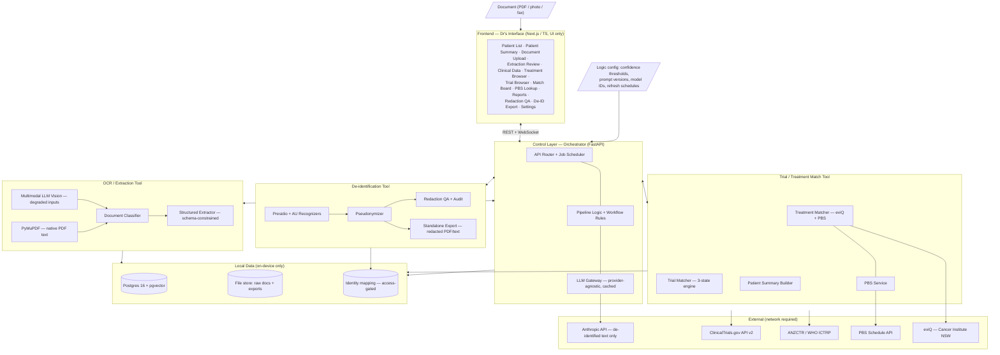
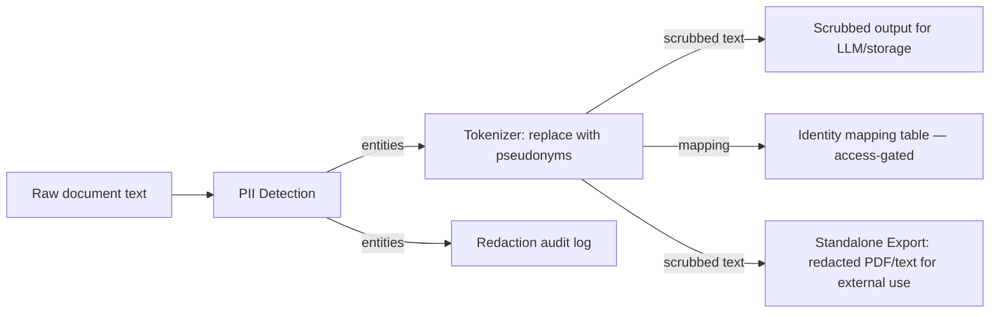
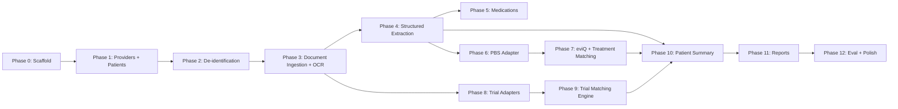

# Vigil — Clinical Decision Support Platform
### Technical Design Document v1.1

> **Working name:** *Vigil*. A local-first, single-practice clinical decision support tool for oncologists that ingests patient documents, structures clinical data, matches patients against standard-of-care treatments and clinical trials, and surfaces PBS drug information — all while keeping patient data on-device.
>
> **Audience:** This doc feeds two downstream steps — (1) **Claude Design** for UI mockups (see §5 Screen Inventory), and (2) **Claude Code** for implementation (see §3 Stack, §6 Data Model, §12 API Surface, §14 Repo Structure).
>
> **Regulatory posture:** Clinical Decision Support Software (CDSS) operating under the TGA CDSS exemption. The tool informs and supports; the clinician decides. It does not autonomously recommend, prescribe, or replace clinical judgment. All outputs are independently verifiable by the treating clinician. If this tool is ever distributed beyond a single practice, the exemption criteria must be re-evaluated and a TGA notification of supply may be required.

---

## ⚠️ CLAUDE CODE: ENVIRONMENT SETUP REQUIREMENTS

**CRITICAL: Do not install dependencies directly onto the host machine.**

All dependency installation must happen inside isolated environments:

- **Python dependencies:** Always create and use a virtual environment (`python -m venv .venv` or `conda create`) before installing any packages via `pip`. Never run `pip install` outside a venv.
- **Node.js dependencies:** Use `npm install` within the project directory (local `node_modules/`). Never use `npm install -g` for project dependencies.
- **System-level services (PostgreSQL, Redis):** Run exclusively via Docker containers defined in `docker-compose.yml`. Do not install Postgres, Redis, or any other service directly on the host OS.
- **OCR/document processing tools (Tesseract, LibreOffice):** These are installed inside the Docker backend container via the Dockerfile, not on the host.

The entire application stack runs via `docker compose up`. The only host prerequisites are Docker, Docker Compose, Node.js (for frontend dev), and Python 3.12+ (for backend dev outside Docker if preferred).

---

## 1. Goals & Design Principles

| # | Goal | Implication |
|---|------|-------------|
| G1 | **Clinical decision support, not clinical decision making.** The tool surfaces information; the oncologist decides. | All outputs framed as "information for review." No autonomous recommendations. No language suggesting the tool has made a clinical determination. Maintains TGA CDSS exemption. |
| G2 | **Local-first & private.** Patient data never leaves the machine except as explicitly permitted (de-identified LLM calls only). | Local Postgres, local file storage. De-identification pipeline runs before any external API call. PBS/trial refresh pulls public data in; patient data never goes out identifiable. |
| G3 | **Multi-patient, cancer-agnostic architecture.** Supports all malignancies — common and rare. Launches with breast, lung, colorectal, and melanoma; expands to all cancer types including rare tumours (e.g. Merkel cell, sarcomas) where the tool adds the most value because information and trials are hardest to find. | Clinical logic is registry/config-driven, not hardcoded to any diagnosis. `patient`-scoped everything. Adding a new cancer type requires only data (eviQ protocols + PBS cross-references), not code changes. |
| G4 | **Structured source of truth.** Free-text clinical documents → typed, queryable, longitudinal data. | Postgres relational core + generic Observation model for extensibility (§8). |
| G5 | **Traceable.** Every extracted value and every match decision cites its source. | Source-span provenance on extractions; evidence refs on criterion evaluations. |
| G6 | **Paper-ready.** Handles the worst-case input: phone photos of printouts, faxes, scanned PDFs, and native digital PDFs. | Multimodal LLM vision as primary OCR for degraded inputs; traditional text extraction for clean PDFs. |
| G7 | **Offline-capable for core workflows.** Document viewing, patient profiles, and previously-fetched data work without internet. | LLM extraction, trial refresh, and PBS refresh require network. Everything else works offline from local DB. |
| G8 | **Repeatable.** Re-running a patient through the pipeline reproduces the same structured profile and report. | Versioned prompts, pinned model IDs, deterministic report templates, content-addressed LLM cache. |

### Non-goals (v1)
- Not a regulated medical device. Operates under TGA CDSS exemption for single-practice use.
- No EMR/EHR integration (MOSAIQ, Genie, CHARM, EPIC). Standalone document upload only.
- No multi-practice / multi-tenant architecture. Single-practice deployment.
- No patient-facing features. Clinician-only tool.
- No treatment ordering or prescribing. Information display only.

---

## 2. Tiered Product Architecture

### Tier 1 — Document Ingestion & Patient Data Platform
The foundation. Handles document upload (any format: scanned PDF, digital PDF, phone photos, faxes), OCR/vision extraction, de-identification, structured data extraction, and patient profile construction. Includes a human-in-the-loop review workflow for low-confidence extractions.

### Tier 2 — Treatment & Clinical Trial Matching
Built on the structured data from Tier 1. Three sub-components:
- **Standard of care treatments** — sourced from eviQ (Cancer Institute NSW), cross-referenced with PBS drug listings. Deterministic: "for this cancer type/stage/molecular profile, these are the standard treatment protocols available in Australia."
- **PBS drug information** — sourced from the PBS Schedule API. Monthly refresh. Shows subsidy status, prescribing conditions, patient co-payment information for any recommended drug.
- **Clinical trial matching** — sourced from ClinicalTrials.gov API v2 and ANZCTR. Three-state eligibility engine (Eligible-looking / Needs-info / Excluded) with per-criterion evidence.

### Tier 3 — Patient Summary ("At a Glance")
The clinical payoff screen. A single view that gives the oncologist the most current picture of any patient before a consultation, built entirely from data ingested in Tier 1. Includes: current diagnosis and staging, latest scan results with trend direction (stable/progressing/responding), most recent bloods with anything flagged, current treatment line and best response, performance status (ECOG), molecular profile summary, open action items (pending reviews, missing data, upcoming trial windows), and a timeline of key clinical events. This is the screen Dr. De Souza opens before walking into a consultation room.

This tier is semi-independent — it relies on Tier 1 data but does not require Tier 2 (treatment/trial matching) to be built. It has standalone value as a patient record summarisation tool even if treatment matching is never used.

### Cross-cutting — Data Redaction & Privacy Toolkit
Not a tier but a foundational module with its own dedicated UI for:
- PII detection and pseudonymization quality assurance
- Synthetic patient data validation (test redaction against Dr. De Souza's synthetic datasets before real patient use)
- Redaction audit trail (what was detected, what was replaced, confidence scores)
- Pre-flight check before any LLM API call: visual confirmation that the text being sent contains no PII

---

## 3. Technology Stack

| Layer | Choice | Notes |
|-------|--------|-------|
| Frontend | **Next.js 14 (App Router) + TypeScript** | Local web app at `localhost:3000`. Offline-capable views via service worker + local cache. |
| UI | **Tailwind CSS + shadcn/ui**, TanStack Query, TanStack Table | Clinical-professional aesthetic. Dense tables. Green/amber/red state colours. Types generated from backend OpenAPI. |
| Backend | **Python 3.12 + FastAPI**, Pydantic v2 | Async REST + WebSocket for ingestion progress. |
| ORM / migrations | **SQLAlchemy 2.0 + Alembic** | Schema-versioned; no runtime DDL. |
| DB | **PostgreSQL 16** | JSONB for flexible payloads; **pgvector** for semantic search over criteria/clinical notes. |
| Jobs | **Durable job model** (job/job_step tables) + async worker | Resumable ingestion; no Celery/Redis overhead for single-user. |
| Doc parsing | **PyMuPDF / pdfplumber** for native PDFs; **multimodal LLM vision** (Claude) for degraded/scanned inputs | Vision-LLM is the primary path for phone photos and poor scans. Traditional OCR as fallback. |
| LLM | **Anthropic API** (Claude) via provider-agnostic gateway; **instructor** + Pydantic for structured output | Model IDs pinned per pipeline version. Temperature 0. Content-addressed caching. |
| De-identification | **Presidio** + custom AU recognizers (Medicare numbers, MRN formats, provider names, AU phone/address patterns, DOB) | Runs before any text is sent to LLM or persisted to analytic tables. See §9. |
| PBS data | **PBS Schedule API** (public, free) | Monthly refresh on 1st of each month. Full drug schedule with prescribing conditions. |
| Treatment protocols | **eviQ adapter** (Cancer Institute NSW) | Web scraper/indexer for standard-of-care treatment protocols. Structured by cancer type → line → protocol. |
| Trial data | **ClinicalTrials.gov API v2** + **ANZCTR** (WHO ICTRP feed / scraping) | Incremental refresh. Snapshotted for reproducibility. |
| Report export | **python-docx** + **LibreOffice headless** → PDF | Deterministic templates bound to structured data. |
| Eval | **pytest** + golden-set harness | Extraction accuracy, match-decision agreement, redaction completeness. |
| Packaging | **Docker Compose** (postgres, backend, frontend) | One-command local bring-up: `docker compose up`. |

> **Claude Code note:** The backend Dockerfile must install system dependencies (Tesseract, LibreOffice headless, poppler-utils) inside the container. The Python environment inside the container uses a virtualenv. The frontend runs in its own container with Node.js. PostgreSQL runs in the official `postgres:16` container. No services are installed on the host.

---

## 4. System Architecture

The architecture follows an orchestrator pattern: the frontend is UI-only, all logic flows through a central Control Layer that delegates to independent, swappable tool modules.



**Key architectural invariants:**

1. **Frontend is UI-only.** No business logic, no direct tool calls. Everything goes through the Control Layer.
2. **The Control Layer (Orchestrator) is the single brain.** It sequences operations (e.g. "de-identify → OCR → extract → review"), manages job state, and enforces the privacy invariant.
3. **Tools are independent modules.** The De-identification Tool, OCR Tool, and Match Tool are self-contained — they can be tested, versioned, and replaced independently. The orchestrator coordinates them.
4. **De-identification sits between raw input and everything else.** The OCR tool and Match tool never see identifiable patient data. The orchestrator enforces this by always routing through the De-identification Tool first.
5. **The `IDENTITY` store (pseudonym ↔ real identity mapping) is access-gated and never transmitted.** It lives in a separate table with separate access controls.

---

## 5. Screen Inventory (for Claude Design)

| # | Screen | Purpose | Key elements |
|---|--------|---------|--------------|
| 1 | **Dashboard** | Landing page / practice overview | Patient count, recent activity, pending reviews, upcoming trial refresh dates, system status (online/offline) |
| 2 | **Patient List** | Browse/search/create patient profiles | Table: display name, cancer type, stage, #docs, #eligible trials, last updated. "New patient" button. Search/filter by cancer type. |
| 3 | **Patient Overview** | At-a-glance clinical profile for one patient | Diagnosis header, molecular marker chips, therapy-line timeline, ECOG badge, CNS-status panel (if applicable), key lab trends, alerts (pending reviews, missing data). Tabs → Clinical Data / Documents / Treatments / Trials / Reports |
| 4 | **Document Upload** | Ingest documents into the system | Drag-drop zone + camera/scanner input. Per-document status stepper (uploaded → de-identified → classified → extracted → review). Document type badge. Supports batch upload. |
| 5 | **Extraction Review** | Human-in-the-loop QA for extracted data | Split view: source document (left, with highlight overlays on source spans) ↔ extracted structured fields (right). Confidence indicators. Accept/edit/reject per field. Low-confidence fields highlighted. |
| 6 | **Redaction QA** | Validate de-identification quality + standalone redaction export | Side-by-side: original text (left) ↔ redacted text (right). Detected PII entities highlighted with type labels (Name, DOB, MRN, Address, Phone, Medicare). Confidence scores. Manual override (mark missed PII / unmark false positives). "Pre-flight check" mode: preview exactly what text would be sent to the LLM API. Synthetic data test mode. **"Redact & Export" tab:** standalone de-identification mode — upload any document, de-identify it, and download/export the redacted version as PDF or text. Supports batch upload for clinical trial document submissions. Confirmed useful by Dr. De Souza for trial report uploads and referrals to other centres. |
| 7 | **Clinical Data Viewer** | Longitudinal structured patient data | Tabs per data type (Labs / Imaging / Lesions / Molecular / Therapy Lines / Performance Status / Comorbidities). Tables with time series. Lesion size trend sparklines. Lab value trend charts with reference ranges. Each row links to source document. |
| 8 | **Medication Manager** | Full medication list with reconciliation workflow | **Active Medications table:** drug name (generic + brand), dose, frequency, route, indication, category badge (cancer treatment / supportive care / comorbidity management / supplement), source badge (patient-reported / document-extracted / doctor-entered), confidence indicator (high/medium/low), verified status, start date, prescribing doctor. Sortable by category. **Add Medication form:** autocomplete against `drug_reference` table (typing "Norvasc" resolves to amlodipine), dose/frequency/route fields with common-value dropdowns, indication, category, start date, prescribing doctor. **Quick-add for doctor prescriptions:** streamlined single-row entry when the oncologist prescribes something new in clinic. **Discontinued tab:** past medications with reason for discontinuation. **Reconciliation workflow:** when meds are extracted from a new document, the system flags potential duplicates (brand/generic match, similar drug name) and asks the doctor to confirm: "Is 'Norvasc 5mg' the same as the existing 'Amlodipine 5mg'?" **Change log:** audit trail of every medication list change (who changed what, when, why). **Print view:** printable medication list suitable for the patient or for referral letters. |
| 8 | **Treatment Browser** | Standard-of-care treatment options | Filtered by patient's cancer type/stage/molecular profile. Sourced from eviQ. Each protocol shows: regimen name, line of therapy, drugs involved, PBS status per drug (with co-payment info), link to eviQ protocol page. Three states: PBS-listed / Not PBS-listed / PBS with restrictions. |
| 9 | **Trial Browser** | Explore local trial database | Filter by phase/status/site/condition/drug. Trial detail: eligibility criteria (parsed), sites with distance from practice, registry link, last refreshed date. |
| 10 | **Match Board** | Core output — patient vs trials | "Run match" button (select ruleset/model version). Results in three columns: Eligible-looking / Needs-info / Excluded. Each trial card expands to per-criterion evidence drawer (PASS/FAIL/UNKNOWN with rationale + source data). |
| 11 | **PBS Drug Lookup** | Quick drug reference | Search by drug name or active ingredient. Shows: PBS item code, restriction level (unrestricted / restricted / authority required), patient co-payment (general + concessional), prescribing conditions, indication-specific listings. Monthly refresh indicator. |
| 12 | **Patient Summary** | "At a Glance" — the consultation-ready landing page (Tier 3). This is the primary screen Dr. De Souza opens before walking into a consultation. | Single-screen layout with the following sections per Dr. De Souza's spec: **Registration:** Name, DOB, Age, Medicare number, Address, contact details, mobile phone number. **Diagnosis:** Cancer type, stage, histopathology, molecular profiling summary (marker chips). **Most Recent Results:** Latest blood tests (flagged values highlighted, sparkline trends for key analytes), latest scans (CT/MRI/PET — summary + trend indicator: stable/progressing/responding), latest PET scan. **Recent Treatment:** Most recent cycles of treatment (up to 6 months), current regimen, line number, best response. **Clinical Notes:** Most recent clinical note, most recent letter to referring doctor. **Management:** Overall plan of management. **Medical History:** Past medical illnesses / comorbidities (e.g. diabetes, arthritis — important for treatment decisions and trial eligibility), current medication list. **Open Items:** Pending extraction reviews, missing molecular data, trials with UNCERTAIN criteria that could be resolved. Each section shows a "Last updated" timestamp linking to its source document. Print-friendly and email-friendly layout — reports can be printed or emailed to another trial centre for referrals. |
| 13 | **Report Builder** | Generate & export clinical briefing | Template picker (treatment summary, trial matching report, patient summary snapshot, combined). Live preview. Export to PDF/DOCX. Version history. |
| 14 | **Provider Management** | Manage doctors and referring clinicians | List of providers (internal + external). Create/edit provider: title, name, provider number, specialty, contact details. Link providers to patients with roles (treating oncologist, referring GP, surgeon, etc.). Displays provider's patient panel. Used during patient registration and when assigning referring/treating doctors. |
| 15 | **Settings** | System configuration | LLM provider/model/API key, practice details (name, address, location for travel-time calcs), confidence thresholds, refresh schedules (PBS monthly, trials weekly/on-demand), trial geographic scope (AU only / AU+US+UK+EU), file storage paths, synthetic data import. |

**Design language:** Clinical-professional. Dense but legible tables. Colour-coded states throughout: green (meets/pass/PBS-listed), amber (needs-info/uncertain/restricted), red (excluded/fail/not-listed), grey (context/unknown/not-assessed). shadcn/ui + Tailwind so it maps cleanly to Claude Code output. No pixel art, no playfulness — this is a clinical tool. Think paycalculator.com.au density with better typography.

---

## 6. Data Model

### 6.1 Entity Relationships

```mermaid
erDiagram
    PRACTICE ||--o{ PROVIDER : employs
    PROVIDER ||--o{ PATIENT_PROVIDER : involved_with
    PATIENT ||--o{ PATIENT_PROVIDER : has_providers
    PATIENT ||--o{ DOCUMENT : has
    PATIENT ||--o{ DIAGNOSIS : has
    PATIENT ||--o{ MOLECULAR_RESULT : has
    PATIENT ||--o{ THERAPY_LINE : has
    PATIENT ||--o{ LESION : has
    PATIENT ||--o{ IMAGING_STUDY : has
    PATIENT ||--o{ LAB_RESULT : has
    PATIENT ||--o{ PERFORMANCE_STATUS : has
    PATIENT ||--o{ CNS_STATUS : has
    PATIENT ||--o{ COMORBIDITY : has
    PATIENT ||--o{ MEDICATION : takes
    MEDICATION }o--o| DRUG_REFERENCE : resolved_to
    MEDICATION }o--o| THERAPY_LINE : part_of
    MEDICATION }o--o| PROVIDER : prescribed_by
    MEDICATION ||--o{ MEDICATION_CHANGE_LOG : tracks
    DRUG_REFERENCE }o--o| PBS_ITEM : listed_on
    PATIENT ||--o{ MANAGEMENT_PLAN : has
    PATIENT ||--o{ CLINICAL_NOTE : has
    PATIENT ||--o{ OBSERVATION : has
    PATIENT ||--o{ MATCH_RUN : evaluated_in
    DOCUMENT ||--o{ EXTRACTION : yields
    EXTRACTION }o--|| DOCUMENT_TYPE : typed_as
    IMAGING_STUDY ||--o{ LESION_MEASUREMENT : measures
    LESION ||--o{ LESION_MEASUREMENT : tracked_by
    TRIAL ||--o{ TRIAL_SITE : at
    TRIAL ||--o{ TRIAL_CRITERION : defines
    MATCH_RUN ||--o{ MATCH_RESULT : contains
    MATCH_RESULT ||--o{ CRITERION_EVALUATION : details
    MATCH_RESULT }o--|| TRIAL : for
    MATCH_RUN }o--|| PATIENT : evaluates
    REPORT }o--|| MATCH_RUN : from
    DOCUMENT_TYPE ||--o{ OBSERVATION : governs
    TREATMENT_PROTOCOL ||--o{ PROTOCOL_DRUG : includes
    PROTOCOL_DRUG }o--|| PBS_ITEM : listed_as
    TREATMENT_PROTOCOL }o--|| CANCER_TYPE : for
    REDACTION_LOG ||--o{ REDACTION_ENTITY : contains
    REDACTION_LOG }o--|| DOCUMENT : for
```



### 6.2 Database Robustness — Constraints, Indexes & Conventions

> **Claude Code note: this section is mandatory.** Every table must implement these conventions. Do not skip constraints for speed — a corrupt clinical database is worse than a slow migration.

**Base model (all tables inherit):**
- `id` — UUID primary key, server-generated (`gen_random_uuid()`)
- `created_at` — `TIMESTAMPTZ NOT NULL DEFAULT now()`
- `updated_at` — `TIMESTAMPTZ NOT NULL DEFAULT now()`, auto-updated via trigger
- `deleted_at` — `TIMESTAMPTZ` nullable, for soft delete. All queries filter `WHERE deleted_at IS NULL` by default via SQLAlchemy query hooks.

**Foreign key constraints:**
- Every FK column has an explicit `REFERENCES` with `ON DELETE` behaviour:
  - Patient-scoped clinical data (labs, imaging, therapy lines, etc.): `ON DELETE CASCADE` — if a patient is hard-deleted, their clinical data goes with them
  - Provider references (e.g. `reviewed_by`, `uploaded_by`): `ON DELETE SET NULL` — providers can be removed without destroying audit history
  - Document → Patient: `ON DELETE CASCADE`
  - Extraction → Document: `ON DELETE CASCADE`
  - MatchResult → MatchRun: `ON DELETE CASCADE`
  - PatientProvider → Patient/Provider: `ON DELETE CASCADE`
- All FKs have a corresponding index on the referencing column (Postgres does not auto-create these)

**Check constraints:**
- Enum-like columns use `CHECK` constraints at the DB level, not application-level validation alone:
  - `provider.specialty IN ('medical_oncology', 'radiation_oncology', 'surgery', 'general_practice', 'haematology', 'pathology', 'radiology', 'other')`
  - `patient_provider.role IN ('treating_oncologist', 'referring_gp', 'referring_specialist', 'surgeon', 'radiation_oncologist', 'trial_coordinator')`
  - `document.deid_status IN ('pending', 'processing', 'complete', 'failed')`
  - `extraction.review_status IN ('pending', 'approved', 'edited', 'rejected')`
  - `match_result.overall_state IN ('ELIGIBLE', 'UNCERTAIN', 'INELIGIBLE')`
  - `criterion_evaluation.result IN ('PASS', 'FAIL', 'UNKNOWN')`
- Numeric bounds: `performance_status.value >= 0`, `lesion_measurement.size_mm > 0`

**Unique constraints:**
- `patient_identity.patient_id` — one identity row per patient
- `document(patient_id, sha256)` — prevent duplicate uploads of the same file for the same patient
- `provider.provider_number` (partial, where not null) — Medicare provider numbers are unique
- `pbs_item(item_code, schedule_date)` — one PBS entry per item per schedule month
- `trial(registry, external_id)` — one trial per registry ID

**Indexes (beyond auto-created PK and FK indexes):**
- `patient`: partial index on `deleted_at IS NULL` — speeds up active patient queries
- `lab_result`: composite `(patient_id, analyte, collected_at DESC)` — lab trend queries
- `imaging_study`: composite `(patient_id, modality, study_date DESC)` — latest scan queries
- `therapy_line`: composite `(patient_id, line_number)` — treatment history ordering
- `document`: composite `(patient_id, doc_date DESC)` — document timeline
- `trial`: GIN index on `conditions` (JSONB) — trial search by condition
- `trial_site`: composite `(country, city)` — geographic filtering
- `extraction`: index on `review_status` — pending review queue
- `llm_cache`: index on `cache_key` — cache lookups

**JSONB validation:**
- Columns typed as JSONB with a defined schema (e.g. `observation.values`, `extraction.data`) are validated at the application layer via Pydantic before write. The DB stores validated output.
- `document_type.json_schema` stores the JSON Schema that governs its associated extractions.

**Encryption:**
- Columns in `patient_identity` marked `_encrypted` use application-level AES-256-GCM encryption. The encryption key lives in `.env`, never in the database. These columns are `BYTEA` in Postgres, not `TEXT`.
- The `patient_identity` table is placed in a separate Postgres schema (`identity`) with restricted access grants, supporting row-level security if ever needed.

### 6.3 Table Catalogue

**Identity & Source**

| Table | Purpose | Key columns |
|-------|---------|-------------|
| `practice` | The clinical practice/clinic this instance serves | `id`, `name`, `address`, `phone`, `fax`, `email`, `abn` (nullable), `lat`, `lng` (for trial site distance calculations). Single row for v1 (single-practice deployment). |
| `provider` | Doctors, specialists, and other clinicians — both internal (this practice) and external (referring doctors, other specialists) | `id`, `title` (Dr/Prof/A.Prof), `first_name`, `last_name`, `provider_number` (Medicare provider number, nullable), `specialty` (medical_oncology/radiation_oncology/surgery/general_practice/haematology/pathology/radiology/other), `practice_id` (FK, nullable — null for external providers), `phone`, `email`, `fax`, `is_internal` (boolean — works at this practice vs external referrer/specialist), `notes` |
| `patient` | Pseudonymous clinical profile | `id`, `display_name` (pseudonym), `sex`, `dob_year` (not full DOB in analytic columns), `is_synthetic` (boolean — for test data), `created_at`, `updated_at` |
| `patient_identity` | **Access-gated.** Real name ↔ pseudonym mapping. Never transmitted. | `patient_id`, `real_name`, `real_dob`, `medicare_number_encrypted`, `mrn`, `address_encrypted`, `phone_encrypted`, `email_encrypted`, `next_of_kin_name`, `next_of_kin_phone_encrypted`. Separate table, separate access controls. |
| `patient_provider` | Which providers are involved with which patient and in what role | `patient_id`, `provider_id`, `role` (treating_oncologist/referring_gp/referring_specialist/surgeon/radiation_oncologist/trial_coordinator), `is_primary` (boolean), `relationship_start`, `relationship_end` (nullable — null = current), `notes` |
| `document` | One uploaded file | `patient_id`, `document_type_id`, `file_uri` (local object store), `sha256`, `doc_date`, `uploaded_at`, `uploaded_by` (FK → provider, nullable), `deid_status`, `input_method` (scan/photo/pdf/fax) |
| `document_type` | Registry of known doc types + extraction schemas | `key` (e.g. `radiology_ct_chest`), `display_name`, `json_schema` (JSONB), `extraction_prompt_ref`, `storage_mode` (typed/observation), `status` (active/proposed), `version` |

**Clinical Core (typed, high-value tables)**

| Table | Purpose | Key columns |
|-------|---------|-------------|
| `diagnosis` | Cancer diagnosis | `patient_id`, `cancer_type`, `histology`, `stage_system` (TNM/FIGO/Ann Arbor), `stage`, `primary_site`, `laterality`, `dx_date`, `source_extraction_id` |
| `molecular_result` | Genomic/IHC/molecular findings | `patient_id`, `gene`, `variant`, `method` (NGS/FISH/IHC/PCR), `result` (positive/negative/equivocal), `pd_l1_tps` (nullable), `assay_date`, `source_extraction_id` |
| `therapy_line` | Prior/current systemic therapy | `patient_id`, `line_number`, `regimen`, `agents` (JSONB array), `intent` (curative/palliative/adjuvant/neoadjuvant), `start_date`, `end_date`, `best_response` (CR/PR/SD/PD), `reason_stopped`, `source_extraction_id` |
| `imaging_study` | One imaging examination | `patient_id`, `modality` (CT/MRI/PET/bone/ultrasound), `body_region`, `study_date`, `impression`, `findings` (JSONB), `comparison_date`, `source_extraction_id` |
| `lesion` | A tracked lesion across time | `patient_id`, `site`, `laterality`, `character` (e.g. parenchymal, leptomeningeal), `first_seen_date`, `current_status` |
| `lesion_measurement` | One measurement of a lesion | `lesion_id`, `size_mm`, `study_date`, `modality`, `source_extraction_id` |
| `lab_result` | Single lab value | `patient_id`, `analyte`, `value`, `unit`, `ref_low`, `ref_high`, `flag` (low/normal/high/critical), `collected_at`, `panel` (FBC/UEC/LFT/TFT/tumour_markers), `source_extraction_id` |
| `performance_status` | ECOG or KPS at a point in time | `patient_id`, `scale` (ECOG/KPS), `value`, `assessed_on`, `source_extraction_id` |
| `cns_status` | CNS disease status (first-class because it gates most oncology trials) | `patient_id`, `present`, `lesion_count`, `locations` (JSONB), `treated`, `treatment_type`, `symptomatic`, `on_steroids`, `steroid_dose_mg`, `leptomeningeal`, `assessed_on`, `source_extraction_id` |
| `comorbidity` | Past medical history / other conditions (diabetes, arthritis, cardiac, renal — affects treatment decisions and trial eligibility) | `patient_id`, `condition_name`, `icd10_code` (nullable), `status` (active/resolved/managed), `diagnosed_date` (nullable), `notes`, `source_extraction_id` |
| `management_plan` | Overall plan of management — the treating oncologist's stated plan | `patient_id`, `plan_text`, `authored_by` (FK → provider), `plan_date`, `source_extraction_id` |
| `clinical_note` | Free-text clinical notes and letters (most recent clinical note, letters to referring doctors) | `patient_id`, `note_type` (clinical_note/letter_to_referrer/discharge_summary), `author` (FK → provider, nullable), `recipient` (FK → provider, nullable), `note_date`, `content_summary`, `key_points` (JSONB), `source_extraction_id` |

**Medication Tracking**

Medication tracking has its own section because it spans multiple concerns: patient-reported meds, document-extracted meds, doctor-prescribed additions, and drug reference data. It must handle the reality that patients bring incomplete or inconsistent information — brand vs. generic names, vague descriptions, missing doses — while still being useful for drug interaction awareness and trial eligibility screening.

There are two categories of medication tracked in different places:
- **Cancer treatments** are tracked in `therapy_line` at the regimen level (e.g. "Line 2: Carboplatin + Pemetrexed"). This is the oncologist's treatment journey view.
- **All individual medications** — including cancer drugs, supportive care (antiemetics, growth factors, steroids), and non-cancer medications (blood pressure, diabetes, pain, supplements) — are tracked in `medication`. There will be intentional overlap: the drugs in a therapy_line also appear as individual medication rows so the full medication list is in one place.

| Table | Purpose | Key columns |
|-------|---------|-------------|
| `drug_reference` | Canonical drug lookup table — maps brand names to generics, enables deduplication | `id`, `generic_name` (canonical, e.g. "amlodipine"), `brand_names` (JSONB array, e.g. ["Norvasc", "Amlodipine Sandoz"]), `drug_class` (e.g. "calcium_channel_blocker", "TKI", "checkpoint_inhibitor", "antiemetic"), `atc_code` (ATC classification, nullable), `is_cancer_drug` (boolean), `pbs_item_id` (FK → pbs_item, nullable — links to PBS if listed), `common_doses` (JSONB array of typical dose strings, e.g. ["5mg", "10mg"] — for autocomplete, not validation), `common_routes` (JSONB array, e.g. ["oral"]) |
| `medication` | One medication a patient is taking, has taken, or has been prescribed | `id`, `patient_id`, `drug_reference_id` (FK → drug_reference, nullable — null when the drug can't be resolved to a known reference), `drug_name_raw` (what was actually stated/written — preserves original text before normalization), `generic_name` (resolved, nullable), `brand_name` (if stated, nullable), `dose_amount` (numeric, nullable — null when patient says "I take something for blood pressure" without knowing the dose), `dose_unit` (mg/mcg/g/mL/units/puffs, nullable), `dose_display` (human-readable string, e.g. "5mg twice daily" — for display when structured fields are incomplete), `frequency` (daily/twice_daily/three_times_daily/weekly/fortnightly/monthly/prn/stat/other), `frequency_detail` (nullable free text for complex schedules, e.g. "Mon/Wed/Fri"), `route` (oral/iv/subcut/im/topical/inhaled/pr/other), `indication` (what it's for — nullable free text, e.g. "hypertension", "nausea prevention"), `category` (cancer_treatment/supportive_care/comorbidity_management/supplement/other), `status` (active/discontinued/on_hold/completed/unknown), `start_date` (nullable), `end_date` (nullable — null = current if status is active), `reason_discontinued` (nullable — e.g. "side effects", "completed course", "switched to alternative"), `prescribed_by` (FK → provider, nullable), `source` (patient_reported/document_extracted/doctor_entered/pharmacy_list), `confidence` (high/medium/low — how reliable is this entry? patient verbal recall = low; GP letter = medium; doctor entered = high), `verified_by` (FK → provider, nullable — doctor confirmed this entry is correct), `verified_at` (nullable), `therapy_line_id` (FK → therapy_line, nullable — links cancer drugs back to their treatment line), `source_extraction_id` (nullable — null for manually entered meds), `notes` |
| `medication_change_log` | Audit trail for medication list changes (additions, dose changes, discontinuations) | `id`, `medication_id` (FK), `change_type` (added/dose_changed/discontinued/restarted/status_changed/verified/corrected), `previous_value` (JSONB — snapshot of changed fields before), `new_value` (JSONB — snapshot after), `changed_by` (FK → provider), `changed_at`, `reason` (nullable) |

**Generic Long-Tail**

| Table | Purpose | Key columns |
|-------|---------|-------------|
| `observation` | Normalized point-in-time clinical facts for types without dedicated tables | `patient_id`, `document_type_id`, `code_system`, `code`, `value_num`, `value_str`, `unit`, `effective_date`, `source_extraction_id`, `values` (JSONB validated against document_type.json_schema) |

**Extractions & Review**

| Table | Purpose | Key columns |
|-------|---------|-------------|
| `extraction` | Structured output of one document | `document_id`, `document_type_id`, `data` (JSONB), `confidence`, `review_status` (pending/approved/edited/rejected), `reviewed_by` (FK → provider), `reviewed_at`, `pipeline_run_id`, `source_spans` (JSONB) |

**Treatment & PBS**

| Table | Purpose | Key columns |
|-------|---------|-------------|
| `cancer_type` | Registry of cancer types we support | `key` (e.g. `nsclc`, `breast_hr_positive`), `display_name`, `icd10_codes` (JSONB), `active` |
| `treatment_protocol` | Standard-of-care protocol from eviQ | `id`, `cancer_type_id`, `protocol_name`, `line_of_therapy`, `intent`, `eviq_id`, `eviq_url`, `evidence_level`, `last_refreshed`, `raw_data` (JSONB) |
| `protocol_drug` | One drug in a protocol | `treatment_protocol_id`, `drug_name`, `generic_name`, `role` (backbone/combination/maintenance), `route`, `pbs_item_id` (nullable FK) |
| `pbs_item` | PBS Schedule entry | `item_code`, `drug_name`, `brand_names` (JSONB), `restriction_level` (unrestricted/restricted/authority_required/authority_required_streamlined), `indications` (JSONB), `max_quantity`, `repeats`, `patient_copay_general`, `patient_copay_concessional`, `schedule_date`, `raw_data` (JSONB) |
| `pbs_refresh_log` | Tracks monthly PBS data refreshes | `id`, `schedule_date`, `refreshed_at`, `item_count`, `status` |

**Trials & Matching**

| Table | Purpose | Key columns |
|-------|---------|-------------|
| `trial` | Registry record | `id`, `registry` (CTGOV/ANZCTR), `external_id` (NCT…), `title`, `phase`, `overall_status`, `sponsor`, `conditions` (JSONB), `interventions` (JSONB), `snapshot_id`, `last_updated` |
| `trial_site` | Site + geography | `trial_id`, `facility`, `city`, `state`, `country`, `site_status`, `lat`, `lng`, `travel_min` (computed from practice location) |
| `trial_criterion` | Parsed eligibility criterion | `trial_id`, `kind` (inclusion/exclusion), `raw_text`, `structured` (JSONB: `{attribute, operator, value}` nullable), `category`, `parser_version` |
| `trial_snapshot` | Immutable registry snapshot | `id`, `taken_at`, `registry`, `query_params`, `record_count` |
| `match_run` | One patient × trial-set evaluation | `patient_id`, `ruleset_version`, `model_version`, `snapshot_id`, `created_at` |
| `match_result` | One patient × one trial result | `match_run_id`, `trial_id`, `overall_state` (ELIGIBLE/UNCERTAIN/INELIGIBLE), `score` |
| `criterion_evaluation` | Per-criterion result | `match_result_id`, `trial_criterion_id`, `result` (PASS/FAIL/UNKNOWN), `rationale`, `evidence_ref` (JSONB: patient data point + criterion text) |

**Redaction & Privacy**

| Table | Purpose | Key columns |
|-------|---------|-------------|
| `redaction_log` | Record of PII detection for one document | `id`, `document_id`, `pipeline_run_id`, `created_at`, `entity_count`, `overall_confidence` |
| `redaction_entity` | One detected PII entity | `redaction_log_id`, `entity_type` (NAME/DOB/MRN/MEDICARE/ADDRESS/PHONE/PROVIDER_NAME), `original_text_hash` (hash, not plaintext — for dedup/audit without storing PII), `replacement_token`, `start_offset`, `end_offset`, `confidence`, `manually_verified` |

**Reports & Audit**

| Table | Purpose | Key columns |
|-------|---------|-------------|
| `report` | Generated clinical briefing | `patient_id`, `match_run_id`, `report_type` (treatment_summary/trial_match/combined), `template_version`, `manifest` (JSONB), `file_uri`, `created_at` |
| `pipeline_run` | Audit record of any pipeline execution | `id`, `kind` (ingest/extract/match/report/pbs_refresh/trial_refresh/eviq_refresh), `status`, `inputs` (JSONB), `versions` (JSONB), `started_at`, `finished_at`, `error_detail` |
| `llm_call_log` | Every external LLM call | `pipeline_step`, `model_id`, `prompt_version`, `tokens_in`, `tokens_out`, `cost_aud`, `latency_ms`, `input_hash`, `cache_hit` |
| `llm_cache` | Content-addressed LLM response cache | `cache_key` (hash of prompt_version + model_id + input_hash), `response` (JSONB), `created_at` |

---

## 7. Document Ingestion Pipeline

```mermaid
flowchart LR
    U[Upload: PDF / photo / fax] --> T{Text extractable?}
    T -- native PDF --> P[PyMuPDF text extraction]
    T -- scanned/photo/degraded --> V[Multimodal LLM vision extraction]
    P & V --> D[De-identify: Presidio + AU recognizers]
    D --> QA{Redaction QA passed?}
    QA -- auto-pass high confidence --> C[Classify document type]
    QA -- low confidence / first use --> RQ[Redaction QA review UI] --> C
    C -- known type --> E[LLM structured extraction — temp 0, schema-constrained]
    C -- unknown type --> N[Propose new document_type via schema induction §8]
    E --> VAL[Pydantic validation + confidence score]
    VAL --> R{Confidence ≥ threshold?}
    R -- yes --> PERSIST[Auto-stage as 'pending review']
    R -- no --> REVIEW[Flag 'needs review']
    PERSIST & REVIEW --> HUMAN[Human review UI: accept/edit/reject]
    HUMAN --> WRITE[Write to typed tables / observation]
```



**Key design decisions:**

- **Multimodal LLM vision is the primary OCR path for degraded inputs.** Phone photos of printouts, faxes, and poor scans go directly to Claude's vision model. This is more expensive per document but dramatically more accurate than Tesseract on the kind of real-world inputs a doctor's office produces. Native PDF text extraction (PyMuPDF) handles clean digital PDFs.
- **De-identification runs before classification or extraction.** The LLM never sees identifiable patient data. The scrubbed clinical text (findings, measurements, mutations, treatment details) is what the LLM processes.
- **Redaction QA is an explicit gate**, not a silent pass-through. In the early phases (and whenever synthetic data testing mode is active), every redaction goes through the QA UI. Once confidence is validated, high-confidence redactions auto-pass but are still logged and auditable.
- **Nothing writes to clinical tables until `review_status = approved`.** This is the guardrail that prevents a hallucinated lab value from silently driving a match decision.

### 7.1 Supported Document Types (launch set)

| Type key | Source documents | Extracts into |
|----------|-----------------|---------------|
| `radiology_ct` | CT scans (chest/abdo/pelvis/brain) | `imaging_study`, `lesion`, `lesion_measurement` |
| `radiology_mri` | MRI (brain, liver, spine) | `imaging_study`, `lesion`, `lesion_measurement`, `cns_status` |
| `radiology_pet_ct` | PET/CT | `imaging_study`, `observation` (SUV values, avid sites) |
| `radiology_bone_scan` | Bone scan | `imaging_study`, `observation` |
| `pathology_histology` | Histopathology reports | `diagnosis`, `molecular_result` (IHC panel: ER/PR/HER2/Ki67 for breast; TTF1/p40 for lung) |
| `pathology_molecular` | NGS / molecular addendum | `molecular_result` (EGFR, ALK, ROS1, BRAF, KRAS, PD-L1 TPS, HER2, PIK3CA, BRCA1/2, MSI) |
| `labs_haematology` | FBC/CBC | `lab_result` (Hb, WCC, platelets, neutrophils, lymphocytes) |
| `labs_chemistry` | U&E/LFT/renal/bone profile | `lab_result` |
| `labs_tumour_markers` | CEA, CA15-3, CA125, PSA, AFP, etc. | `lab_result` with `panel = tumour_markers` |
| `clinical_letter` | Oncologist letters, discharge summaries, GP referrals | `diagnosis`, `therapy_line`, `performance_status`, `comorbidity`, `medication`, `management_plan`, `clinical_note` |
| `medication_list` | Printed medication lists, pharmacy printouts, patient-provided lists, photos of pill bottles | `medication` (multiple rows — one per drug). Source set to `patient_reported` or `pharmacy_list`. Confidence set to `medium` for printed lists, `low` for handwritten/verbal. |
| `surgical_report` | Operative notes | `observation`, `therapy_line` (surgical line) |
| `radiation_report` | Radiation oncology treatment summaries | `therapy_line` (radiation line), `observation` |

> **Claude Code notes on document types:**
> - Each document type has a corresponding Pydantic model in `backend/app/modules/extraction/schemas/`. The Pydantic model is the single source of truth: it constrains the LLM's structured output AND validates the extraction result. All extraction prompts live in `prompts/extraction/` as versioned template files.
> - **Medication extraction from clinical letters** is particularly important: GP referral letters almost always contain a medication list. The extraction prompt must pull each drug as a separate medication row with whatever detail is available (drug name is mandatory; dose, frequency, route, indication are best-effort). The pipeline must attempt to resolve each extracted drug name against `drug_reference` to normalize brand → generic and flag potential duplicates against existing medications for the patient.

### 7.2 Medication Reconciliation Pipeline

When medications are extracted from a new document, they go through a reconciliation step before being added to the patient's medication list:

```
Extracted medication (e.g. "Norvasc 5mg daily")
        │
        ▼
Resolve against drug_reference
        │  ├── Exact match → generic_name = "amlodipine", drug_reference_id set
        │  ├── Fuzzy match → flag for review ("Did you mean amlodipine?")
        │  └── No match → keep drug_name_raw, drug_reference_id = null, flag for review
        ▼
Check for duplicates in patient's existing medication list
        │  ├── Same drug_reference_id + same dose → skip (already tracked)
        │  ├── Same drug_reference_id + different dose → flag as dose change
        │  ├── Same drug class / similar name → flag as potential duplicate for review
        │  └── No match → new medication
        ▼
Stage as 'pending reconciliation' (visible in Medication Manager reconciliation queue)
        │
        ▼
Doctor/coordinator reviews: confirm new / mark duplicate / update existing / reject
        │
        ▼
Write to medication table with source = 'document_extracted'
```

### 7.3 Drug Reference Table Seeding

The `drug_reference` table is pre-seeded at database initialization with common oncology and supportive care drugs plus common non-cancer medications. Sources for seeding:

- **PBS Schedule data** — all oncology-listed drugs (already available from PBS adapter). Cross-linked via `pbs_item_id`.
- **eviQ protocol drugs** — all drugs appearing in indexed treatment protocols.
- **Common non-cancer medications** — a curated seed list of the ~500 most commonly prescribed medications in Australia (antihypertensives, diabetes meds, statins, PPIs, anticoagulants, pain medications, common supplements). Built from PBS data filtered by dispensing volume.

The table grows over time as new drugs are encountered and manually added during reconciliation. The `common_doses` and `common_routes` fields power autocomplete in the Add Medication form.

> **Claude Code note:** Create a seed script at `backend/scripts/seed_drug_reference.py` that populates the `drug_reference` table from PBS data and a curated JSON file (`data/seed/common_medications.json`). The seed JSON should ship with the repo (it's reference data, not patient data). Run the seed script as part of the Alembic migration or as a post-migration data load.

---

## 8. Dynamic Test Types (schema induction)

Same architecture as Trellis/TrialMatch: **registry + JSONB, with optional human-approved promotion to typed table.**

1. Unknown document → LLM proposes `{type_key, display_name, json_schema, extraction_prompt}` → status `proposed`
2. Clinician/operator reviews and approves in the UI → becomes `active`
3. Extractions stored in `observation.values` (JSONB), validated against the registered schema
4. If a type becomes high-volume, promote to a dedicated table via Alembic migration

**No runtime DDL. No LLM-generated CREATE TABLE statements.**

---

## 9. De-identification Engine (Cross-cutting)

### 9.1 Architecture



### 9.1.1 Standalone De-identification Mode

Confirmed as independently useful by Dr. De Souza. Clinical trial reports (blood tests, scans, etc.) must be de-identified before being uploaded to trial portals or faxed to other centres. This mode provides:
- **"Redact this document" workflow:** Upload a document → de-identify → download/export the redacted version as PDF or plain text.
- **No ingestion required.** The document does not need to be attached to a patient or processed through the full extraction pipeline.
- **Batch mode:** Redact multiple documents at once for trial submissions.
- **Audit trail:** Every standalone redaction is logged with the same audit detail as pipeline redactions.

This is accessible from the Redaction QA screen as a separate "Redact & Export" tab.

### 9.2 PII Entity Types (Australian-specific)

| Entity type | Detection method | Examples |
|-------------|-----------------|----------|
| `PERSON_NAME` | Presidio NER + pattern matching | "Dr. Paul De Souza", "Kelly Nguyen" |
| `DATE_OF_BIRTH` | Regex patterns (DD/MM/YYYY, D-Mon-YYYY, etc.) + contextual ("DOB:", "born") | "15/03/1965" |
| `MEDICARE_NUMBER` | Regex: 10-digit with check digit + optional IRN | "2123 45670 1/1" |
| `MRN` | Regex: configurable per-institution format (typically 6-8 digits with optional prefix) | "MRN: 1234567", "UR: A987654" |
| `ADDRESS` | Presidio + AU address patterns (street number + street name + suburb + state + postcode) | "42 Smith St, Hurstville NSW 2220" |
| `PHONE` | Regex: AU mobile (04xx), landline (02/03/07/08), international | "0412 345 678" |
| `PROVIDER_NAME` | Named entity + title patterns ("Dr.", "Prof.", clinic/hospital names) | "St George Private Hospital" |
| `REFERRING_DOCTOR` | Context-aware: "Referred by", "Referring:", letter signatures | "Referred by Dr. Jane Smith" |

### 9.3 Pseudonymization Strategy

- **Reversible within the local system.** The `patient_identity` table stores the real-name ↔ pseudonym mapping. This mapping never leaves the device.
- **Irreversible in what leaves the device.** The scrubbed text sent to the LLM API uses consistent replacement tokens (e.g. `[PATIENT]`, `[DOB_REDACTED]`, `[PROVIDER_1]`) so the LLM can still reason about "this patient" and "their referring doctor" without knowing who they are.
- **Consistency within a patient.** The same real name always maps to the same pseudonym token within a patient's document set, so cross-document references remain coherent.

### 9.4 Synthetic Data Testing Mode

Before any real patient data is processed:

1. Dr. De Souza creates synthetic patient records (fake names, fake MRNs, realistic clinical content)
2. These are loaded into the system as "synthetic" patients (flagged in the DB)
3. The redaction pipeline runs on them
4. The Redaction QA UI shows exactly what was detected and replaced
5. False negatives (missed PII) and false positives (clinical terms incorrectly flagged as PII) are identified and used to tune the recognizers
6. Only after redaction quality is validated on synthetic data does the system process real patient documents

> **Claude Code note:** Add a `is_synthetic` boolean flag on the `patient` table. Synthetic patients are visually distinguished in the UI (e.g. a "SYNTHETIC" badge). The synthetic data import accepts a directory of PDF/image files with a companion JSON manifest mapping filenames to expected PII entities (ground truth for redaction accuracy evaluation).

---

## 10. Treatment Matching — Standard of Care (eviQ + PBS)

### 10.1 eviQ Adapter

eviQ (eviq.org.au) is a free, open-access resource of evidence-based cancer treatment protocols maintained by Cancer Institute NSW. It is structured by:
- Cancer type (e.g. breast, lung, colorectal, melanoma)
- Treatment intent (curative, palliative, adjuvant, neoadjuvant)
- Line of therapy (first-line, second-line, etc.)
- Specific protocol (e.g. "Carboplatin AUC5 + Pemetrexed" for NSCLC)

The adapter:
1. Indexes eviQ protocol pages for the four launch cancer types (breast, lung, colorectal, melanoma)
2. Extracts structured protocol data: regimen name, drugs, dosing, indications, molecular requirements (e.g. "HER2-positive" or "EGFR-mutant")
3. Stores in `treatment_protocol` + `protocol_drug` tables
4. Cross-references each drug against the local `pbs_item` table
5. Refreshes periodically (eviQ updates are irregular — check weekly, log changes)

> **Claude Code note:** eviQ has no formal API. Build a respectful scraper with appropriate rate limiting (minimum 2-second delay between requests), proper User-Agent identification, and caching. Store raw HTML in the file store for audit/re-parse. If eviQ's structure changes, the adapter should fail gracefully and flag for manual review rather than silently producing incorrect data. Verify eviQ's terms of use at build time — it is freely accessible and endorsed for clinical use, but confirm there are no restrictions on programmatic access.

### 10.2 PBS Schedule Adapter

The PBS public API (data.pbs.gov.au) provides the complete PBS Schedule dataset, updated on the 1st of every month.

The adapter:
1. Pulls the full oncology-relevant drug listing on the 1st of each month (or on-demand)
2. Normalizes into `pbs_item` table: item code, drug name, brand names, restriction level, indications, co-payment amounts
3. Cross-links with `protocol_drug` entries

Key PBS fields to surface in the UI:
- **Restriction level:** Unrestricted / Restricted / Authority Required / Authority Required (Streamlined)
- **Specific indications:** e.g. "For the treatment of locally advanced or metastatic non-small cell lung cancer with EGFR exon 19 deletion or L858R mutation"
- **Patient co-payment:** General rate and Concessional rate
- **Safety Net thresholds**

### 10.3 Treatment Matching Logic

This is **deterministic, not LLM-driven.** The LLM is only used to validate compatibility in ambiguous cases.

```
For a given patient:
1. Look up cancer_type from diagnosis
2. Query treatment_protocol WHERE cancer_type matches AND line_of_therapy ≥ patient's current line
3. Filter by molecular requirements:
   - Protocol requires EGFR+ → check patient.molecular_result for EGFR positive
   - Protocol requires HER2+ → check patient.molecular_result for HER2 positive
   - etc.
4. For each matching protocol, look up PBS status of each drug:
   - All drugs PBS-listed for this indication → GREEN "PBS-covered"
   - Some drugs not PBS-listed → AMBER "Partially PBS-covered — [drug X] not on PBS for this indication"
   - Key drug not PBS-listed → RED "Not PBS-covered for this indication"
5. Surface results in Treatment Browser, ordered by: current standard of care first, then alternatives
```

The LLM is used only when:
- A protocol's molecular/staging requirements are ambiguous or can't be deterministically matched against the patient's structured data
- The patient's clinical situation has nuances not captured in structured fields (e.g. comorbidities affecting drug choice)
- The clinician asks "why is this protocol showing as an option?" and the system needs to generate an explanation

---

## 11. Clinical Trial Matching — Three-State Engine

Identical architecture to Trellis/TrialMatch. Per trial, evaluate each gating criterion to **PASS / FAIL / UNKNOWN**.

### 11.1 Trial Data Sources & Geographic Scope

**ClinicalTrials.gov API v2** — primary source. Field-scoped queries, pagination, incremental refresh keyed on `lastUpdatePostDate`.

**ANZCTR** — via WHO ICTRP feed. No clean public API. v1: WHO ICTRP XML feed as primary; direct scraping as fallback. Flag as lower-confidence source.

**Geographic scope (confirmed by Dr. De Souza):** Australian trials are the primary, most practical focus. International trials are configurable but limited to **US, UK, and Europe** to avoid information overload — a global scope would surface 20× the volume and overwhelm the clinician. The settings page includes a geographic filter with presets: "Australia only" (default), "Australia + US/UK/EU", or custom country selection.

### 11.2 Criterion Parsing

Trial eligibility free-text → array of structured criteria. A controlled **attribute vocabulary** maps between parsed criteria and patient data:

`age`, `ecog`, `prior_systemic_lines`, `required_mutation` (EGFR, ALK, ROS1, BRAF, KRAS, HER2, BRCA, etc.), `pd_l1_tps`, `brain_mets_status`, `leptomeningeal_disease`, `measurable_disease`, `organ_function` (creatinine clearance, liver function, ANC, platelets), `prior_immunotherapy`, `prior_targeted_therapy`, `hormone_receptor_status`, `her2_status`, `stage_minimum`, `histology_required`

### 11.3 Evaluation

- **Deterministic pre-filters** on structured fields: age, ECOG, required mutations, line count, stage, hormone receptor status, HER2 status, organ function thresholds, CNS flags.
- **LLM criterion evaluation** for free-text criteria that can't be deterministically resolved. Input = criterion text + relevant patient structured data (de-identified). Output = `{result, rationale, evidence_ref}`.

### 11.4 Aggregation

| Condition | Trial-level result |
|-----------|-------------------|
| Any hard exclusion = FAIL, or any required inclusion = FAIL | **INELIGIBLE** |
| No FAILs, but ≥1 gating criterion = UNKNOWN | **UNCERTAIN** (surfaces exactly what's unknown) |
| All gating criteria = PASS | **ELIGIBLE** |

---

## 12. API Surface (FastAPI)

```
# Patients
POST   /patients                           Create patient profile
GET    /patients                           List patients (filter by cancer_type, provider)
GET    /patients/{id}                      Profile + derived clinical summary
PATCH  /patients/{id}                      Update profile

# Providers & Practice
GET    /practice                           Practice details (single practice, v1)
PATCH  /practice                           Update practice details
POST   /providers                          Create provider (internal or external)
GET    /providers                          List providers (filter by specialty, is_internal)
GET    /providers/{id}                     Provider detail + their patients
PATCH  /providers/{id}                     Update provider
POST   /patients/{id}/providers            Link provider to patient with role
GET    /patients/{id}/providers            List providers for a patient

# Documents
POST   /patients/{id}/documents            Upload → starts ingestion pipeline
GET    /patients/{id}/documents            List documents
GET    /documents/{id}                     Document detail + extraction status

# Extractions & Review
GET    /documents/{id}/extraction          Extracted data + source spans
POST   /extractions/{id}/review            Accept/edit/reject extraction
GET    /patients/{id}/review-queue         Pending reviews for a patient

# Redaction QA
GET    /documents/{id}/redaction           Redaction log + entities
POST   /documents/{id}/redaction/verify    Mark entity as verified/false-positive
GET    /redaction/preflight/{id}           Preview: exactly what text would go to LLM
POST   /redaction/synthetic-test           Run redaction on synthetic data batch

# Standalone De-identification (confirmed useful by Dr. De Souza)
POST   /redaction/standalone               Upload doc → de-identify → return redacted version
POST   /redaction/standalone/batch         Batch de-identify multiple documents
GET    /redaction/standalone/{id}/export    Download redacted document as PDF/text

# Clinical Data
GET    /patients/{id}/observations         All structured data (filter by type, date range)
GET    /patients/{id}/labs                 Lab results (filter by panel, analyte)
GET    /patients/{id}/imaging              Imaging studies
GET    /patients/{id}/lesions              Lesion tracking with measurements
GET    /patients/{id}/molecular            Molecular results
GET    /patients/{id}/therapy-lines        Treatment history
GET    /patients/{id}/comorbidities        Past medical history / other conditions
# Medications
GET    /patients/{id}/medications          Full medication list (filter by status, category)
POST   /patients/{id}/medications          Add medication manually (doctor-entered)
PATCH  /medications/{id}                   Update medication (dose change, discontinue, etc.)
POST   /medications/{id}/verify            Doctor verifies an extracted/patient-reported med
POST   /medications/{id}/discontinue       Discontinue with reason
GET    /medications/{id}/changelog         Change log for one medication
GET    /patients/{id}/medications/reconcile Pending reconciliation items (potential duplicates from new extractions)
POST   /patients/{id}/medications/reconcile Resolve a reconciliation (confirm duplicate / mark as separate)
GET    /drug-reference                     Search drug reference table (autocomplete)
GET    /drug-reference/{id}                Drug detail + PBS linkage
GET    /patients/{id}/management-plan      Overall plan of management
GET    /patients/{id}/clinical-notes       Clinical notes + letters to referrers
GET    /patients/{id}/timeline             Longitudinal clinical timeline

# Treatments (eviQ + PBS)
GET    /treatments                         Browse treatment protocols (filter by cancer_type, line)
GET    /treatments/{id}                    Protocol detail + PBS status per drug
POST   /treatments/refresh                 Refresh eviQ data
GET    /patients/{id}/treatment-options     Treatment protocols matching this patient's profile

# PBS
GET    /pbs/drugs                          Search PBS drug listings
GET    /pbs/drugs/{item_code}              PBS item detail
POST   /pbs/refresh                        Pull latest PBS schedule

# Trials
POST   /trials/refresh                     Pull/refresh from ClinicalTrials.gov + ANZCTR
GET    /trials                             Browse/filter trial database
GET    /trials/{id}                        Trial detail + parsed criteria + sites

# Patient Summary (Tier 3 — "At a Glance" landing page)
GET    /patients/{id}/summary              Full summary (registration, diagnosis, latest results, recent treatment, clinical notes, management plan, comorbidities, medications, open items)
GET    /patients/{id}/summary/imaging      Latest imaging with trend
GET    /patients/{id}/summary/labs         Latest labs with flags + sparkline data
GET    /patients/{id}/summary/treatment    Current treatment line + recent cycles (up to 6 months)
GET    /patients/{id}/summary/notes        Most recent clinical note + most recent letter to referrer
GET    /patients/{id}/summary/plan         Overall management plan
GET    /patients/{id}/summary/actions      Open items needing attention

# Matching
POST   /patients/{id}/match                Run matching engine → match_run
GET    /match-runs/{id}                    Match results + per-criterion evaluations
GET    /match-runs/{id}/diff?vs={other_id} Change set vs a prior run

# Reports
POST   /patients/{id}/reports              Generate report (select type + template)
GET    /reports/{id}                       Report detail
GET    /reports/{id}/export?format=pdf     Export as PDF or DOCX

# System
GET    /pipeline-runs                      Audit trail
GET    /pipeline-runs/{id}                 Pipeline run detail
GET    /document-types                     Document type registry
POST   /document-types/{key}/approve       Approve a proposed new type
GET    /health                             System health (DB, LLM connectivity, last refresh dates)
```

All mutating pipeline endpoints return a `pipeline_run_id`. The frontend polls status via `GET /pipeline-runs/{id}` or subscribes via WebSocket at `WS /pipeline-runs/{id}/stream`.

---

## 13. LLM Orchestration & Privacy

| Concern | Design |
|---------|--------|
| Provider abstraction | `LLMGateway` interface; Anthropic implementation v1. All calls go through it. |
| Structured output | Tool/JSON-schema-constrained responses → Pydantic validation → retry on invalid. No free-form parsing. |
| Prompt registry | Prompts are versioned artifacts (`prompt_key@version`) in `prompts/` directory. Version recorded on every `pipeline_run`. |
| Caching | `llm_cache` keyed on `hash(prompt_version, model_id, input_hash)`. Cache hit → identical output → reproducibility. |
| Task separation | `extract_*`, `classify_document`, `parse_criteria`, `adjudicate_criterion`, `narrate_*` are distinct prompt families with distinct schemas. |
| Guardrails | Pydantic validation, confidence scoring, repair pass on invalid output, human review gate. |
| Cost/observability | Log tokens + latency + cost per call on `llm_call_log`. |
| **Privacy invariant** | **De-identification runs before any external LLM call. The LLM sees scrubbed clinical text only. This is a hard, non-negotiable architectural constraint.** |
| Model pinning | All pipeline steps reference a specific `model_id`. Model upgrades are explicit, versioned, and tested against the eval harness before deployment. |
| Zero data retention | Configure the Anthropic API client with appropriate headers/settings for ZDR where available. Verify Anthropic's current data retention policy at build time. |

---

## 14. Repository Structure — Modular Monolith

Each backend domain module is **self-contained**: it owns its own models, Pydantic schemas, service layer, and API router. Modules communicate through well-defined service interfaces, never by importing another module's internals. The orchestrator sits above them and coordinates cross-module workflows.

> **Claude Code note: module boundary rule.** A module may import from `core/` and `llm/` (shared infrastructure). A module must NOT import from another module's internals. If module A needs data from module B, it calls B's service interface. The orchestrator is the only layer that imports multiple module services to compose workflows.

```
vigil/
├── docker-compose.yml              # Postgres + backend + frontend
├── .env.example                     # Template for local env vars (API keys, paths)
├── README.md
│
├── frontend/                        # Next.js 14 + TypeScript
│   ├── app/                         # App Router pages
│   │   ├── dashboard/
│   │   ├── patients/
│   │   ├── patients/[id]/
│   │   │   ├── summary/             # Tier 3 — "At a Glance" landing page
│   │   │   ├── documents/
│   │   │   ├── clinical-data/
│   │   │   ├── treatments/
│   │   │   ├── trials/
│   │   │   └── reports/
│   │   ├── documents/
│   │   ├── extraction-review/
│   │   ├── redaction-qa/
│   │   ├── treatments/
│   │   ├── trials/
│   │   ├── match/
│   │   ├── pbs/
│   │   ├── providers/               # Doctor/provider management
│   │   ├── reports/
│   │   └── settings/
│   ├── components/                  # shadcn/ui + custom components
│   │   ├── ui/                      # Base shadcn components
│   │   ├── patients/                # Patient-specific components
│   │   ├── documents/               # Document upload, viewer, etc.
│   │   ├── clinical/                # Lab charts, imaging timeline, etc.
│   │   ├── matching/                # Match board, criterion cards
│   │   └── layout/                  # Shell, nav, status bar
│   ├── lib/                         # API client, types, utils
│   ├── generated/                   # Types from backend OpenAPI (openapi-typescript)
│   ├── package.json
│   ├── Dockerfile
│   └── tsconfig.json
│
├── backend/
│   ├── app/
│   │   │
│   │   ├── core/                    # Shared infrastructure — importable by all modules
│   │   │   ├── config.py            # Settings, env vars
│   │   │   ├── database.py          # Engine, session factory, base model
│   │   │   ├── dependencies.py      # FastAPI dependency injection
│   │   │   ├── security.py          # Access control for identity tables
│   │   │   └── base_model.py        # Shared SQLAlchemy base (timestamps, soft delete)
│   │   │
│   │   ├── llm/                     # LLM gateway — shared service, importable by modules
│   │   │   ├── gateway.py           # Provider-agnostic interface
│   │   │   ├── anthropic_impl.py
│   │   │   ├── cache.py             # Content-addressed caching
│   │   │   └── versioning.py        # Prompt + model version management
│   │   │
│   │   ├── orchestrator/            # Control Layer — coordinates modules
│   │   │   ├── pipelines.py         # Ingestion, matching, reporting workflow sequences
│   │   │   ├── jobs.py              # Durable job/step model + async worker
│   │   │   └── scheduler.py         # PBS/trial/eviQ refresh scheduling
│   │   │
│   │   ├── modules/                 # ─── Domain modules (each self-contained) ───
│   │   │   │
│   │   │   ├── patients/            # Patient & provider management
│   │   │   │   ├── models.py        # Patient, PatientIdentity, Diagnosis, etc.
│   │   │   │   ├── schemas.py       # Pydantic request/response schemas
│   │   │   │   ├── service.py       # Patient CRUD, profile assembly
│   │   │   │   └── router.py        # /patients endpoints
│   │   │   │
│   │   │   ├── providers/           # Doctor & practice management
│   │   │   │   ├── models.py        # Provider, Practice, PatientProvider
│   │   │   │   ├── schemas.py
│   │   │   │   ├── service.py       # Provider CRUD, lookup
│   │   │   │   └── router.py        # /providers, /practices endpoints
│   │   │   │
│   │   │   ├── documents/           # Document upload, storage, classification
│   │   │   │   ├── models.py        # Document, DocumentType, Extraction
│   │   │   │   ├── schemas.py
│   │   │   │   ├── service.py       # Upload, classify, store
│   │   │   │   ├── vision_ocr.py    # Multimodal LLM vision extraction
│   │   │   │   ├── text_extract.py  # PyMuPDF native PDF text extraction
│   │   │   │   └── router.py        # /documents endpoints
│   │   │   │
│   │   │   ├── extraction/          # Structured data extraction from documents
│   │   │   │   ├── models.py        # Typed clinical tables (LabResult, ImagingStudy, etc.)
│   │   │   │   ├── schemas/         # Per-document-type extraction Pydantic models
│   │   │   │   │   ├── radiology.py
│   │   │   │   │   ├── pathology.py
│   │   │   │   │   ├── labs.py
│   │   │   │   │   ├── clinical_letter.py
│   │   │   │   │   ├── medication_list.py
│   │   │   │   │   └── __init__.py
│   │   │   │   ├── service.py       # Extract, validate, normalize, stage for review
│   │   │   │   ├── review.py        # Human-in-the-loop review workflow
│   │   │   │   ├── schema_registry.py # Dynamic document type registry (§8)
│   │   │   │   └── router.py        # /extractions, /review-queue endpoints
│   │   │   │
│   │   │   ├── medications/         # Medication tracking & reconciliation
│   │   │   │   ├── models.py        # Medication, DrugReference, MedicationChangeLog
│   │   │   │   ├── schemas.py
│   │   │   │   ├── service.py       # CRUD, prescribe, discontinue, verify
│   │   │   │   ├── reconciliation.py # Duplicate detection, brand→generic resolution
│   │   │   │   ├── drug_reference.py # Drug lookup, autocomplete, PBS cross-reference
│   │   │   │   └── router.py        # /medications, /drug-reference endpoints
│   │   │   │
│   │   │   ├── deid/                # De-identification engine
│   │   │   │   ├── models.py        # RedactionLog, RedactionEntity
│   │   │   │   ├── schemas.py
│   │   │   │   ├── engine.py        # Presidio + custom recognizers orchestration
│   │   │   │   ├── au_recognizers.py # Medicare, MRN, AU address/phone patterns
│   │   │   │   ├── pseudonymizer.py # Token generation + identity mapping
│   │   │   │   ├── qa.py            # Redaction QA logic
│   │   │   │   ├── standalone.py    # Standalone redact-and-export workflow
│   │   │   │   └── router.py        # /redaction endpoints
│   │   │   │
│   │   │   ├── treatments/          # Standard-of-care treatments (eviQ + PBS)
│   │   │   │   ├── models.py        # TreatmentProtocol, ProtocolDrug, PBSItem, CancerType
│   │   │   │   ├── schemas.py
│   │   │   │   ├── eviq_adapter.py  # eviQ scraper/indexer
│   │   │   │   ├── pbs_adapter.py   # PBS Schedule API client
│   │   │   │   ├── matcher.py       # Deterministic treatment matching logic
│   │   │   │   └── router.py        # /treatments, /pbs endpoints
│   │   │   │
│   │   │   ├── trials/              # Clinical trial data + matching
│   │   │   │   ├── models.py        # Trial, TrialSite, TrialCriterion, TrialSnapshot
│   │   │   │   ├── schemas.py
│   │   │   │   ├── ctgov_client.py  # ClinicalTrials.gov API v2
│   │   │   │   ├── anzctr_client.py # ANZCTR / WHO ICTRP
│   │   │   │   ├── criteria_parser.py
│   │   │   │   └── router.py        # /trials endpoints
│   │   │   │
│   │   │   ├── matching/            # Three-state eligibility engine
│   │   │   │   ├── models.py        # MatchRun, MatchResult, CriterionEvaluation
│   │   │   │   ├── schemas.py
│   │   │   │   ├── prefilters.py    # Deterministic structured-field checks
│   │   │   │   ├── adjudication.py  # LLM criterion evaluation
│   │   │   │   ├── aggregation.py   # PASS/FAIL/UNKNOWN → trial state
│   │   │   │   └── router.py        # /match endpoints
│   │   │   │
│   │   │   ├── summary/             # Patient Summary builder (Tier 3)
│   │   │   │   ├── schemas.py
│   │   │   │   ├── builder.py       # Assembles latest-of-everything for landing page
│   │   │   │   ├── trends.py        # Lab sparklines, imaging progression logic
│   │   │   │   ├── actions.py       # Open items aggregation
│   │   │   │   └── router.py        # /patients/{id}/summary endpoints
│   │   │   │
│   │   │   └── reports/             # Report generation + export
│   │   │       ├── models.py        # Report
│   │   │       ├── schemas.py
│   │   │       ├── templates/       # DOCX/PDF report templates
│   │   │       ├── generator.py
│   │   │       ├── export.py        # python-docx + LibreOffice → PDF
│   │   │       └── router.py        # /reports endpoints
│   │   │
│   │   ├── audit/                   # Cross-cutting audit infrastructure
│   │   │   ├── models.py            # PipelineRun, LLMCallLog, LLMCache
│   │   │   └── service.py
│   │   │
│   │   └── main.py                  # FastAPI app factory — registers all module routers
│   │
│   ├── alembic/                     # Database migrations
│   │   └── versions/                # One migration per schema change
│   ├── scripts/
│   │   └── seed_drug_reference.py   # Seed drug_reference from PBS + curated list
│   ├── tests/
│   │   ├── modules/                 # Mirror of modules/ — unit tests per module
│   │   ├── integration/             # Cross-module integration tests
│   │   └── conftest.py              # Shared fixtures, test DB
│   ├── requirements.txt
│   ├── Dockerfile
│   └── pyproject.toml
│
├── prompts/                         # Versioned prompt templates (version-controlled)
│   ├── extraction/                  # Per-document-type extraction prompts
│   ├── classification/              # Document classification prompts
│   ├── criteria_parsing/            # Trial criterion parsing prompts
│   ├── adjudication/                # Criterion evaluation prompts
│   └── narration/                   # Report narrative prompts
│
├── eval/                            # Golden datasets + evaluation harness
│   ├── extraction/
│   ├── redaction/
│   ├── matching/
│   └── harness.py
│
└── data/                            # Local data directory (gitignored except seed/)
    ├── seed/                        # Reference data shipped with repo (NOT gitignored)
    │   └── common_medications.json  # Curated list of ~500 common AU medications for drug_reference seeding
    ├── uploads/
    ├── exports/
    └── synthetic/
```

> **Claude Code notes:**
> - The `data/` directory is `.gitignored`. The `prompts/` directory IS version-controlled.
> - The `.env` file (API keys) is `.gitignored`; `.env.example` is committed with placeholder values.
> - Each module's `models.py` defines its SQLAlchemy models. All models inherit from `core.base_model.BaseModel` which provides `id` (UUID), `created_at`, `updated_at`, and `deleted_at` (soft delete) columns.
> - Each module's `router.py` is a FastAPI `APIRouter` that `main.py` includes with a prefix. Routers call only their own module's service layer.
> - Each module's `service.py` defines the public interface other modules (and the orchestrator) can call. Services accept and return Pydantic schemas, never raw SQLAlchemy models.
> - Tests mirror the module structure. Each module has its own test directory. Integration tests cover cross-module workflows.

---

## 15. Build Order & Dependency Chain

> **Principle:** Each phase depends only on phases before it, never on phases after it. Every phase produces something demonstrable and testable. The frontend and backend for each domain are built together so each phase is a complete vertical slice.



---

### Phase 0 — Project Scaffold

**What:** Docker Compose (Postgres 16 + FastAPI backend + Next.js frontend), Alembic baseline migration with full database schema (all tables, all constraints, all indexes from §6.2–6.3), `core/` infrastructure (config, DB session factory, base model with UUID/timestamps/soft-delete), FastAPI app factory with health endpoint, Next.js shell with app router layout + navigation sidebar + all route stubs (empty pages with titles), OpenAPI type generation pipeline (`openapi-typescript`), `.env.example`.

**Exit criteria:** `docker compose up` boots all three containers. `localhost:3000` shows the frontend shell with navigation to all pages (all showing "Coming soon" placeholders). `localhost:8000/health` returns green. `localhost:8000/docs` shows the Swagger UI. Database has all tables with correct constraints (verified by inspecting with `psql`).

**Why first:** Everything depends on this. No module can exist without the Docker stack, the database, or the shared infrastructure. Building the full DB schema upfront (rather than per-phase migrations) means every module has its tables ready from day one — no migration ordering headaches. The frontend shell establishes navigation and layout patterns that every subsequent phase fills in. This is also the phase where the modular monolith pattern is validated: one module is registered, its router is mounted, its tests pass.

**Forward dependencies:** None. This phase depends on nothing.

---

### Phase 1 — Provider & Patient Registration

**What:**
- `providers/` module: Practice CRUD (single practice, v1), Provider CRUD (create internal doctors + external referrers with title, name, specialty, provider number, contact details).
- `patients/` module: Patient CRUD with pseudonymous display name, PatientIdentity management (encrypted real name, DOB, Medicare, address), PatientProvider linking (assign treating oncologist, referring GP, etc.), `is_synthetic` flag for test patients.
- Frontend: Provider management page, Patient list (with search/filter by cancer type), Patient create/edit forms, Patient overview shell (tabs structure, but most tabs still placeholder).

**Exit criteria:** Dr. De Souza can set up his practice details, add himself and his trial coordinators as providers, add external referring doctors, create patient profiles, and link patients to their treating/referring providers. Patient list is searchable and filterable.

**Why second:** This is the simplest domain module — pure CRUD, no external dependencies (no LLM, no external APIs, no document processing). It validates the full vertical slice pattern: SQLAlchemy models → Pydantic schemas → FastAPI router → Next.js page → generated TypeScript types. It produces something Dr. De Souza can immediately use to start entering his practice information. It's also a prerequisite for almost everything that follows — documents belong to patients, extractions are reviewed by providers, medications are prescribed by providers.

**Depends on:** Phase 0 (scaffold, DB schema, core infrastructure).

---

### Phase 2 — De-identification Engine + Redaction QA

**What:**
- `deid/` module: Presidio integration with custom Australian recognizers (Medicare numbers, MRNs, AU addresses, AU phone formats, provider names, DOB patterns), pseudonymizer (consistent token replacement per patient), redaction audit logging, standalone redact-and-export workflow.
- Synthetic data import: load a directory of fake patient documents with a ground-truth manifest of expected PII entities.
- Frontend: Redaction QA screen (side-by-side original vs. redacted, entity highlighting, confidence scores, manual override), pre-flight check mode, synthetic data test mode, "Redact & Export" tab for standalone de-identification.

**Exit criteria:** Synthetic patient documents can be uploaded, de-identified, and reviewed in the QA UI. Redaction accuracy is measured against ground truth (precision and recall per entity type). Pre-flight check shows exactly what text would be sent to the LLM. Standalone redact-and-export produces a clean PDF with all PII removed. Dr. De Souza can validate that the system catches all identifying information before any real patient data is processed.

**Why third:** This is the trust gate. The de-identification engine must be validated *before* any real patient documents enter the system (Phase 3). It's self-contained — no dependency on OCR, extraction, or the LLM API (it uses Presidio locally). It can be fully tested with synthetic data. It also delivers independent value immediately: Dr. De Souza confirmed that standalone document de-identification is useful for trial report submissions and referrals.

**Depends on:** Phase 0 (scaffold), Phase 1 (patient table for audit linking, but the standalone mode works without patients).

---

### Phase 3 — Document Ingestion + OCR

**What:**
- `documents/` module: Document upload (drag-drop + camera/scanner input, all formats: PDF, photo, fax), local file storage, document metadata tracking, input method detection (native PDF vs. scanned vs. photo).
- `llm/` shared service: LLM gateway interface, Anthropic implementation, content-addressed caching, prompt versioning, `llm_call_log` recording, cost tracking.
- OCR pipeline: PyMuPDF text extraction for native PDFs, multimodal LLM vision extraction for degraded/scanned inputs, quality detection (route to vision if text extraction yields low-quality output).
- De-identification integration: all extracted text passes through Phase 2's engine before any downstream processing.
- Document classification: LLM classifies document into known types (radiology_ct, labs_haematology, clinical_letter, etc.) or proposes new types.
- Frontend: Document upload page (drag-drop zone, upload progress, per-document status stepper: uploaded → de-identified → classified → queued for extraction).

**Exit criteria:** A user can upload any clinical document (clean PDF, scanned PDF, phone photo of a printout). The system extracts text (via appropriate method), de-identifies it, classifies the document type, and displays the classified document with its de-identified text. The LLM gateway is functional with caching and cost logging. Documents are stored locally and linked to their patient.

**Why fourth:** This is the first phase that processes real clinical documents and the first that needs the LLM API. It depends on de-identification (Phase 2) being validated — without that trust gate, we can't send any text to the LLM. It depends on patients existing (Phase 1) so documents have somewhere to attach. The LLM gateway built here is reused by every subsequent phase that needs LLM calls (extraction, criteria parsing, matching adjudication, report narration). This phase produces the classified, de-identified document — the input to structured extraction (Phase 4).

**Depends on:** Phase 0 (scaffold), Phase 1 (patients), Phase 2 (de-identification).

---

### Phase 4 — Structured Extraction + Clinical Data

**What:**
- `extraction/` module: LLM-powered structured extraction for all launch document types (radiology, pathology, labs, clinical letters — see §7.1). Schema-constrained output via Pydantic models. Confidence scoring. Source-span provenance. Dynamic document type registry (§8) for unknown types.
- Human-in-the-loop review workflow: extraction results are staged as "pending review", doctor/coordinator reviews in split-view UI (source document left, extracted fields right), accept/edit/reject per field.
- Write to typed clinical tables: approved extractions populate `diagnosis`, `molecular_result`, `therapy_line`, `imaging_study`, `lesion`, `lab_result`, `performance_status`, `cns_status`, `comorbidity`, `clinical_note`, `management_plan`.
- Frontend: Extraction review screen (split view with confidence indicators), Clinical data viewer (tabs per data type: Labs / Imaging / Lesions / Molecular / Therapy Lines / Performance Status / Comorbidities, with time-series tables, sparklines, reference ranges), Patient overview tabs now populated.

**Exit criteria:** A complete patient clinical profile can be built from uploaded documents. Each extraction is reviewable and approvable. The clinical data viewer shows longitudinal data across all structured types. Lab values show trends. Imaging studies show lesion tracking. Every displayed value links back to its source document and source span.

**Why fifth:** This is where documents become structured, queryable clinical data — the foundation that Tiers 2 and 3 both sit on. It depends on document ingestion (Phase 3) for classified, de-identified document text, and on the LLM gateway (also Phase 3) for the extraction calls. It depends on the full DB schema (Phase 0) for all the typed clinical tables. The review workflow is critical for clinical safety — nothing reaches the clinical tables without doctor approval. This phase is the largest and most complex single phase; it may be worth splitting into sub-phases (labs+imaging first, then pathology+letters) during implementation.

**Depends on:** Phase 0 (all clinical tables), Phase 1 (patients, providers for reviewed_by), Phase 2 (de-identification), Phase 3 (document ingestion, OCR, LLM gateway).

---

### Phase 5 — Drug Reference + Medication Management

**What:**
- `medications/` module: DrugReference table seeding (from PBS data subset + curated common medications JSON), medication CRUD with full structured fields, manual "quick-add" for in-clinic prescriptions, medication reconciliation pipeline (§7.2: brand→generic resolution, duplicate detection, reconciliation queue), medication change log (audit trail), medication verification workflow.
- Frontend: Medication Manager screen (active meds table with category/source/confidence badges, add medication form with autocomplete against drug_reference, quick-add mode, discontinued tab, reconciliation queue, change log, printable medication list).

**Exit criteria:** Dr. De Souza can manually add medications to a patient's profile with autocomplete (typing "Norvasc" resolves to amlodipine). Medications extracted from clinical letters (Phase 4) flow into the reconciliation queue for review. Duplicate detection flags potential matches. Every medication change is audit-logged. Printable medication list can be generated.

**Why sixth:** The medication module has two input paths: manual entry (works immediately) and document extraction (needs Phase 4). Building it after extraction means both paths work from day one. The drug reference seeding needs PBS data (a subset can be bundled as seed JSON; the full PBS adapter comes in Phase 6). The reconciliation pipeline is the hardest part of medication tracking and benefits from the extraction pipeline already being stable. This phase can partially overlap with Phase 6 since they're independent.

**Depends on:** Phase 0 (medication + drug_reference tables), Phase 1 (patients, providers for prescribed_by), Phase 4 (extraction pipeline for document-extracted medications).

---

### Phase 6 — PBS Adapter

**What:**
- PBS Schedule API client: pull full oncology-relevant drug listings, normalize into `pbs_item` table, monthly refresh scheduling (1st of each month), on-demand refresh.
- Drug reference enrichment: cross-link `drug_reference` entries with PBS items, populate `pbs_item_id` foreign keys.
- Frontend: PBS Drug Lookup screen (search by drug name or active ingredient, display restriction level, co-payment amounts, prescribing conditions, indication-specific listings, schedule date indicator).

**Exit criteria:** The full PBS oncology drug schedule is loaded and searchable. Each drug shows its restriction level, co-payment amounts (general + concessional), and prescribing conditions. Drug reference entries are linked to their PBS listings. Monthly refresh works automatically.

**Why seventh:** The PBS adapter pulls public data and has no dependency on patient data — it could theoretically be built earlier. It's placed here because: (a) it's needed by treatment matching (Phase 7), (b) it enriches the drug reference table built in Phase 5, and (c) the PBS Drug Lookup screen has standalone value even without treatment matching. It's a relatively small, self-contained phase.

**Depends on:** Phase 0 (pbs_item table), Phase 5 (drug_reference for cross-linking — but the PBS adapter itself works without it; cross-linking is the integration point).

---

### Phase 7 — eviQ Adapter + Treatment Matching

**What:**
- eviQ scraper/indexer for the four launch cancer types (breast, lung, colorectal, melanoma): extract treatment protocols with regimen name, drugs, dosing, molecular requirements, line of therapy, intent.
- `treatments/` module: treatment protocol storage, drug cross-referencing against PBS items, deterministic treatment matching logic (§10.3: cancer type → molecular profile → available protocols → PBS status per drug).
- Cancer type registry seeding for the four launch types.
- Frontend: Treatment Browser screen (filtered by patient's cancer type/stage/molecular profile, each protocol shows PBS coverage status per drug with green/amber/red indicators, link to eviQ protocol page).

**Exit criteria:** For a patient with a structured diagnosis and molecular data, the system surfaces matching standard-of-care treatment protocols with PBS status per drug. Protocols are sourced from eviQ and updated periodically. The doctor can see at a glance which treatments are PBS-covered, which have restrictions, and which are not listed.

**Why eighth:** Treatment matching is the first piece of Tier 2 clinical value. It depends on PBS data (Phase 6) for drug cross-referencing and on patient clinical data (Phase 4) for the matching inputs (diagnosis, molecular markers, treatment line). The matching logic is deterministic (no LLM needed), making it predictable and testable. It's placed before trial matching because standard-of-care treatments are the baseline that clinical trials build on — Dr. De Souza needs to see what's already available before looking at experimental options.

**Depends on:** Phase 0 (treatment tables, cancer_type), Phase 4 (patient clinical data), Phase 6 (PBS data).

---

### Phase 8 — Trial Adapters + Criteria Parsing

**What:**
- `trials/` module: ClinicalTrials.gov API v2 client (field-scoped queries, pagination, incremental refresh), ANZCTR adapter (WHO ICTRP feed / scraping), trial storage with snapshotting for reproducibility, trial site data with geographic coordinates.
- Criteria parser: LLM-powered parsing of eligibility free-text into structured criterion objects (attribute, operator, value) against the controlled attribute vocabulary (§11.2).
- Geographic scope filtering (Australia default, configurable US/UK/EU).
- Travel time calculation from practice location to trial sites.
- Frontend: Trial Browser screen (filter by phase/status/site/condition/drug, trial detail with parsed eligibility criteria and site list with distance from practice, registry link).

**Exit criteria:** The local trial database is populated from ClinicalTrials.gov and ANZCTR with Australian oncology trials. Each trial's eligibility criteria are parsed into structured criteria. Trial sites show distance from the practice. The trial browser is searchable and filterable. Refresh works on-demand and on schedule.

**Why ninth:** Trial data fetching is independent of patient data (it pulls public registry data). Criteria parsing reuses the LLM gateway from Phase 3. This phase builds the trial database that the matching engine (Phase 9) evaluates against. It's placed after treatment matching (Phase 7) because treatment matching provides the clinical baseline, and trial matching extends it — but they could be built in parallel since they're independent modules.

**Depends on:** Phase 0 (trial tables), Phase 3 (LLM gateway for criteria parsing).

---

### Phase 9 — Three-State Trial Matching Engine

**What:**
- `matching/` module: Deterministic pre-filters on structured fields (age, ECOG, mutations, line count, staging, organ function, CNS flags), LLM criterion adjudication for free-text criteria, three-state aggregation (ELIGIBLE / UNCERTAIN / INELIGIBLE), per-criterion evidence with patient data citation and criterion text.
- Match run management: versioned runs with snapshot pinning, diff between consecutive runs.
- Frontend: Match Board screen (three columns: Eligible-looking / Needs-info / Excluded, each trial card expands to per-criterion evidence drawer with PASS/FAIL/UNKNOWN rationale + source data).

**Exit criteria:** A patient can be matched against the full trial database. Results are displayed in three columns with per-criterion detail. Each criterion evaluation cites the patient data point and the trial criterion text. Consecutive match runs can be diffed to show what changed. The system clearly surfaces what's unknown so the doctor knows what information to obtain.

**Why tenth:** This is the culmination of Tier 2 — it needs patient clinical data (Phase 4), parsed trial criteria (Phase 8), and the LLM gateway (Phase 3). It's the core clinical value proposition for trial matching. It's placed after treatment matching (Phase 7) and trial data (Phase 8) because those are its direct inputs. This is the phase Dr. De Souza will be most excited about showing to trial coordinators.

**Depends on:** Phase 0 (match tables), Phase 4 (patient clinical data), Phase 8 (trial data + parsed criteria), Phase 3 (LLM gateway for adjudication).

---

### Phase 10 — Patient Summary ("At a Glance")

**What:**
- `summary/` module: Latest-of-everything queries (most recent labs, imaging, treatment, clinical note, letter to referrer), trend calculations (lab value sparklines with reference ranges, imaging progression logic: stable/progressing/responding), open items aggregation (pending reviews, missing molecular data, UNCERTAIN trial criteria that could be resolved, upcoming scan dates), management plan display, comorbidity and medication summary sections.
- Frontend: Patient Summary landing page (Tier 3) — the full spec from Dr. De Souza (§5 screen 12): Registration header, Diagnosis, Most Recent Results (bloods + scans), Recent Treatment (up to 6 months), Clinical Notes + Letters, Management Plan, Comorbidities + Medications, Open Items. Each section shows "last updated" linking to source document. Print-friendly and email-friendly layout.

**Exit criteria:** Opening a patient shows a single consultation-ready screen with current status across all clinical domains. Lab trends show sparklines. Imaging shows progression direction. The summary is printable and can be emailed as a referral document to another centre. Every section links to its source data.

**Why eleventh:** The Patient Summary is a read-only aggregation layer — it reads from every clinical data table but writes to none. It can only be as good as the data underneath it, which is why it comes after all the data-producing phases (extraction, medications, treatments, trials). Building it earlier would mean showing an empty or incomplete summary, which undermines the "At a Glance" value proposition. This is actually the screen Dr. De Souza will use most often day-to-day — it just needs the data pipeline to be solid first.

**Depends on:** Phase 4 (all clinical data), Phase 5 (medications), Phase 7 (treatment options — displayed in summary), Phase 9 (trial matches — summary of eligible trials in Open Items).

---

### Phase 11 — Report Generator

**What:**
- `reports/` module: Template system (treatment summary, trial matching report, patient summary snapshot, combined), deterministic template sections + LLM-generated narrative sections, PDF and DOCX export via python-docx + LibreOffice headless, report versioning.
- Frontend: Report Builder screen (template picker, live preview, export button, version history).

**Exit criteria:** A clinical briefing report can be generated for any patient, combining structured data with narrative summaries. Reports export as print-ready PDF and editable DOCX. Reports are versioned and reproducible. A patient summary snapshot can be exported for referral to another centre.

**Why twelfth:** Reports are the output of the entire system. They pull data from every module: patient registration, clinical data, treatment options, trial matches, medication list. Building them last means all the data they need to render is available and tested. The LLM narrative sections reuse the gateway from Phase 3. This is the final piece of the clinical workflow: ingest documents → structure data → match treatments/trials → generate report for the patient's file or for referral.

**Depends on:** Phase 4 (clinical data), Phase 5 (medications), Phase 7 (treatment matches), Phase 9 (trial matches), Phase 10 (patient summary queries reused in report templates).

---

### Phase 12 — Eval Harness + Polish

**What:**
- Golden-set evaluation harness: extraction accuracy (precision/recall per field per document type), redaction completeness (PII detection recall), match decision agreement (against manually-scored ground truth).
- Performance optimization: query tuning against real data volumes, LLM cache hit rate analysis, frontend loading times.
- UI polish: responsive layout review, print stylesheet verification, accessibility pass, error state handling, offline mode testing.
- Documentation: user guide for Dr. De Souza and trial coordinators.

**Exit criteria:** Extraction accuracy, redaction completeness, and match agreement are measured and baselined. Performance is acceptable for a single-practice workload. The UI is polished and all screens are responsive. A user guide exists. The system is ready for Dr. De Souza to use with real patient data (after Phase 2 redaction validation with synthetic data is confirmed).

**Why last:** Evaluation requires ground truth data, which requires real (or synthetic) data flowing through the complete pipeline. Polish requires all screens to exist. Documentation requires all features to be built. This phase doesn't block any other phase — it's the quality gate before handing the system to Dr. De Souza for real clinical use.

**Depends on:** All previous phases.

---

## 16. Launch Cancer Types & Expansion Strategy

Architecture is cancer-agnostic by design. Launch with focused support for four high-incidence types, then expand to all malignancies. **Dr. De Souza's stated goal is coverage of all malignancies** — including haematological cancers (even though medical oncologists don't typically manage them, the system should have the capacity) and especially rare cancers (Merkel cell, sarcomas, etc.) where the tool adds the most value because information and trials are hardest to find.

**Adding a new cancer type requires data, not code:** register it in the `cancer_type` table, index its eviQ protocols, cross-reference PBS drugs, and the matching engine handles it automatically.

### Launch set (Phase 3-4)

### Breast Cancer
- **Key molecular markers:** ER, PR, HER2 (IHC + FISH), Ki67, BRCA1/2, PIK3CA, PD-L1
- **Subtypes driving treatment:** HR+/HER2−, HER2+, Triple-negative (TNBC)
- **Key eviQ protocols to index:** Adjuvant/neoadjuvant chemo, endocrine therapy, CDK4/6 inhibitors, anti-HER2 therapy, immunotherapy for TNBC
- **PBS-relevant drugs:** Trastuzumab, Pertuzumab, Palbociclib, Ribociclib, Abemaciclib, Pembrolizumab (TNBC), Olaparib (BRCA+), Tamoxifen, Letrozole, Anastrozole

### Non-Small Cell Lung Cancer (NSCLC)
- **Key molecular markers:** EGFR (L858R, exon 19 del, T790M, exon 20 ins), ALK, ROS1, BRAF V600E, KRAS G12C, MET exon 14, RET, NTRK, PD-L1 TPS, HER2
- **Key eviQ protocols to index:** First-line TKIs (Osimertinib, Alectinib), immunotherapy (Pembrolizumab ± chemo), chemo doublets, maintenance
- **PBS-relevant drugs:** Osimertinib, Alectinib, Lorlatinib, Dabrafenib+Trametinib, Sotorasib, Pembrolizumab, Nivolumab+Ipilimumab, Atezolizumab

### Colorectal Cancer
- **Key molecular markers:** KRAS, NRAS, BRAF V600E, MSI/dMMR, HER2
- **Key eviQ protocols to index:** FOLFOX, FOLFIRI, CAPOX, anti-EGFR (Cetuximab/Panitumumab for RAS wild-type), anti-VEGF (Bevacizumab), immunotherapy (MSI-H)
- **PBS-relevant drugs:** Cetuximab, Panitumumab, Bevacizumab, Pembrolizumab (MSI-H), Oxaliplatin, Irinotecan, Capecitabine, 5-FU

### Melanoma
- **Key molecular markers:** BRAF V600E/V600K, NRAS, KIT, PD-L1
- **Key eviQ protocols to index:** Adjuvant immunotherapy, adjuvant BRAF+MEK, first-line immunotherapy (single/combo), BRAF+MEK targeted therapy
- **PBS-relevant drugs:** Pembrolizumab, Nivolumab, Ipilimumab, Dabrafenib+Trametinib, Encorafenib+Binimetinib

### Expansion priority (post-launch)
- **Wave 2:** Prostate, Upper GI (gastric, oesophageal, pancreatic), Renal cell carcinoma
- **Wave 3:** Head & neck, Ovarian/gynaecological, Bladder/urothelial
- **Wave 4:** Rare tumours (Merkel cell, sarcomas, neuroendocrine, cholangiocarcinoma) — highest value-add per Dr. De Souza
- **Wave 5:** Haematological malignancies (lymphoma, myeloma, leukaemia) — different staging systems (Ann Arbor, R-ISS) and treatment paradigms, but the architecture supports it

---

## 17. Offline Capability

| Feature | Requires network? | Offline behaviour |
|---------|-------------------|-------------------|
| View patient profiles, clinical data, documents | No | Full functionality from local DB |
| Upload documents (save to local file store) | No | Queued for processing when online |
| Document extraction (LLM call) | **Yes** | Queued; status shows "waiting for connection" |
| Extraction review (human approval) | No | Full functionality |
| View treatment protocols (previously fetched) | No | Shows last-refreshed date |
| View trial database (previously fetched) | No | Shows last-refreshed date |
| View match results (previously computed) | No | Full functionality |
| Run new match (LLM calls for adjudication) | **Yes** for LLM-adjudicated criteria | Deterministic pre-filters run offline; LLM criteria queued |
| PBS drug lookup (previously fetched) | No | Shows schedule date |
| Refresh PBS data | **Yes** | — |
| Refresh trial data | **Yes** | — |
| Refresh eviQ data | **Yes** | — |
| Generate report (if all data available) | Partially — LLM narrative sections need network | Deterministic template sections work offline |

> **Claude Code note:** Implement a `ConnectionStatus` component in the frontend that shows current online/offline state and timestamps of last successful refresh for each external data source. Use TanStack Query's `networkMode: 'offlineFirst'` for queries against the local backend, and `networkMode: 'online'` only for operations that require the LLM API.

---

## 18. Resolved Decisions (from Dr. De Souza)

| # | Question | Answer | Impact |
|---|----------|--------|--------|
| 1 | Cancer type scope | All malignancies, including haem and rare cancers. Rare tumours are highest value-add. | Architecture confirmed cancer-agnostic. Expansion roadmap in §16. |
| 2 | Report template preference | No preferred template — everyone will have different ideas on layout. Key: all important info visible on the landing page. | Patient Summary landing page designed to Dr. De Souza's spec (§5 screen 12). Report Builder remains flexible/template-based. |
| 3 | Trial coordinator access | Same view as doctor — trial coordinators want as much information as possible, including previous treatments, medication lists, past medical illnesses. | No role-based access restriction in v1. Single user role for all clinicians/coordinators. |
| 4 | Trial geographic scope | Australian trials primary. International limited to US, UK, Europe — not global (too much information). | Geographic filter with presets in settings. Default: Australia only. |
| 5 | Standalone de-identification | Yes — excellent. All trial reports need de-identifying before upload/fax. | Standalone "Redact & Export" mode added to Redaction QA screen + standalone API endpoints. |
| 6 | Synthetic patient data | Yes, no problems. Will provide when needed. | Synthetic data testing mode confirmed. Kelly to request when Phase 1 build is ready. |
| 7 | Printable reports | Yes — useful for printing or emailing to other trial centres for patient referrals. Patients should not get copies of summaries, but they'd be useful for inter-centre communication. | Print-friendly PDF layout. Email-friendly export. Patient Summary snapshot exportable. |

## 19. Remaining Open Decisions

1. **Comorbidity completeness.** Dr. De Souza wants past medical illnesses on the landing page (diabetes, arthritis, etc.). Should the system attempt to extract a full past medical history from GP referral letters, or just the conditions explicitly mentioned in oncology letters? Full PMHx extraction from GP letters is more comprehensive but harder to validate.

2. **Management plan format.** The "overall plan of management" on the landing page — is this free text extracted from the most recent clinical letter, or should the system attempt to structure it (e.g. "continue current regimen → re-scan in 8 weeks → if progression, consider trial X")? Free text is easier and safer; structured is more useful for trial coordination.

3. **Letter generation.** Does Dr. De Souza ever want the system to *draft* letters to referring doctors based on the patient's current data, or is it strictly a reading/display tool? This is a significant scope expansion if yes.

4. **eviQ data freshness.** How often should we re-check eviQ for protocol updates? Weekly proposed. Confirm.

---

## Appendix A — Data Source Summary

| Source | Type | Access | Refresh | Cost |
|--------|------|--------|---------|------|
| PBS Schedule API | Drug listings + prescribing conditions | Free public API | Monthly (1st of month) | Free |
| eviQ (Cancer Institute NSW) | Standard-of-care treatment protocols | Free web access (no API — scraper required) | Check weekly | Free |
| ClinicalTrials.gov API v2 | Clinical trial registry | Free public API | On-demand + scheduled | Free |
| ANZCTR | Australian/NZ clinical trial registry | WHO ICTRP feed / scraping | On-demand | Free |
| Anthropic API (Claude) | LLM for extraction, classification, adjudication | API key required | Per-call | ~$3–15/patient depending on document volume |

## Appendix B — Key External References

- **TGA CDSS exemption guidance:** tga.gov.au — Understanding clinical decision support software
- **PBS API documentation:** data.pbs.gov.au
- **eviQ Cancer Treatments Online:** eviq.org.au
- **ClinicalTrials.gov API v2:** clinicaltrials.gov/data-api/about-api
- **ANZCTR:** anzctr.org.au
- **Genie Partner API (future integration):** docs.geniesolutions.io/genie-partner-api (FHIR-based, read access)
- **MOSAIQ interoperability:** HL7/FHIR — vendor-gated, enterprise pricing ($25K–$150K integration cost)
- **Presidio (de-identification):** github.com/microsoft/presidio

## Appendix C — Example Schemas

**C.1 Treatment protocol (breast, HER2+)**
```json
{
  "protocol_name": "Docetaxel + Trastuzumab + Pertuzumab (THP)",
  "cancer_type": "breast_her2_positive",
  "line_of_therapy": "first_line",
  "intent": "palliative",
  "eviq_id": "12345",
  "drugs": [
    {"name": "Docetaxel", "role": "backbone", "pbs_status": "listed", "pbs_item": "12345A"},
    {"name": "Trastuzumab", "role": "combination", "pbs_status": "listed", "pbs_item": "12345B"},
    {"name": "Pertuzumab", "role": "combination", "pbs_status": "authority_required", "pbs_item": "12345C",
     "pbs_restriction": "For HER2-positive metastatic breast cancer in combination with trastuzumab and docetaxel as first-line treatment"}
  ],
  "molecular_requirements": {"her2": "positive"},
  "evidence_level": "Category 1"
}
```

**C.2 PBS item**
```json
{
  "item_code": "12345B",
  "drug_name": "Trastuzumab",
  "brand_names": ["Herceptin", "Ogivri", "Kanjinti"],
  "restriction_level": "authority_required_streamlined",
  "indications": [
    {
      "condition": "HER2-positive metastatic breast cancer",
      "requirements": "HER2 overexpression confirmed by IHC 3+ or FISH positive",
      "max_quantity": 1,
      "repeats": 5
    }
  ],
  "patient_copay_general": 42.50,
  "patient_copay_concessional": 7.30,
  "schedule_date": "2026-09-01"
}
```

**C.3 Redaction entity**
```json
{
  "entity_type": "MEDICARE_NUMBER",
  "replacement_token": "[MEDICARE_REDACTED]",
  "start_offset": 145,
  "end_offset": 160,
  "confidence": 0.98,
  "manually_verified": false
}
```

**C.4 Match criterion evaluation**
```json
{
  "trial_criterion_id": "NCT06515990:excl:cns",
  "result": "FAIL",
  "rationale": "Trial requires treated, non-progressive brain metastases off high-dose steroids for ≥4 weeks. Patient has untreated brain metastases as of 2026-06-23.",
  "evidence_ref": {
    "patient": {"table": "cns_status", "field": "treated", "value": false, "assessed_on": "2026-06-23"},
    "criterion": "Brain metastases allowed only if treated, non-progressive, off high-dose steroids ≥4 weeks"
  }
}
```

---

*End v1.1. Incorporates Dr. De Souza's feedback (§18). Ready for Claude Design mockups (§5) and Claude Code implementation (§3, §6, §12, §14, §15).*
