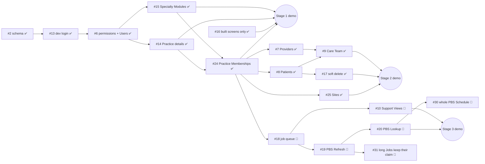

# Build Order

> **As of 2026-09-26.** Where the build stands and what comes next. The plan and its rules are in [Vigil_Design_Document.md](Vigil_Design_Document.md) §15. Tickets live in [GitHub Issues](https://github.com/kl-a/vigil_care/issues), grouped into one milestone per stage. Update this file whenever a ticket finishes or the order changes.

**Showing screens:** a screen appears for everyone once it's marked `built` in `frontend/lib/screens.ts` (or its Patient tab) and its stage has shipped. Raise `SHIPPED_STAGE` in `frontend/lib/stages.ts` when a stage's demo is ready, and mark it here.

**How the build is ordered**
- Every stage ends with a **stage demo**: a scripted walkthrough in dev, on synthetic data, for stakeholders ([docs/demos/](demos/)).
- The **Clinical Record is entered by hand first**. The document pipeline fills the same record later.
- Screens appear only once built, and grow section by section.
- **Patients' Documents come straight after the Patient Summary** (Stages 6–9), so the Practice can track Patients and their Documents before any trial or treatment matching.
- **Login hardening comes last** (Stage 13) and is required before prod or any real Patient data.

## Where we are

| Status | Meaning |
|---|---|
| ✅ Done | Merged to `main` |
| 🔨 Built | Committed on its branch, awaiting PR/merge |
| ⏭️ Ready | All blockers done, so it can start now |
| ⏳ Blocked | Waiting on the tickets listed |
| 📋 Outline | Stage planned; tickets written when we get close |

### Foundation

| Ticket | What | Status |
|---|---|---|
| [#11](https://github.com/kl-a/vigil_care/issues/11) | Walking skeleton: stack, environments, health, app shell, gates harness | ✅ Done ([PR #12](https://github.com/kl-a/vigil_care/pull/12)) |
| [#2](https://github.com/kl-a/vigil_care/issues/2) | Baseline schema, database guardrails, clickable data model | ✅ Done ([PR #21](https://github.com/kl-a/vigil_care/pull/21)) |

### Stage 1 · Front door

**Demo:** sign in as each Job Title and watch the screens change. Add a User and show the audit entry, edit the Practice details, and switch Oncology off and on.

| Order | Ticket | What | Blocked by | Status |
|---|---|---|---|---|
| 1 | [#13](https://github.com/kl-a/vigil_care/issues/13) | Dev login as a seeded User, and demo data | #2 | ✅ Done ([PR #22](https://github.com/kl-a/vigil_care/pull/22)) |
| 2 | [#6](https://github.com/kl-a/vigil_care/issues/6) | Permissions, Verification and User Management basics | #13 | ✅ Done ([PR #23](https://github.com/kl-a/vigil_care/pull/23)) |
| 3 | [#14](https://github.com/kl-a/vigil_care/issues/14) | Practice details in Settings (location moves to the primary Site in #25) | #6 | ✅ Done ([PR #26](https://github.com/kl-a/vigil_care/pull/26)) |
| 3 | [#15](https://github.com/kl-a/vigil_care/issues/15) | Specialty Modules: contract, registry and Settings toggle | #6 | ✅ Done ([PR #26](https://github.com/kl-a/vigil_care/pull/26)) |
| any | [#16](https://github.com/kl-a/vigil_care/issues/16) | Show only built screens, and System status | none | ✅ Done ([PR #23](https://github.com/kl-a/vigil_care/pull/23)) |
| 4 | [#24](https://github.com/kl-a/vigil_care/issues/24) | Practice Memberships: one login, several Practices (data model + dev login; no switcher yet) | #14, #15 | ✅ Done ([PR #27](https://github.com/kl-a/vigil_care/pull/27)) |

### Stage 2 · Patients (shipped: `SHIPPED_STAGE = 2`)

**Demo:** find Jane Citizen and edit her details, then show the audit entry and the encrypted fields in the database. Add her treating oncologist and referring GP. Script so far: [docs/demos/stage-2.md](demos/stage-2.md).

| Order | Ticket | What | Blocked by | Status |
|---|---|---|---|---|
| 1 | [#8](https://github.com/kl-a/vigil_care/issues/8) | Patients with encrypted Patient Identity (includes the key interface) | #6, #24 | ✅ Done ([PR #28](https://github.com/kl-a/vigil_care/pull/28)) |
| 1 | [#7](https://github.com/kl-a/vigil_care/issues/7) | Provider directory | #6, #24 | ✅ Done ([PR #28](https://github.com/kl-a/vigil_care/pull/28)) |
| 1 | [#25](https://github.com/kl-a/vigil_care/issues/25) | Sites: where a Practice sees Patients | #14, #24 | ✅ Done ([PR #28](https://github.com/kl-a/vigil_care/pull/28)) |
| 2 | [#17](https://github.com/kl-a/vigil_care/issues/17) | Soft-delete a Patient | #8 | ✅ Done ([PR #29](https://github.com/kl-a/vigil_care/pull/29)) |
| 2 | [#9](https://github.com/kl-a/vigil_care/issues/9) | Care Team | #8, #7 | ✅ Done ([PR #29](https://github.com/kl-a/vigil_care/pull/29)) |

### Stage 3 · PBS & Support Views (shipped: `SHIPPED_STAGE = 3`)

**Demo:** look up pembrolizumab's PBS Listing per indication. As the developer admin, start a PBS Refresh and follow it in the Support Views. Script: [docs/demos/stage-3.md](demos/stage-3.md).

This stage can run alongside Stage 2.

| Order | Ticket | What | Blocked by | Status |
|---|---|---|---|---|
| 1 | [#18](https://github.com/kl-a/vigil_care/issues/18) | Job queue and Refresh Jobs | #6, #24 | 🔨 Built (`stage-3`) |
| 2 | [#19](https://github.com/kl-a/vigil_care/issues/19) | PBS Refresh | #18 | 🔨 Built (`stage-3`) |
| 2 | [#10](https://github.com/kl-a/vigil_care/issues/10) | Support Views without Patient data (+ no-Patient-data gate) | #18 | 🔨 Built (`stage-3`) |
| 3 | [#20](https://github.com/kl-a/vigil_care/issues/20) | PBS Drug Lookup screen | #19 | 🔨 Built (`stage-3`) |
| 3 | [#30](https://github.com/kl-a/vigil_care/issues/30) | PBS Drug Lookup: the whole PBS Schedule, browsable and clearer | #20 | 🔨 Built (`stage-3`) |
| 4 | [#31](https://github.com/kl-a/vigil_care/issues/31) | Long-running Jobs keep their claim; PBS Refresh logs each API request. Doesn't block the Stage 3 merge; must land before Stage 8 | #18, #19 | 🔨 Built (`stage-3`) |

### Stages 4–13 (outlines)

| Stage | Shows stakeholders | Depends on | Status |
|---|---|---|---|
| 4 · Clinical Record by hand | 4a Conditions and cancer, 4b Treatment and Medications, 4c Results and plan | 2, 3 | 📋 Outline |
| 5 · Patient Summary | Patient Summary v1 and Open Items, from the hand-entered record | 4 | 📋 Outline |
| 6 · Document filing | Upload a Patient's Documents (Original encrypted), view them, set Type and date by hand, Hold, move; nothing leaves the Practice | 5 | 📋 Outline |
| 7 · Redaction Jobs | De-identification trust gate: OCR, masking, Redaction QA, leak check | 6 | 📋 Outline |
| 8 · Document pipeline | Processes filed Documents: OCR, VLM worker, classification, cloud ledger, Held Documents | 7, [#31](https://github.com/kl-a/vigil_care/issues/31) (long Jobs keep their claim) | 📋 Outline |
| 9 · Extraction Review | Extracted Facts reviewed into the same Clinical Record | 8 | 📋 Outline |
| 10 · Trials | 10a Trial Browser (public data; can start any time after Stage 3), 10b Match Board | 9 | 📋 Outline |
| 11 · Treatment Options | eviQ + PBS Coverage. **Blocked on eviQ terms of use** ([revisit-later.md](revisit-later.md) #9) | 3, 4 | 📋 Outline |
| 12 · Exports | Identified and De-identified Exports with sign-off | 5, 7, 9 (10 for trial reports) | 📋 Outline |
| 13 · Login hardening & polish | 2FA, inactivity lock, re-authentication, bootstrap, onboarding, backup, polish. Tickets so far: [#4](https://github.com/kl-a/vigil_care/issues/4), [#5](https://github.com/kl-a/vigil_care/issues/5), [#32](https://github.com/kl-a/vigil_care/issues/32) (runbook) | all | 📋 Outline |

## Critical path

**Next up:**
1. Merge Stage 3 (#18, #19, #10, #20, #30, #31): it's built and shipped, ready for its demo ([docs/demos/stage-3.md](demos/stage-3.md)).
2. Stage 4 · Clinical Record by hand: write its tickets (4a Conditions and cancer, 4b Treatment and Medications, 4c Results and plan).

**Provisional decisions:** [docs/revisit-later.md](revisit-later.md) lists them with their triggers; working through them is tracked in [#33](https://github.com/kl-a/vigil_care/issues/33).

**After Stage 3:** Stages 4 → 5 → 6 → 7 → 8 → 9 in order, then Trials, Treatment Options (once eviQ is cleared), Exports and Login hardening.
